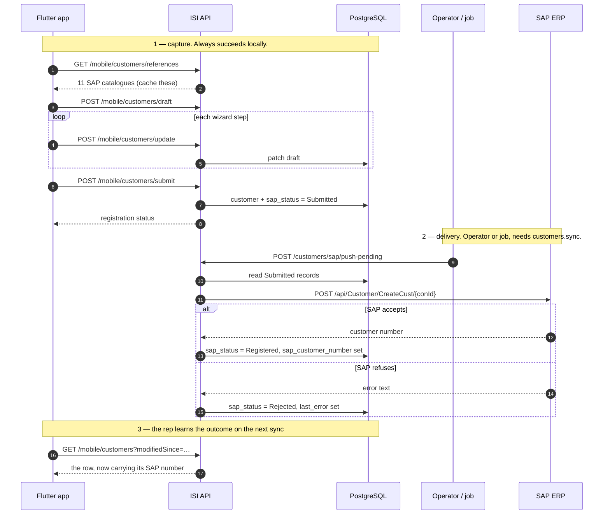

# Create Customer — Mobile

**Purpose:** registering a new customer from the field, including delivery to SAP.
**Scope:** `POST /api/v1/mobile/customers`, `POST /api/v1/mobile/customers/business-partner`,
and the draft wizard under `/api/v1/mobile/customers/draft*`.
**Status:** Active · **Last updated:** 2026-08-28

There are **three** creation paths and they are not interchangeable. Pick by whether
the shop must reach SAP, and whether the form is long enough to lose.

---

## Contents

1. [Which path to use](#which-path-to-use)
2. [Path A — simple create](#path-a--simple-create)
3. [Path B — business partner for SAP](#path-b--business-partner-for-sap)
4. [Path C — the draft wizard](#path-c--the-draft-wizard)
5. [Flow: SAP → backend → mobile](#flow-sap--backend--mobile)
6. [Two statuses](#two-statuses)
7. [Validation rules](#validation-rules)
8. [Offline strategy](#offline-strategy)
9. [Checklist](#checklist)

---

## Which path to use

| | Path A `POST /mobile/customers` | Path B `POST …/business-partner` | Path C draft wizard |
|---|---|---|---|
| Vocabulary | Platform (`shopName`, `city`) | **SAP** (`name1`, `salesOrg`) | SAP, 46 fields |
| Reaches SAP | No | No — queued for later | No — until submitted |
| Returns | Full customer | Registration status | Draft, then a customer |
| Survives app kill | No | No | **Yes, server-side** |
| Use for | A quick local contact | A shop that must be in the ERP | A long multi-screen form |

**None of the three calls SAP inline.** A representative standing at a counter has no
route to the ERP and often no signal at all, and their registration still has to
succeed. Delivery to SAP is an operator action or a scheduled job.

**Do not build a "sync to SAP now" button.** Everything under `/customers/sap/*`
requires `customers.sync`, which representatives deliberately do not hold — they get a
bare 403 with no `errorCode`, because the pipeline rejects it before a handler runs.

---

## Path A — simple create

`POST /api/v1/mobile/customers` · `customers.create` · **201**

Platform vocabulary, minimal fields. For a customer that does not need to exist in
SAP — a prospect, a cash buyer, a contact captured on a visit.

```json
{
  "customerCode": "ISI-PP0099",
  "shopName": "Sok Heng Hardware",
  "type": "Retailer",
  "phone": "012 345 678",
  "addressLine1": "Street 271, Sangkat Toul Tumpung",
  "city": "Phnom Penh",
  "district": "Chamkarmon",
  "province": "Phnom Penh",
  "ownerName": "Sok Heng",
  "whatsapp": "+85512345678",
  "territory": "PP-CENTRAL",
  "latitude": 11.5449,
  "longitude": 104.9160,
  "creditLimit": 5000,
  "creditTermDays": 30,
  "enName": "Sok Heng Hardware",
  "khName": "ហាង សុខ ហេង",
  "contacts": [
    { "name": "Sok Heng", "phone": "012345678", "position": "Owner", "isPrimary": true }
  ]
}
```

Returns the full customer plus a `Location` header. The customer starts in `Draft`
and cannot trade until someone holding `customers.approve` activates it. Ownership
defaults to the caller, so a rep registering a shop owns that relationship without a
second call.

**`customerCode` must be unique** — a duplicate is `409 Customer.DuplicateCode`. The
SAP block is not accepted here; SAP assigns it.

---

## Path B — business partner for SAP

`POST /api/v1/mobile/customers/business-partner` · `customers.create` · **200**

### Why the field names look like SAP

Because they are SAP's. The app already fills its dropdowns from
`GET /mobile/customers/references`, so the representative is picking real SAP codes.
Renaming them into platform vocabulary here and back on the push would be two lossy
translations for no gain.

```json
{
  "name1": "Doc Sample Hardware",
  "name3": "ហាងគំរូ",
  "partnerCategory": "2",
  "partnerGroup": "Z001",
  "bpRole": "ZFLCU1",
  "accountGroup": "Z001",
  "country": "KH",
  "region": "R01",
  "city": "Phnom Penh",
  "street": "Street 271",
  "houseNo": "12B",
  "mobilePhone": "012345678",
  "telephone": "023456789",
  "language": "E",
  "salesOrg": "0001",
  "distributionChannel": "10",
  "division": "10",
  "customerGroup": "01",
  "currency": "USD",
  "paymentTerms": "T015",
  "searchTerm1": "PHNOM PENH",
  "latitude": 11.5449,
  "longitude": 104.9160,
  "territory": "PP-CENTRAL",
  "submitToSap": true
}
```

### The response is a status, not a customer

```json
{
  "success": true,
  "message": "Customer created successfully.",
  "data": {
    "customerId": "01a03189-9670-7599-98ac-45ebaf277899",
    "customerCode": "BP-202608-00002",
    "name": "Doc Sample Hardware",
    "sapStatus": "Submitted",
    "sapCustomerNumber": null,
    "submittedAt": "2026-08-24T02:11:35Z",
    "registeredAt": null,
    "lastError": null,
    "attemptCount": 0
  }
}
```

To render a detail screen straight afterwards, follow up with
`GET /mobile/customers/{customerId}`.

`customerCode` is generated (`BP-YYYYMM-NNNNN`) — the real SAP number arrives in
`sapCustomerNumber` once the ERP accepts the record.

### Only `name1` is required — but five fields decide whether it can ever reach SAP

A blank `name1` is the only thing that fails the request:

```json
{ "status": 400, "errorCode": "Customer.NameRequired" }
```

Everything else is optional, exactly as in SAP. **But a record missing
`accountGroup`, `bpRole`, `partnerGroup`, or the sales area
(`salesOrg` + `distributionChannel` + `division`) cannot be registered later** — the
push marks it `Rejected` without even calling SAP.

Treat those five as required in your form even though the server does not. A record
that saves and can never be delivered is worse than a validation error.

### `submitToSap`

| Value | Effect |
|---|---|
| `true` (default) | `sapStatus: Submitted`. The next operator push delivers it. |
| `false` | `sapStatus: NotSubmitted`. Stays local until somebody queues it. |

Send `true` for a normal field registration. Send `false` only if your flow has a
review step before the shop goes near the ERP.

---

## Path C — the draft wizard

Path B is one request with ~25 fields. The full SAP business partner has **46**. A
form that long, filled on a phone in a market, will be interrupted — so the draft
lives on the server, not in app state.

Seven endpoints, all `customers.create`:

| Method | Route | Purpose |
|---|---|---|
| `POST` | `/mobile/customers/draft` | Start a draft. Returns `draftId` + 46 empty fields |
| `POST` | `/mobile/customers/update` | Patch fields. Call after every step |
| `POST` | `/mobile/customers/submit` | Convert the draft into a customer |
| `GET` | `/mobile/customers/draft/active` | Resume — the caller's open draft |
| `GET` | `/mobile/customers/drafts` | All the caller's drafts |
| `GET` | `/mobile/customers/draft/{draftId}` | One draft |
| `DELETE` | `/mobile/customers/draft/{draftId}` | Discard |

### Starting

`POST /mobile/customers/draft` with an empty body:

```json
{
  "data": {
    "draftId": "01a0477f-2d66-7a62-a564-bda8b1a85648",
    "status": "Draft",
    "isEditable": true,
    "submittedCustomerId": null,
    "submittedAt": null,
    "createdAt": "2026-08-28T08:31:52Z",
    "updatedAt": null,
    "fields": { "name1": null, "partnerCategory": "2", "…": "46 in total" }
  }
}
```

`partnerCategory` is pre-set to `2` (organisation) — the common case. The 46 fields
cover names, the business-partner block, address, contact, sales area, pricing, tax
and blocking flags.

### Updating

`POST /mobile/customers/update` — a patch, so send only what changed:

```json
{ "draftId": "01a0477f-…", "fields": { "name1": "Sok Heng Hardware", "city": "Phnom Penh" } }
```

Call it at the end of each wizard step. That is the whole point: the app can be
killed between steps and nothing is lost.

### Resuming

`GET /mobile/customers/draft/active` on app launch. If it returns a draft, offer to
resume:

```dart
Future<void> onOpenRegistration() async {
  final res = await api.get('/mobile/customers/draft/active');
  final draft = res.data['data'];
  if (draft != null && draft['isEditable'] == true) {
    if (await askResume(draft)) return openWizardAt(draft);
    await api.delete('/mobile/customers/draft/${draft['draftId']}');
  }
  final fresh = await api.post('/mobile/customers/draft');
  openWizardAt(fresh.data['data']);
}
```

`isEditable` is false once submitted — a submitted draft is a receipt, not a form.
Check it before opening the wizard.

### Submitting

`POST /mobile/customers/submit` with `{ "draftId": "…" }`. The draft becomes a
customer; `submittedCustomerId` is set and `isEditable` goes false. Same five-field
rule as Path B applies for later SAP delivery.

---

## Flow: SAP → backend → mobile

Registration is the direction the other documents do not cover: **mobile → backend →
SAP**, with delivery deferred.



The representative's job ends at step 1. Steps 2 and 3 happen without them, and the
outcome reaches the device through the ordinary delta sync — no special polling.

---

## Two statuses

A customer carries both, and they move independently:

| Field | Values | Question it answers |
|---|---|---|
| `status` | `Draft` `PendingApproval` `Active` `Suspended` `Closed` | May this shop trade? |
| `sapStatus` | `NotSubmitted` `Submitted` `Registered` `Rejected` | Does the ERP know about it? |

A customer registered from the field is `status: Draft` **and** `sapStatus: Submitted`
at the same time — awaiting a human approval here, awaiting delivery there. Neither
implies the other.

```dart
String sapLabel(String s) => switch (s) {
      'NotSubmitted' => 'Not sent to SAP',
      'Submitted'    => 'Waiting to reach SAP',
      'Registered'   => 'In SAP',
      'Rejected'     => 'SAP rejected — office will fix',
      _              => 'Unknown',        // never crash on an unfamiliar value
    };
```

Render it **read-only**. The rep cannot retry — that needs `customers.sync`.

`lastError` is SAP's own English message, kept verbatim so the office can act on it.
Show the label to the rep and log the detail.

---

## Validation rules

Enforced on every path:

| Rule | Failure |
|---|---|
| Name required | `400 Customer.NameRequired` |
| Code unique (Path A) | `409 Customer.DuplicateCode` |
| Latitude and longitude together | `400 General.Validation` |
| `(0,0)` rejected | `400 Customer.CoordinatesMissing` |
| `creditTermDays` 0–180 | `400 Customer.CreditTermInvalid` |
| `creditLimit` ≥ 0 | `400 Customer.CreditLimitNegative` |
| Known `type` | `400 General.Validation` |
| At most 25 contacts | `400 Customer.TooManyContacts` |

**Phone numbers accept human formatting.** `012 345 678` and `+855-12-345-678` both
work — spaces, dashes and brackets are stripped, not rejected. Do not make a
representative retype a number because of a space.

**Send `null` coordinates when the GPS fix fails, never zeros.** `(0,0)` is a valid
point in the Gulf of Guinea and what a device reports on a failed fix:

```dart
final pos = await tryGetPosition();
body['latitude']  = pos?.latitude;    // null, not 0.0
body['longitude'] = pos?.longitude;
```

An unknown `type` and a lone latitude both arrive as `General.Validation` with a
per-field `errors` map, because request validation runs before the domain. Handle
that map as your default error path.

---

## Offline strategy

The draft wizard is server-side, so it needs connectivity. For genuinely offline
capture, queue locally and replay:

```dart
Future<void> register(Map<String, dynamic> body) async {
  final localId = await outbox.enqueue('customers.create', body);
  try {
    final res = await api.post('/mobile/customers/business-partner', data: body);
    await outbox.complete(localId, serverId: res.data['data']['customerId']);
  } on DioException catch (e) {
    final code = e.response?.statusCode;
    if (code != null && code >= 400 && code < 500) {
      // The server will never accept this. Surface it; do not retry forever.
      await outbox.reject(localId, e.response?.data?['errorCode']);
    }
    // 5xx or no connection: leave queued, retry on the next connectivity event.
  }
}
```

Two rules for the outbox:

- **Do not retry a 4xx.** A duplicate code or a blank name will fail identically
  forever. Mark it for the user to fix.
- **Make the replay idempotent.** Generate `customerCode` client-side and keep it
  stable across retries, so a response lost to a dropped connection produces
  `409 Customer.DuplicateCode` on replay rather than a second customer. Treat that
  409 as success and reconcile by code.

---

## Checklist

- [ ] Correct path chosen (A local, B SAP-bound, C long form)
- [ ] Reference catalogues cached and used for every SAP code dropdown
- [ ] `accountGroup`, `bpRole`, `partnerGroup` and the sales area treated as required
- [ ] `submitToSap: true` for normal field registration
- [ ] Draft resumed via `/draft/active` on launch; `isEditable` checked
- [ ] `POST /update` called at the end of every wizard step
- [ ] Path B response read as a status, with a follow-up GET for the record
- [ ] `status` and `sapStatus` shown as separate things; `sapStatus` read-only
- [ ] `lastError` logged, never shown raw to a rep
- [ ] Null coordinates on GPS failure, never `0,0`
- [ ] Phone formatting left alone
- [ ] Outbox does not retry 4xx; replay is idempotent on `customerCode`
- [ ] No "sync to SAP" button in the field app

---

## See also

- [edit-customer.md](edit-customer.md) — updating an existing customer
- [filter-customer.md](filter-customer.md#where-the-filter-values-come-from) — the reference catalogues
- [../registration.md](../registration.md) — the operator-side registration surface
