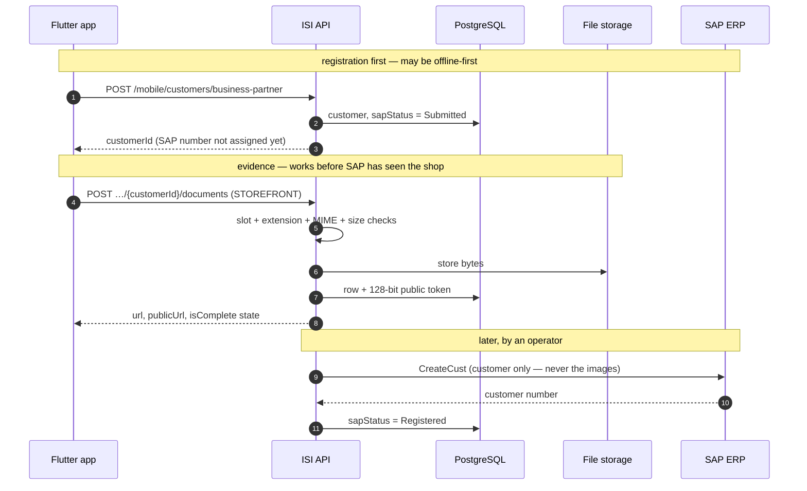

# Customer Documents — Mobile

**Purpose:** capturing and reading the on-site evidence photographs for a customer.
**Scope:** `/api/v1/mobile/customers/{customerId}/documents` and `/files/customers/{publicToken}`.
**Status:** Active · **Last updated:** 2026-08-31

The photo screen at the end of customer registration: storefront, inside-store, ID
card, and optionally a patent/tax or VAT certificate.

**These are application-managed data, not SAP master data.** SAP owns the customer
record; this platform owns the photographs, keyed to the customer. Nothing here is
pushed to the ERP, and SAP provides no images of its own.

---

## Contents

1. [Quick start](#quick-start)
2. [Endpoints](#endpoints)
3. [Addressing a customer](#addressing-a-customer)
4. [The five slots](#the-five-slots)
5. [Upload](#upload)
6. [Validation](#validation)
7. [Replacement](#replacement)
8. [The checklist](#the-checklist)
9. [Showing an image](#showing-an-image)
10. [Delete](#delete)
11. [Flow: SAP → backend → mobile](#flow-sap--backend--mobile)
12. [Dart implementation](#dart-implementation)
13. [Offline queue](#offline-queue)
14. [Error codes](#error-codes)
15. [Checklist](#checklist)

---

## Quick start

```dart
// 1. Open the screen — ask the server what is already there
final state = await api.get('/mobile/customers/$customerId/documents');
final missing = Set<String>.from(state.data['data']['missingRequired']);

// 2. Camera → compress → upload one slot
await api.post(
  '/mobile/customers/$customerId/documents',
  data: FormData.fromMap({
    'file': await MultipartFile.fromFile(path, contentType: MediaType('image', 'jpeg')),
    'Type': 'STOREFRONT',
    'CapturedAt': DateTime.now().toUtc().toIso8601String(),
  }),
);

// 3. Re-read; enable Send when isComplete
```

Three rules that avoid the common mistakes:

1. **Compress before uploading.** 10 MB is the ceiling, not the target.
2. **Drive the checklist from `missingRequired` / `isComplete`**, not app state.
3. **Never surface `publicUrl` for an ID card** — it is always null there, by design.

---

## Endpoints

| Method | Route | Permission | Purpose |
|---|---|---|---|
| `POST` | `/mobile/customers/{customerId}/documents` | `customers.create` | Upload one document |
| `GET` | `/mobile/customers/{customerId}/documents` | `customers.read` | List, with what is still missing |
| `GET` | `/mobile/customers/{customerId}/documents/{documentId}/content` | `customers.read` | Stream the bytes |
| `DELETE` | `/mobile/customers/{customerId}/documents/{documentId}` | `customers.update` | Delete row and file |
| `GET` | `/files/customers/{publicToken}` | **none** | Published photo, no auth |

Representatives hold `customers.create` and `customers.update`, so they can upload,
replace and delete their own customers' evidence.

---

## Addressing a customer

`{customerId}` accepts **either** the platform id **or** the customer code — which for
a SAP-originated customer *is* its SAP customer number. Both reach the same record:

```
POST /api/v1/mobile/customers/6100000017/documents                        ← SAP number
POST /api/v1/mobile/customers/01a0479c-d112-7a3d-93c7-5d5534e88dc1/documents
```

6,010 of the 6,011 customers currently held have `code == sapCustomerId`, so the SAP
number is the natural key once one exists.

> **Do not require a SAP number.** A customer registered in the field does not have
> one yet: registration is offline-first, the record is saved with
> `sapStatus: Submitted`, and an operator pushes it to the ERP later — hours or days.
> The representative has taken the photographs *now*, standing in the shop. Uploading
> against the platform id is what makes that work.

A customer outside the caller's scope returns **404, not 403** — the same rule as
every other customer route.

---

## The five slots

| `type` | Screen label | Required | Accepts | Public URL |
|---|---|---|---|---|
| `STOREFRONT` | Storefront photo | ✅ | JPG, PNG | **Yes** |
| `INSIDE_STORE` | Inside-store photo | ✅ | JPG, PNG | **Yes** |
| `ID_CARD` | ID card photo | ✅ | JPG, PNG | No |
| `PATENT_TAX` | Patent / tax document | ⬜ | JPG, PNG, **PDF** | No |
| `VAT_CERTIFICATE` | VAT certificate | ⚠️ when Tax Class = VAT | JPG, PNG, **PDF** | No |

Codes, not display strings — the API never asks you to send `"Storefront photo"`.
`typeDisplay` comes back localised for the label, so the screen's text comes from the
server:

```
Accept-Language: en-US  →  "typeDisplay": "Storefront photo"
Accept-Language: km-KH  →  "typeDisplay": "រូបភាពមុខហាង"
```

The old enumeration names (`StorefrontPhoto`, `IdCardPhoto`, …) are still accepted on
**input** for clients built before the codes existed. Responses always use the codes.

---

## Upload

`POST /api/v1/mobile/customers/{customerId}/documents` · multipart, one file per
request. There is no batch endpoint — a failed batch tells you nothing about which
photograph to retake.

```
Authorization: Bearer <access_token>
Content-Type: multipart/form-data

file=@storefront.jpg
Type=STOREFRONT
CapturedAt=2026-08-31T08:00:00Z     (optional)
```

```json
{
  "success": true,
  "message": "Photo uploaded successfully.",
  "data": {
    "id": "01a0479c-d20c-7275-b8ac-8883b582e9e7",
    "type": "STOREFRONT",
    "typeDisplay": "Storefront photo",
    "fileName": "storefront.jpg",
    "contentType": "image/jpeg",
    "sizeBytes": 297431,
    "url": "/api/v1/mobile/customers/6100000017/documents/01a0479c-…/content",
    "publicUrl": "/files/customers/hAS_juvp1vHZ3V87WYfwnw",
    "isPubliclyVisible": true,
    "capturedAt": "2026-08-31T08:00:00Z",
    "uploadedAt": "2026-08-31T09:12:44Z"
  }
}
```

**Status-independent.** Draft, PendingApproval, Active, Suspended, even Closed — all
accept uploads. Evidence is captured while a representative is standing in the shop;
failing the upload because of where the customer sits in its approval flow would lose
the photograph for a reason unrelated to it.

**Send `CapturedAt`.** A queued upload can reach the server hours after the visit.
Without it the record is dated to whenever the connection came back, not to when the
rep was in the shop.

**Compress first.** The server has no resizer. Target ~1600 px and ~300 KB; a rep on
3G sending five 4 MB camera originals will time out and blame the app.

---

## Validation

Enforced server-side. Do not rely on the client having got it right.

| Rule | Failure |
|---|---|
| File part present and non-empty | `Customer.DocumentFileRequired` |
| `Type` is a known slot | `Customer.DocumentTypeInvalid` |
| Extension allowed **for that slot** | `Customer.DocumentExtensionNotAllowed` |
| `Content-Type` agrees with the extension | `Customer.DocumentContentTypeMismatch` |
| At most **10 MB** | `Customer.DocumentTooLarge` |
| Customer exists and is in scope | `Customer.NotFound` (404) |

Verified against the running API:

```
PDF  → STOREFRONT      400  Customer.DocumentExtensionNotAllowed
PDF  → PATENT_TAX      200  accepted
PNG labelled jpeg      400  Customer.DocumentContentTypeMismatch
Type=NONSENSE          400  Customer.DocumentTypeInvalid
PNG  → ID_CARD         200  accepted
```

Extension and MIME type are both client-supplied and neither is trustworthy alone,
but requiring them to **agree** removes the easiest mislabelling — a PDF renamed to
`.jpg` to reach a photo slot. Set the content type explicitly:

```dart
MultipartFile.fromFile(path, contentType: MediaType('image', 'jpeg'))   // not guessed
```

---

## Replacement

**One live document per slot.** Upload `STOREFRONT` again and the previous one is
removed, its file deleted, and a **new public token issued** — so any URL already
shared for the old photograph stops working:

```
before      /files/customers/zJ9My2tYH0tqpQXRNPbABQ   200
re-upload STOREFRONT
after       /files/customers/zJ9My2tYH0tqpQXRNPbABQ   404   revoked
            /files/customers/gszOctQA8hGd2X7qUttR2g   200   the new one
```

A rep who retakes a blurred photo four times leaves one file behind, not four.
**Refresh any cached URL after an upload** rather than assuming it survived.

---

## The checklist

`GET /api/v1/mobile/customers/{customerId}/documents`

```json
{
  "success": true,
  "data": {
    "customerId": "01a0479c-…",
    "documents": [
      { "id": "…", "type": "STOREFRONT",   "fileName": "storefront.jpg", "…": "…" },
      { "id": "…", "type": "INSIDE_STORE", "fileName": "inside.jpg",     "…": "…" }
    ],
    "missingRequired": ["ID_CARD"],
    "isComplete": false
  }
}
```

`missingRequired` names the required slots with nothing in them; `isComplete` is true
when it is empty. **Drive the UI from these**, not from app state — they survive an
app restart, a device swap and a partially failed upload.

Documents come back ordered by slot, so the screen renders the same sequence every
time.

> **The required three are not enforced on upload.** A rep whose upload fails on a
> market connection must not lose the registration, so the customer saves regardless
> and HQ blocks approval instead. `isComplete` is what your Send button should read.

---

## Showing an image

Two URLs, for two audiences:

| Field | Auth | Use it for |
|---|---|---|
| `url` | Bearer token + `customers.read` | **Inside the app.** Always present. |
| `publicUrl` | None | Embedding where a token cannot go. Null for non-public slots. |

```dart
// Inside the app — you already have a token
Image.network(
  '$baseUrl${doc.url}',
  headers: {'Authorization': 'Bearer $accessToken'},
);
```

**`publicUrl` is null for `ID_CARD`, `PATENT_TAX` and `VAT_CERTIFICATE`** — they carry
personal and financial data, and a URL that needs no credentials is a breach waiting
for the link to leak. The server decides this from the slot; no parameter overrides
it, and the public route answers 404 for them.

Do not build UI that offers to "share" a document without checking
`isPubliclyVisible` first.

Published files are served `Cache-Control: public, max-age=31536000, immutable` —
safe because a token addresses one immutable set of bytes; a replacement gets a new
URL rather than new content at the old one.

---

## Delete

`DELETE /api/v1/mobile/customers/{customerId}/documents/{documentId}` → **204**

Removes the row and the stored file, and revokes the public URL immediately. Requires
`customers.update` — it is an edit to a customer's evidence, not the removal of a
customer, so `customers.delete` is not needed.

Use it for "remove this photo" rather than uploading a blank. To *replace*, just
upload the slot again.

---

## Flow: SAP → backend → mobile



**Documents never reach SAP.** The ERP is master for customer data; this platform is
master for the photographs. Once the SAP number arrives it becomes another way to
address the same documents — nothing has to be re-uploaded.

---

## Dart implementation

```dart
class CustomerDocumentsApi {
  CustomerDocumentsApi(this._dio);
  final Dio _dio;

  static const required = {'STOREFRONT', 'INSIDE_STORE', 'ID_CARD'};

  Future<DocumentsState> load(String customerId) async {
    final data = (await _dio.get('/mobile/customers/$customerId/documents')).data['data'];
    return DocumentsState(
      byType: {for (final d in data['documents']) d['type'] as String: CustomerDocument.fromJson(d)},
      missing: Set<String>.from(data['missingRequired']),
      isComplete: data['isComplete'] == true,
    );
  }

  Future<CustomerDocument> upload({
    required String customerId,
    required String type,          // STOREFRONT, INSIDE_STORE, ID_CARD, …
    required File file,
    required DateTime capturedAt,
  }) async {
    // Content type stated, not inferred — the server rejects a mismatch with the
    // extension, which is what catches a PDF renamed to .jpg.
    final ext = p.extension(file.path).toLowerCase();
    final media = switch (ext) {
      '.png' => MediaType('image', 'png'),
      '.pdf' => MediaType('application', 'pdf'),
      _      => MediaType('image', 'jpeg'),
    };

    final res = await _dio.post(
      '/mobile/customers/$customerId/documents',
      data: FormData.fromMap({
        'file': await MultipartFile.fromFile(file.path, contentType: media),
        'Type': type,
        'CapturedAt': capturedAt.toUtc().toIso8601String(),
      }),
    );

    return CustomerDocument.fromJson(res.data['data']);
  }

  Future<void> delete(String customerId, String documentId) =>
      _dio.delete('/mobile/customers/$customerId/documents/$documentId');
}
```

Compress before calling `upload` — `flutter_image_compress` to ~1600 px on the long
edge, quality ~80, which lands around 300 KB.

---

## Offline queue

The upload needs connectivity. For genuinely offline capture, queue locally and
replay:

```dart
Future<void> capture(String customerId, String type, File file) async {
  final id = await outbox.enqueue(customerId, type, file.path, DateTime.now().toUtc());
  try {
    await api.upload(customerId: customerId, type: type, file: file, capturedAt: …);
    await outbox.complete(id);
  } on DioException catch (e) {
    final code = e.response?.statusCode;
    if (code != null && code >= 400 && code < 500) {
      // The server will never accept this file. Surface it; do not retry forever.
      await outbox.reject(id, e.response?.data?['errorCode']);
    }
    // 5xx or no connection: leave queued, retry on the next connectivity event.
  }
}
```

Two rules:

- **Do not retry a 4xx.** A PDF sent to a photo slot fails identically forever.
- **Replay is naturally idempotent** — re-uploading a slot replaces it, so a response
  lost to a dropped connection costs one duplicate file server-side, not a duplicate
  row.

Keep the original file until the upload is confirmed. `capturedAt` is captured at
photo time, not at replay time.

---

## Error codes

| Code | Status | Meaning |
|---|---|---|
| `Customer.NotFound` | 404 | Unknown customer, or outside your scope |
| `Customer.DocumentFileRequired` | 400 | No file part, or zero bytes |
| `Customer.DocumentTypeInvalid` | 400 | `Type` is not one of the five slots |
| `Customer.DocumentExtensionNotAllowed` | 400 | Wrong file kind for that slot |
| `Customer.DocumentContentTypeMismatch` | 400 | `Content-Type` disagrees with the extension |
| `Customer.DocumentTooLarge` | 400 | Over 10 MB |
| `Customer.DocumentEmpty` | 400 | Stored file had no bytes |
| `Customer.DocumentNotFound` | 404 | No such document on this customer |
| `Customer.TooManyDocuments` | 400 | More than 20 on one customer |

Errors are RFC 9457 problem documents — branch on `errorCode`, never on `detail`.

---

## Checklist

- [ ] Photos compressed to ~1600 px / ~300 KB (10 MB is the ceiling)
- [ ] `Type` sent as a code (`STOREFRONT`), not a label or enum name
- [ ] `Content-Type` set explicitly and matching the extension
- [ ] PDF only sent to `PATENT_TAX` / `VAT_CERTIFICATE`
- [ ] `CapturedAt` sent, from photo time not upload time
- [ ] Checklist driven by `missingRequired` / `isComplete`
- [ ] Cached URLs refreshed after a re-upload — tokens rotate
- [ ] `url` used in-app with the bearer token; `publicUrl` only where a token cannot go
- [ ] Share/export UI gated on `isPubliclyVisible`
- [ ] Outbox does not retry 4xx
- [ ] SAP number used to address the customer once one exists, platform id before then

---

## See also

- [create-customer.md](create-customer.md) — the registration this evidence completes
- [get-customer-by-id.md](get-customer-by-id.md) — the customer record itself
- [mobile.md](mobile.md) — the whole mobile customer surface
