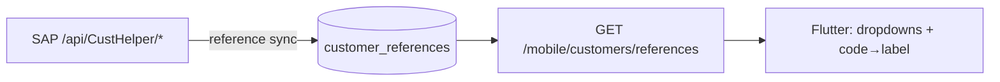

# Filter, Sort and Page Customers — Mobile

**Purpose:** every query parameter on the mobile customer list, and what each costs.
**Scope:** `GET /api/v1/mobile/customers`.
**Status:** Active · **Last updated:** 2026-08-28

Filters AND together. Free-text search is one more parameter alongside them — see
[search-customer.md](search-customer.md).

---

## Contents

1. [Parameter reference](#parameter-reference)
2. [Paging](#paging)
3. [Sorting](#sorting)
4. [Exact-match filters](#exact-match-filters)
5. [Scoping filters](#scoping-filters)
6. [Sync filters](#sync-filters)
7. [Where the filter values come from](#where-the-filter-values-come-from)
8. [Client implementation](#client-implementation)
9. [Checklist](#checklist)

---

## Parameter reference

| Parameter | Type | Default | Behaviour |
|---|---|---|---|
| `pageNumber` | int | 1 | One-based. Below 1 is treated as 1. |
| `pageSize` | int | 25 | **Clamped to 200.** Never rejected. |
| `sort` | string | `createdAt` | Comma-separated; `-` prefixes descending. Allow-listed. |
| `search` | string | — | Free text across 7 columns. |
| `status` | enum | — | `Draft` `PendingApproval` `Active` `Suspended` `Closed` |
| `type` | enum | — | `Retailer` `Wholesaler` `Distributor` `KeyAccount` |
| `territory` | string | — | Exact match. |
| `province` | string | — | Exact match. |
| `district` | string | — | Exact match. |
| `assignedRepId` | guid | — | Ignored without `customers.readall`. |
| `linkedToSapOnly` | bool | — | `true` → only customers with a SAP number. |
| `modifiedSince` | date-time | — | Incremental sync. Implies `includeDeleted`. |
| `includeDeleted` | bool | false | Include tombstones (`deleted: true`). |

An unrecognised parameter is ignored, not rejected. An unparseable `status` or `type`
is also ignored — the filter silently does not apply, so validate your enum values
client-side rather than relying on a 400.

---

## Paging

```
?pageNumber=2&pageSize=25
```

`pageSize` is clamped rather than rejected because a client on a flaky connection
asking for 10,000 rows is a mistake worth absorbing quietly — but it will not be
allowed to scan the table either. **Read `metadata.pageSize` back** and drive your
paging arithmetic from it.

Follow `metadata.hasNextPage`. Do not compute `page < totalPages` yourself: with
6,010 customers and concurrent writes, `totalRecords` can shift between requests.

> **Offset paging can skip or repeat rows across pages** when the underlying set is
> being written to — and the nightly job rewrites every row. For a full sync this is
> acceptable because you are upserting by primary key, so a repeat is harmless and a
> skip is caught by the next delta. For anything order-sensitive, sort by a stable
> key (`code`) rather than a mutable one (`updatedAt`).

---

## Sorting

```
?sort=-updatedAt,shopName
```

Comma-separated, applied left to right. A `-` prefix descends. Only these keys are
honoured; anything else falls through to the default:

| Key | Orders by |
|---|---|
| `code`, `customerCode` | Customer number |
| `name` | Legal / registered name |
| `shopName` | **The localised display name**, per `Accept-Language` |
| `status` | Lifecycle enum |
| `type` | Trade type enum |
| `city`, `district`, `territory` | Address fields |
| `createdAt`, `updatedAt` | Timestamps |
| `lastVisitDate`, `lastOrderDate` | Metric dates |
| `lifetimeValue` | Denormalised sales value |

The allow-list is a security control, not a convenience: passing an arbitrary client
string into `ORDER BY` lets a caller sort by an unindexed column and is one step from
an injection vector.

### `name` and `shopName` are different sorts

This is the distinction that matters for a Khmer client:

- `sort=name` orders by the **legal** name — Latin, from SAP's `NameEn`/`CoName`.
- `sort=shopName` orders by the **displayed** name — `nameKm` under `km-KH`,
  `nameEn` under `en-US`, with the same `requested → English → legal` fallback the
  list projection uses.

Under `km-KH`, `sort=shopName` produces a list ordered by the text on screen. Under
`en-US` the same request orders by the English name. Sorting a Khmer list by `name`
looks random to the user, because the ordering key is a string they cannot see.

The default sort is `createdAt` ascending, or change-time ascending on a delta sync
so an interrupted client can resume.

---

## Exact-match filters

`territory`, `province` and `district` are **exact, case-sensitive** string matches —
not prefixes, not fuzzy. `PP-CENTRAL` matches; `pp-central` does not.

Get the values from data you already hold rather than free-typing them:

```dart
// Territories present in the rep's own synced book
final territories = await db.rawQuery(
  'SELECT DISTINCT territory FROM customers WHERE territory IS NOT NULL ORDER BY territory');
```

`status` and `type` are parsed case-insensitively (`active` works), but send the
canonical casing.

**`territory` is frequently null on SAP-sourced customers.** SAP's sales office is the
closest thing its feed has to a territory and it is often blank; the sync leaves the
field null rather than inventing a value, because a wrong territory silently moves a
customer onto another representative's route. A territory filter therefore excludes
every customer SAP could not place — surface "Unassigned" as an explicit option
rather than letting those rows vanish.

---

## Scoping filters

`assignedRepId` filters to one representative's book. It is **ignored unless the
caller holds `customers.readall`** — otherwise it would be a way to enumerate another
rep's customers.

For a plain representative there is nothing to send: the handler already restricts
every query to their own customers. Sending `assignedRepId` with your own id is
harmless but redundant.

`linkedToSapOnly=true` returns only customers with a SAP customer number — useful for
"which of my shops can actually be ordered for". Its inverse (locally registered, not
yet in SAP) has no parameter; filter client-side on `sapCustomerId == null`.

---

## Sync filters

`modifiedSince` and `includeDeleted` are covered in full in
[get-customer.md](get-customer.md). In summary:

- `modifiedSince` turns the list into a delta and switches the default sort to change
  time.
- It implies `includeDeleted`, so a delta always carries tombstones.
- A value more than five minutes ahead of server time is a 400.
- `includeDeleted=true` alone adds tombstones to an ordinary list.

---

## Where the filter values come from

Dropdown values for the SAP classification codes come from a separate endpoint, not
from the customer list:

```
GET /api/v1/mobile/customers/references
```

It returns 11 SAP catalogues, refreshed from the ERP by the reference sync:

| Catalogue | Entries | Example |
|---|---|---|
| `SalesOrg` | 22 | `0001` Phnom Penh (ISI) |
| `SalesOffice` | 20 | `0009` Siem Riep |
| `SalesGroup` | 6 | `010` Channel Sales |
| `DistributionChannel` | 9 | `10` End-User |
| `Division` | 5 | `10` ISI Steel |
| `CustomerGroup` | 8 | `05` Contractor |
| `PriceGroup` | 9 | `52` Key Account |
| `PaymentTerm` | 28 | `T030` 30 days due net |
| `ShippingCondition` | 2 | `01` ISI Services |

```json
{
  "data": {
    "catalogues": {
      "SalesOrg": [ { "code": "0001", "name": "Phnom Penh (ISI)" } ]
    },
    "synchronisedAt": "2026-08-28T03:00:10Z"
  }
}
```

**These are registration inputs, not list filters.** The list endpoint has no
`salesOrg` or `paymentTerms` parameter. Use the catalogues to populate the create form
(see [create-customer.md](create-customer.md)) and to turn a stored code into a label
on a detail screen.

Cache them — they change rarely. `synchronisedAt` tells you how stale your copy is.



---

## Client implementation

```dart
class CustomerFilter {
  const CustomerFilter({
    this.search, this.status, this.type,
    this.territory, this.province, this.district,
    this.linkedToSapOnly, this.sort, this.page = 1, this.pageSize = 25,
  });

  final String? search, status, type, territory, province, district, sort;
  final bool? linkedToSapOnly;
  final int page, pageSize;

  /// Null and blank values are dropped rather than sent empty — an empty
  /// `territory=` is an exact match on the empty string, which matches nothing.
  Map<String, dynamic> toQuery() => {
        'pageNumber': page,
        'pageSize': pageSize,
        if (sort != null) 'sort': sort,
        if (search != null && search!.trim().isNotEmpty) 'search': search!.trim(),
        if (status != null) 'status': status,
        if (type != null) 'type': type,
        if (territory != null && territory!.isNotEmpty) 'territory': territory,
        if (province != null && province!.isNotEmpty) 'province': province,
        if (district != null && district!.isNotEmpty) 'district': district,
        if (linkedToSapOnly == true) 'linkedToSapOnly': true,
      };
}

Future<CustomerListPage> list(CustomerFilter f) async {
  final res = await api.get('/mobile/customers', queryParameters: f.toQuery());
  return CustomerListPage.fromEnvelope(res.data);
}
```

The one trap: **do not send blank strings.** `territory=''` is an exact match on the
empty string and returns nothing, which looks like "no customers in this territory"
rather than "no filter applied".

### Offline filtering

Once the book is synced, apply the same filters locally so the list works with no
signal. Keep the parameter names identical to the server's so the two paths stay
comparable:

```dart
Future<List<CustomerSummary>> localList(CustomerFilter f) {
  final where = <String>[], args = <Object?>[];
  if (f.status != null)    { where.add('status = ?');    args.add(f.status); }
  if (f.territory != null) { where.add('territory = ?'); args.add(f.territory); }
  if (f.search != null) {
    where.add('(shop_name LIKE ? OR customer_code LIKE ? OR city LIKE ?)');
    args.addAll(List.filled(3, '%${f.search}%'));
  }
  return db.query('customers',
      where: where.isEmpty ? null : where.join(' AND '),
      whereArgs: args,
      orderBy: 'shop_name COLLATE NOCASE',
      limit: f.pageSize,
      offset: (f.page - 1) * f.pageSize);
}
```

Local search covers only what you stored — `shop_name` holds one language, so local
results will differ from server results. Say so in the UI if you offer both.

---

## Checklist

- [ ] `metadata.pageSize` read back (clamped to 200)
- [ ] `hasNextPage` followed rather than a computed page count
- [ ] Blank filter values omitted, never sent empty
- [ ] `sort` keys restricted to the allow-list
- [ ] `shopName` used for sorting a localised list, not `name`
- [ ] Enum values validated client-side (an invalid one is silently ignored)
- [ ] Territory/province/district values sourced from data, not typed
- [ ] "Unassigned territory" offered explicitly — SAP leaves it null
- [ ] `assignedRepId` not sent by plain representatives
- [ ] References cached, with `synchronisedAt` shown when stale

---

## See also

- [get-customer.md](get-customer.md) — the list response and offline sync
- [search-customer.md](search-customer.md) — free-text search
- [create-customer.md](create-customer.md) — where the reference catalogues are used
