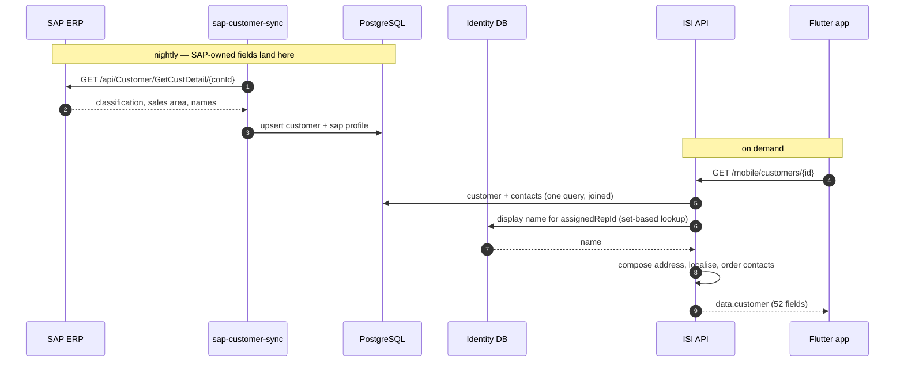

# Get Customer by Id — Mobile

**Purpose:** the full customer record for a detail screen.
**Scope:** `GET /api/v1/mobile/customers/{customerId}`.
**Status:** Active · **Last updated:** 2026-08-28

52 fields, contacts included, in one request. Use it for the detail screen; use
[get-customer.md](get-customer.md) for lists — the summary row is a fifth of the
payload and already carries what a row and a map pin need.

---

## Contents

1. [The request](#the-request)
2. [The response](#the-response)
3. [Field groups](#field-groups)
4. [404 means "not there"](#404-means-not-there)
5. [Audit fields are permission-gated](#audit-fields-are-permission-gated)
6. [Flow: SAP → backend → mobile](#flow-sap--backend--mobile)
7. [Client implementation](#client-implementation)
8. [Checklist](#checklist)

---

## The request

```
GET /api/v1/mobile/customers/01a03189-9670-7599-98ac-45ebaf277899
Authorization: Bearer <access_token>
Accept-Language: km-KH
```

Requires `customers.read`. The path parameter is the platform `id` (a GUID), **not**
the customer code. To resolve a code, see
[search-customer.md](search-customer.md#not-found-locally-fall-back-to-by-code).

---

## The response

Note the extra nesting: `data.customer`, not `data`.

```json
{
  "success": true,
  "message": "Customer retrieved successfully.",
  "data": {
    "customer": {
      "id": "01a03189-…",
      "customerCode": "6100000017",
      "sapCustomerId": "6100000017",
      "shopName": "ដេប៉ូ​​​ រស្មី សៀមរាប",
      "enName": "PNP-DEPOT REAKSMEY SIEM REAP",
      "khName": "ដេប៉ូ​​​ រស្មី សៀមរាប",
      "ownerName": null,
      "description": null,
      "phone": "012345678",
      "email": null,
      "whatsapp": null,
      "address": "Street 271, Siem Reap",
      "addressLine1": "Street 271",
      "addressLine2": null,
      "city": "Siem Reap",
      "district": null,
      "province": null,
      "postalCode": null,
      "territory": null,
      "latitude": null,
      "longitude": null,
      "type": "Retailer",
      "status": "Active",
      "statusDisplay": "សកម្ម",
      "canTrade": true,
      "creditLimit":     { "amount": 0.0, "currency": "USD" },
      "creditBalance":   { "amount": 0.0, "currency": "USD" },
      "availableCredit": { "amount": 0.0, "currency": "USD" },
      "creditTermDays": 0,
      "currency": "USD",
      "assignedRepId": null,
      "assignedRepName": null,
      "originLeadId": null,
      "productsPurchased": [],
      "contacts": [
        { "id": "019ff532-…", "name": "Heng Vuthy", "phone": "012345605",
          "position": "Owner", "email": null, "isPrimary": true }
      ],
      "lastOrderDate": null,
      "lastVisitDate": null,
      "lifetimeValue": { "amount": 0.0, "currency": "USD" },
      "totalOrders": 0,
      "openOpportunityCount": 0,
      "metricsCalculatedAt": "2026-08-28T03:00:11Z",
      "salesOrg": "0001",
      "division": "10",
      "distributionChannel": "10",
      "customerGroup": "01",
      "priceGroup": "11",
      "paymentTerms": "T030",
      "taxNumber": null,
      "createdAt": "2026-08-24T02:11:35Z",
      "updatedAt": "2026-08-28T03:00:11Z",
      "deleted": false,
      "deletedAt": null
    },
    "createdBy": null,
    "updatedBy": null
  },
  "metadata": null,
  "traceId": "0HNO1GJO3S25L:00000001",
  "timestamp": "2026-08-28T08:31:52Z"
}
```

`metadata` is null on a single-resource response — the pagination and sync block only
appears on collections. Do not assume it exists.

---

## Field groups

The 52 fields fall into six groups, and they have different owners and lifetimes.

### Identity and names

`id`, `customerCode`, `sapCustomerId`, `shopName`, `enName`, `khName`.

`shopName` is localised per request. `enName` and `khName` are returned **regardless
of language** — a deliberate exception, because a delivery note carries the Khmer
shopfront name and the English legal name together. Use them when you need both at
once; use `shopName` everywhere else.

### Address

`address` is a pre-composed single line, so every client renders an address the same
way. The parts (`addressLine1`, `addressLine2`, `city`, `district`, `province`,
`postalCode`) are there for a form that edits them.

`latitude`/`longitude` are null when no GPS fix was captured — never `0,0`. Guard the
map pin on both being non-null.

### Lifecycle

`status`, `statusDisplay`, `canTrade`. Branch on `status`; render `statusDisplay`.
`canTrade` is `status == Active`, computed server-side — use it rather than
re-deriving.

### Money

`creditLimit`, `creditBalance`, `availableCredit`, `lifetimeValue` are all
`{ amount, currency }`. `creditTermDays` is a plain int (0 = cash on delivery).
`currency` is the single currency the customer trades in; all four amounts share it.

`availableCredit` is computed as limit − balance. Do not recompute it.

### SAP classification — read-only

`salesOrg`, `division`, `distributionChannel`, `customerGroup`, `priceGroup`,
`paymentTerms`, `taxNumber`.

**Returned but never accepted.** SAP owns them. They arrive as codes; turn them into
labels with the reference catalogues (see
[filter-customer.md](filter-customer.md#where-the-filter-values-come-from)).

`paymentTerms` (the SAP key, e.g. `T030`) and `creditTermDays` (the day count the
platform enforces) are separate on purpose — the mapping between them lives in SAP
customising and can change there without this platform being redeployed. Show
`paymentTerms`' label; enforce nothing from it.

### Metrics — a cache

`lifetimeValue`, `totalOrders`, `openOpportunityCount`, `lastOrderDate`,
`lastVisitDate`, `metricsCalculatedAt`.

Denormalised so a list row renders without an aggregate per row. **Never
authoritative.** Show them with `metricsCalculatedAt`, and never gate an action on
`creditBalance` — it is only as fresh as the last SAP run.

---

## 404 means "not there"

A customer outside the caller's scope returns **404, not 403**. Distinguishing the two
would confirm that a given customer exists, which is exactly what a competitor probing
the API wants to learn.

```json
{ "type": "https://docs.isigroup.com.kh/errors/Customer.NotFound",
  "title": "The requested resource was not found.",
  "status": 404,
  "errorCode": "Customer.NotFound",
  "correlationId": "0HNO1GJO3S25L:00000001" }
```

So a 404 covers three cases you cannot tell apart, and should not try to:

- the id does not exist
- it exists but belongs to another representative
- it was soft-deleted

**Present all three as "this customer is not available".** Do not write "you do not
have permission" — that is the disclosure the design avoids. A soft-deleted customer
also 404s here, so if your local copy has it and the server does not, delete it
locally.

---

## Audit fields are permission-gated

`createdBy` and `updatedBy` are populated **only** for callers holding
`customers.audit` — Finance, Executive and Administrator. Everyone else, including
every sales representative, sees `null`.

Render the row conditionally rather than showing an empty "Last edited by":

```dart
if (details.updatedBy != null) AuditRow(details.updatedBy!, customer.updatedAt),
```

---

## Flow: SAP → backend → mobile

The detail endpoint is a pure database read. Nothing here reaches SAP.



Two design points visible in the payload:

- **Contacts are loaded with the aggregate**, not fetched separately. One query with a
  join beats a second round trip on a link where latency dominates.
- **`assignedRepName` comes from a different database.** Users live behind their own
  context, so the name is resolved afterwards through a directory lookup that takes a
  *set* of ids — a page of fifty customers costs one round trip, not fifty. On this
  endpoint it is a set of one.

---

## Client implementation

```dart
Future<CustomerDetails> getCustomer(String id) async {
  final res = await api.get('/mobile/customers/$id');
  final data = res.data['data'];                     // note: data.customer
  return CustomerDetails(
    customer:  Customer.fromJson(data['customer']),
    createdBy: data['createdBy'],                    // null without customers.audit
    updatedBy: data['updatedBy'],
  );
}
```

### Offline detail screens

The summary row has 23 of the 52 fields. Rather than syncing every customer's full
record, open the detail screen from the cached summary and fetch the rest when online:

```dart
Future<void> openDetail(String id) async {
  showDetail(fromCache: await db.summary(id));       // instant, from the synced book

  try {
    final full = await getCustomer(id);
    await db.upsertDetail(full);
    showDetail(full: full);                          // fills in contacts, SAP block
  } on DioException catch (e) {
    if (e.response?.statusCode == 404) {
      await db.delete(id);                           // gone or out of scope — drop it
      showNotAvailable();
    }
    // otherwise: keep the cached view, show an offline badge
  }
}
```

This gives an instant screen with no signal and a complete one with signal, and it
self-heals a stale local copy.

---

## Checklist

- [ ] Response read from `data.customer`, not `data`
- [ ] `metadata` treated as nullable
- [ ] 404 presented as "not available", never "no permission"
- [ ] 404 deletes the local copy
- [ ] `createdBy` / `updatedBy` rows hidden when null
- [ ] Map pin guarded on both coordinates being non-null
- [ ] Money parsed as `{ amount, currency }`
- [ ] `availableCredit` and `canTrade` used as sent, not recomputed
- [ ] SAP codes rendered through the reference catalogues
- [ ] Metrics shown with `metricsCalculatedAt`, never used to gate an action
- [ ] Detail screen opens from cache, then refreshes

---

## See also

- [get-customer.md](get-customer.md) — the list and the summary row
- [edit-customer.md](edit-customer.md) — updating this record
- [mobile.md](mobile.md) — the whole mobile customer surface
