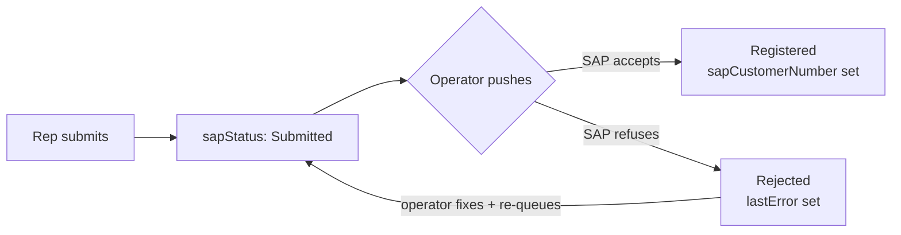

# Customers — Mobile Integration Guide

**Purpose:** the customer endpoints consumed by the Flutter field sales app, including offline synchronisation.
**Scope:** `/api/v1/mobile/customers`. Admin is [admin.md](../admin.md); registration is [registration.md](../registration.md).
**Status:** Active · **Last updated:** 2026-08-28

The customer surface consumed by the Flutter field sales application, including
offline synchronisation.

Base URL `https://<host>/api/v1` · All examples verified against the running API.

---

## Contents

1. [Quick start](#quick-start)
2. [Endpoints and permissions](#endpoints-and-permissions)
3. [The response envelope](#the-response-envelope)
4. [Localisation](#localisation)
5. [Listing, filtering and paging](#listing-filtering-and-paging)
6. [Offline sync](#offline-sync)
7. [Reading one customer](#reading-one-customer)
8. [Creating and updating](#creating-and-updating)
9. [Registering a business partner for SAP](#registering-a-business-partner-for-sap)
10. [Looking a customer up by code](#looking-a-customer-up-by-code)
11. [Contacts](#contacts)
12. [Money](#money)
13. [Metrics are a cache](#metrics-are-a-cache)
14. [Error codes](#error-codes)
15. [Dart model](#dart-model)
16. [Checklist](#checklist)

---

## Quick start

```dart
// First sync — page through everything, keep the last syncTimestamp
var page = 1;
String? watermark;
while (true) {
  final res = await api.get('/mobile/customers',
      queryParameters: {'pageNumber': page, 'pageSize': 200});
  await db.upsertAll(res.data['data']['customers']);
  watermark = res.data['metadata']['syncTimestamp'];
  if (!res.data['metadata']['hasNextPage']) break;
  page++;
}
await prefs.setString('customers_watermark', watermark!);

// Later — ask only for what changed
final delta = await api.get('/mobile/customers',
    queryParameters: {'modifiedSince': watermark, 'pageSize': 200});
```

Registering a shop that must reach SAP is a different endpoint - see
[Registering a business partner for SAP](#registering-a-business-partner-for-sap).

Two rules that prevent the classic offline bugs:

1. **Store `metadata.syncTimestamp` from the server. Never the device clock.**
2. **Honour `deleted: true` rows** — they are tombstones, and dropping them on the
   floor leaves deleted shops on the phone forever.

---

## Endpoints and permissions

| Method | Route | Permission | Returns | Detail |
|---|---|---|---|---|
| `GET` | `/mobile/customers` | `customers.read` | Paged list + sync metadata | [get-customer.md](get-customer.md) |
| `GET` | `/mobile/customers/{id}` | `customers.read` | Full customer + contacts | [get-customer-by-id.md](get-customer-by-id.md) |
| `POST` | `/mobile/customers` | `customers.create` | Created customer (201) | [create-customer.md](create-customer.md) |
| `PUT` | `/mobile/customers/{id}` | `customers.update` | Updated customer | [edit-customer.md](edit-customer.md) |
| `DELETE` | `/mobile/customers/{id}` | `customers.delete` | 204 | — |
| `POST` | `/mobile/customers/business-partner` | `customers.create` | SAP registration status | [create-customer.md](create-customer.md#path-b--business-partner-for-sap) |
| `GET` | `/mobile/customers/references` | `customers.read` | 11 SAP code catalogues | [filter-customer.md](filter-customer.md#where-the-filter-values-come-from) |
| `GET` | `/customers/by-code/{code}` | `customers.read` | One customer, fetched from SAP if unknown | [search-customer.md](search-customer.md#not-found-locally-fall-back-to-by-code) |

### The draft wizard

The full SAP business partner has 46 fields. A form that long, filled on a phone in a
market, gets interrupted — so the draft lives on the server rather than in app state.
All seven require `customers.create`; see
[create-customer.md](create-customer.md#path-c--the-draft-wizard).

| Method | Route | Purpose |
|---|---|---|
| `POST` | `/mobile/customers/draft` | Start a draft — returns `draftId` and 46 empty fields |
| `POST` | `/mobile/customers/update` | Patch fields; call after each wizard step |
| `POST` | `/mobile/customers/submit` | Turn the draft into a customer |
| `GET` | `/mobile/customers/draft/active` | Resume the caller's open draft |
| `GET` | `/mobile/customers/drafts` | All the caller's drafts |
| `GET` | `/mobile/customers/draft/{draftId}` | One draft |
| `DELETE` | `/mobile/customers/draft/{draftId}` | Discard a draft |

Free-text search and the filter/sort/paging parameters are documented in
[search-customer.md](search-customer.md) and [filter-customer.md](filter-customer.md).

### What the app cannot do

Everything under `/customers/sap/*` — trigger a sync, push registrations, retry
failures, read sync totals — requires **`customers.sync`**, which sales
representatives deliberately do not hold. A rep calling one gets a bare 403:

```json
{ "title": "Forbidden", "status": 403,
  "instance": "/api/v1/customers/sap/status",
  "correlationId": "0HNO1GJO3S25N:00000001" }
```

Note there is no `errorCode` on a 403 — the pipeline rejects it before a handler
runs. Branch on the status code.

**Do not build a "sync now" button into the field app.** Delivery to SAP is an
operator action from the admin portal, or a scheduled job. The rep's job ends when
the record is safely on the server.

Read the caller's permissions from `GET /auth/me` and hide actions they lack — a
usability measure only, since the server re-checks every one.

**Sales representatives do not hold `customers.delete`.** A rep pressing Delete gets
403. If field staff must remove their own drafts, that is a permission grant on the
role, not a client change.

### Row-level scoping

A representative sees the customers assigned to them. A holder of
`customers.readall` sees the whole territory. This is enforced in the query handler,
not the controller, so it applies identically to every route and to background jobs.

**A customer outside your scope returns 404, not 403.** Distinguishing the two would
confirm that a given customer exists, which is exactly what a competitor probing the
API wants to learn. Do not present 404 on a customer detail screen as "access
denied" — from the client's point of view it simply is not there.

---

## The response envelope

Success is wrapped:

```json
{
  "success": true,
  "message": "Customers retrieved successfully.",
  "data": { "customers": [ … ], "syncTimestamp": "2026-08-12T09:44:12Z" },
  "metadata": {
    "page": 1,
    "pageSize": 25,
    "totalRecords": 10,
    "totalPages": 1,
    "hasNextPage": false,
    "hasPreviousPage": false,
    "syncTimestamp": "2026-08-12T09:44:12Z",
    "isDeltaSync": false
  },
  "traceId": "0HNNOE4PB87QG:00000001",
  "timestamp": "2026-08-12T09:44:12Z"
}
```

Failure is **not** wrapped — it is an RFC 9457 problem document:

```json
{
  "type": "https://docs.isigroup.com.kh/errors/Customer.NotFound",
  "title": "The requested resource was not found.",
  "status": 404,
  "detail": "No customer was found with identifier '…'.",
  "errorCode": "Customer.NotFound",
  "correlationId": "0HNNOE4PB87QD:00000001"
}
```

**Branch on the HTTP status code, not on `success`.** The flag exists because the
Flutter model expects it, not because reading it is the correct way to detect
failure — on an error response there is no `success` field at all.

`message` is already localised and safe to show. `detail` is not — it is English,
for your logs.

---

## Localisation

Send `Accept-Language: km-KH` or `en-US` on every request.

`shopName`, `description`, `statusDisplay` and `message` arrive **already
translated**. The client never chooses between language columns.

```
Accept-Language: en-US  →  "shopName": "Toul Kork Construction Depot",
                           "statusDisplay": "Active"

Accept-Language: km-KH  →  "shopName": "ឃ្លាំងសំណង់ ទួលគោក",
                           "statusDisplay": "សកម្ម"
```

The response echoes what it decided:

```
content-language: km-KH
x-language-source: AcceptLanguageHeader
```

`x-language-source` answers "why am I getting English?" without server logs.
Resolution is four-tier: header → JWT claim → user profile → platform default.

`enName` and `khName` are returned **regardless of requested language**. That is a
deliberate exception, not a leak: a delivery note carries the Khmer shopfront name
and the English legal name together.

Fallback for any localised field is **requested → English → legal name**. The last
step guarantees a non-empty name, so an untranslated customer shows its legal name
rather than a blank row.

### Status: branch on `status`, display `statusDisplay`

```json
"status": "Active",
"statusDisplay": "សកម្ម"
```

Two flat fields, not a nested object. `status` is a stable code — switch on it.
`statusDisplay` is a localised label — render it. **Never branch on
`statusDisplay`**; it changes with the request language.

Values: `Draft`, `PendingApproval`, `Active`, `Suspended`, `Closed`.

---

## Listing, filtering and paging

`GET /api/v1/mobile/customers`

| Parameter | Type | Notes |
|---|---|---|
| `pageNumber` | int | One-based. Below 1 is treated as 1. |
| `pageSize` | int | Default 25, **clamped** to 200. |
| `search` | string | Name, code, city, SAP number, phone. |
| `sort` | string | `-updatedAt,name`. `-` prefix descends. |
| `status` | enum | `Draft` … `Closed` |
| `type` | enum | `Retailer`, `Wholesaler`, `Distributor`, `KeyAccount` |
| `territory` | string | Exact match. |
| `province` / `district` | string | Exact match. |
| `assignedRepId` | guid | Ignored unless the caller holds `customers.readall`. |
| `linkedToSapOnly` | bool | Only customers with a SAP number. |
| `modifiedSince` | date-time | Incremental sync — see below. |
| `includeDeleted` | bool | Include tombstones. Implied by `modifiedSince`. |

`pageSize` is **clamped, not rejected**. Asking for 10 000 returns 200 rows with no
error — a mistake to absorb quietly on a flaky connection, not a request to fail.
Read the real size back from `metadata.pageSize` rather than assuming you got what
you asked for.

Sortable columns are an allow-list: `code`, `name`, `shopName`, `status`, `type`,
`city`, `district`, `territory`, `createdAt`, `updatedAt`, `lastVisitDate`,
`lastOrderDate`, `lifetimeValue`. Anything else falls back to the default order.

### List row

The summary DTO is about a fifth of the full customer — 23 fields covering
everything a list row and a map pin need:

```json
{
  "id": "019ff532-…",
  "customerCode": "ISI-PP0005",
  "sapCustomerId": "1000105",
  "shopName": "ឃ្លាំងសំណង់ ទួលគោក",
  "ownerName": "Heng Vuthy",
  "phone": "023456005",
  "city": "Phnom Penh",
  "district": "Toul Kork",
  "territory": "PP-NORTH",
  "latitude": 11.5788,
  "longitude": 104.8901,
  "type": "Distributor",
  "status": "Active",
  "statusDisplay": "សកម្ម",
  "canTrade": true,
  "creditLimit":   { "amount": 30000.0, "currency": "USD" },
  "creditBalance": { "amount":  4200.0, "currency": "USD" },
  "lastVisitDate": "2026-08-09T03:12:00Z",
  "lastOrderDate": "2026-08-11T07:45:00Z",
  "assignedRepId": "019fefd2-…",
  "updatedAt": "2026-08-12T02:31:19Z",
  "deleted": false
}
```

---

## Offline sync

### First sync

Omit `modifiedSince`, page with `pageSize=200`, store `metadata.syncTimestamp` from
the **last** page.

### Delta sync

```
GET /api/v1/mobile/customers?modifiedSince=2026-08-12T09:44:12Z
```

Returns only records changed at or after that instant, **including soft-deleted ones
as tombstones** with `deleted: true`. Drop the local copy when you see one.

Without tombstones a record deleted on the server would simply stop appearing in the
delta and linger on the phone indefinitely — the classic offline-sync data leak.

```dart
for (final row in customers) {
  if (row['deleted'] == true) {
    await db.delete(row['id']);      // tombstone
  } else {
    await db.upsert(row);
  }
}
```

### Three load-bearing details

**The watermark comes from the server clock, never the device's.** A phone running
ten minutes fast would otherwise ask for changes since the future, receive an empty
delta, store *that* timestamp, and never sync again — a silent, permanent failure.
A `modifiedSince` more than five minutes ahead of server time is rejected:

```json
{
  "errorCode": "General.Validation",
  "errors": {
    "parameters.modifiedSince": [
      "modifiedSince cannot be in the future. Send the syncTimestamp from the previous response rather than the device clock."
    ]
  }
}
```

**New records are matched on `createdAt` when `updatedAt` is null.** A customer
registered since the last sync reaches the device — you do not need to compensate.

**A delta is ordered by change time**, so a client interrupted halfway can resume
from the last record it stored rather than restarting the page run.

### Advancing the watermark

Only advance it once the whole run has been committed locally. Advancing per page
means an interrupted sync skips everything between the last committed page and the
stored timestamp.

```dart
final t = firstResponse.metadata.syncTimestamp;   // capture up front
await db.transaction(() async { /* apply every page */ });
await prefs.setString('customers_watermark', t);  // commit last
```

---

## Reading one customer

`GET /api/v1/mobile/customers/{id}` returns the full aggregate — 52 fields —
wrapped one level deeper than the list:

```json
{
  "data": {
    "customer": { "id": "…", "shopName": "…", "contacts": [ … ] },
    "createdBy": null,
    "updatedBy": null
  }
}
```

Note `data.customer`, not `data` directly.

`createdBy` and `updatedBy` are populated **only** for callers holding
`customers.audit`; everyone else sees null. Do not render an empty "Last edited by"
row when they are absent.

`assignedRepName` is resolved server-side. Users live behind a separate database, so
the name is stitched in through a directory lookup that takes a *set* of ids — a
page of fifty customers costs one round trip, not fifty.

---

## Creating and updating

There are **two** create endpoints, and they are for different jobs:

| Endpoint | Use when |
|---|---|
| `POST /mobile/customers` | The shop is a platform customer. Simple, platform vocabulary, never goes to SAP. |
| `POST /mobile/customers/business-partner` | The shop must end up in SAP. Takes SAP's own field names. |

If you are unsure, the second one is what the field workflow wants — a shop a
representative registers is expected to reach the ERP eventually.

### Create — `POST /api/v1/mobile/customers`

```json
{
  "customerCode": "ISI-PP0099",
  "shopName": "Sok Heng Hardware",
  "type": "Retailer",
  "phone": "012 345 678",
  "addressLine1": "Street 271, Sangkat Toul Tumpung",
  "city": "Phnom Penh",
  "district": "Chamkarmon",
  "province": "Phnom Penh",
  "ownerName": "Sok Heng",
  "whatsapp": "+85512345678",
  "territory": "PP-CENTRAL",
  "latitude": 11.5449,
  "longitude": 104.9160,
  "creditLimit": 5000,
  "creditTermDays": 30,
  "enName": "Sok Heng Hardware",
  "khName": "ហាង សុខ ហេង",
  "contacts": [
    { "name": "Sok Heng", "phone": "012345678", "position": "Owner", "isPrimary": true }
  ]
}
```

Returns **201** with the created customer and a `Location` header.

The customer starts in **`Draft`** and cannot trade until someone holding
`customers.approve` activates it. Ownership defaults to the caller, so a
representative registering a shop in the field owns that relationship without an
extra assignment step.

**The SAP block is not accepted here.** `sapCustomerId`, `salesOrg`, `division`,
`distributionChannel`, `customerGroup`, `priceGroup` and `paymentTerms` are returned
but never written — SAP owns that data, and letting a phone set `salesOrg` would let
the field invent master data the ERP then contradicts.

### Update — `PUT /api/v1/mobile/customers/{id}`

Same body without `customerCode`. The code is immutable: renaming it would orphan
every SAP document, order and statement that references it.

A **closed** customer cannot be edited at all — expect `Customer.Closed` (422).

### Rules the server enforces

- **Phone numbers accept human formatting.** `012 345 678`, `+855-12-345-678` and
  `012345678` are all fine — spaces, dashes and brackets are stripped, not rejected.
  Do not make a representative retype a number because of a space.
- **Latitude and longitude must be sent together.** One without the other is a 400.
- **`(0, 0)` is rejected.** It is a valid point in the Gulf of Guinea and what a
  device reports when the GPS fix failed. **Send `null` for both when there is no
  fix** — never zeros.
- `creditTermDays` is 0–180. `creditLimit` must be ≥ 0.

```dart
// Correct handling of a failed GPS fix
final pos = await tryGetPosition();
body['latitude']  = pos?.latitude;    // null, not 0.0
body['longitude'] = pos?.longitude;
```

---

## Registering a business partner for SAP

`POST /api/v1/mobile/customers/business-partner` · `customers.create`

The endpoint for a shop that must end up in SAP. **It never calls SAP.** The record
is written to the platform database and the response returns immediately.

That is the whole point. A representative standing at a counter in a market has no
route to the ERP and frequently no signal at all, and their registration still has to
succeed. Calling SAP inline would fail them for a reason that has nothing to do with
them and lose what they just typed.

### Why the field names look like SAP

Because they are SAP's. The app already fills its dropdowns from SAP's helper
endpoints — sales org, sales group, payment term, price group — so the representative
is choosing real SAP codes. Renaming them into platform vocabulary here and back again
on the push would be two lossy translations for no gain.

```json
POST /api/v1/mobile/customers/business-partner
Content-Type: application/json

{
  "name1": "Doc Sample Hardware",
  "name3": "ហាងគំរូ",
  "partnerCategory": "2",
  "partnerGroup": "Z001",
  "bpRole": "ZFLCU1",
  "accountGroup": "Z001",
  "country": "KH",
  "region": "R01",
  "city": "Phnom Penh",
  "street": "Street 271",
  "houseNo": "12B",
  "mobilePhone": "012345678",
  "telephone": "023456789",
  "language": "E",
  "salesOrg": "0001",
  "distributionChannel": "10",
  "division": "10",
  "customerGroup": "01",
  "currency": "USD",
  "paymentTerms": "T015",
  "searchTerm1": "PHNOM PENH",
  "latitude": 11.5449,
  "longitude": 104.9160,
  "territory": "PP-CENTRAL",
  "submitToSap": true
}
```

Response (200, the standard mobile envelope):

```json
{
  "success": true,
  "message": "Customer created successfully.",
  "data": {
    "customerId": "01a03189-9670-7599-98ac-45ebaf277899",
    "customerCode": "BP-202608-00002",
    "name": "Doc Sample Hardware",
    "sapStatus": "Submitted",
    "sapCustomerNumber": null,
    "submittedAt": "2026-08-24T02:11:35.666005+00:00",
    "registeredAt": null,
    "lastError": null,
    "attemptCount": 0
  },
  "traceId": "0HNO1GJO3S25K:00000001"
}
```

**The response is a registration status, not a customer.** If you need the full
record — to render a detail screen straight after creating — follow up with
`GET /mobile/customers/{customerId}`.

### Only `name1` is required

Everything else is optional, exactly as in SAP. But a record missing
`accountGroup`, `bpRole`, `partnerGroup` or the sales area
(`salesOrg` + `distributionChannel` + `division`) **cannot be registered later** — the
push will mark it `Rejected` without even calling SAP.

So: collect those five if you possibly can. A blank `name1` is the only thing that
fails the request itself:

```json
{ "status": 400, "errorCode": "Customer.NameRequired",
  "detail": "Customer name is required." }
```

### `submitToSap`

| Value | Effect |
|---|---|
| `true` (default) | Status `Submitted`. The next operator push delivers it. |
| `false` | Status `NotSubmitted`. Stays local until somebody queues it. |

Send `true` for a normal field registration. Send `false` only if your flow has a
review step before the shop is allowed near the ERP.

### Two statuses, and they mean different things

This trips people up. A customer carries **both**:

| Field | Vocabulary | Meaning |
|---|---|---|
| `status` | `Draft` `PendingApproval` `Active` `Suspended` `Closed` | The commercial lifecycle — may this shop trade? |
| `sapStatus` | `NotSubmitted` `Submitted` `Registered` `Rejected` | Does the ERP know about it? |

They move independently. A customer freshly registered from the field is
`status: Draft` **and** `sapStatus: Submitted` at the same time — awaiting a human
approval here, and awaiting delivery there. Neither implies the other.



### Showing SAP state to the rep

Render it read-only. The rep cannot act on it — retrying is an operator action.

```dart
String sapLabel(String sapStatus) => switch (sapStatus) {
      'NotSubmitted' => 'Not sent to SAP',
      'Submitted'    => 'Waiting to reach SAP',
      'Registered'   => 'In SAP',
      'Rejected'     => 'SAP rejected — office will fix',
      _              => 'Unknown',   // never crash on a value you do not know
    };
```

`lastError` is **SAP's own English message**, kept verbatim so the office can act on
it. Do not show it to a representative as-is; show the label and log the detail.

---

## Looking a customer up by code

`GET /api/v1/customers/by-code/{code}` · `customers.read`

Finds a customer by its code. **The database is checked first**; SAP is consulted
only when the platform has never seen that code — which happens when somebody quotes
a customer number created in the ERP since your last sync.

Whatever comes back from SAP is stored, so the next lookup is local.

Use it when a representative types or scans a customer number that is not in the
local database. Do **not** put it on the normal browse path — the list endpoint is
what that is for, and it is local.

```
GET /api/v1/customers/by-code/6100001234
Accept-Language: en-US
```

### It is on a different surface, and the shape differs

This endpoint lives on `/customers`, not `/mobile/customers`, so it uses the **portal
envelope and the portal customer shape**. You cannot reuse your `CustomerSummary`
parser on it.

```json
{
  "data": {
    "id": "01a03189-9670-7599-98ac-45ebaf277899",
    "code": "BP-202608-00002",
    "name": "Doc Sample Hardware",
    "type": "Retailer",
    "status": "Draft",
    "canTrade": false,
    "phone": "012345678",
    "address": {
      "line1": "Street 271", "line2": null, "city": "Phnom Penh",
      "province": null, "postalCode": null,
      "latitude": 11.5449, "longitude": 104.916
    },
    "creditLimit": 0.0,
    "creditTermDays": 0,
    "assignedSalesRepId": "019fefcb-…",
    "createdAt": "2026-08-24T02:11:35.707489+00:00"
  },
  "meta": { "correlationId": "0HNO1GJO3S25L:00000001", "timestamp": "…" }
}
```

Differences that will bite if you assume otherwise:

| Mobile shape | This endpoint |
|---|---|
| `{ success, message, data, metadata, traceId }` | `{ data, meta }` — no `success`, no `message` |
| `customerCode` | `code` |
| `shopName` (localised) | `name` |
| `statusDisplay` | *absent* — you localise `status` yourself |
| `creditLimit: { amount, currency }` | `creditLimit: 0.0` — a bare number |
| flat `city` / `latitude` | nested under `address` |

**This is a rough edge, not a design.** Parse it with a separate small model and map
into your own type; do not try to make one parser serve both. A mobile-shaped
`by-code` is worth asking the backend team for if your flow leans on it.

### Statuses

| Status | Meaning |
|---|---|
| 200 | Found — locally or fetched from SAP |
| 404 `Customer.NotFoundByCode` | Neither the platform nor SAP has it |
| 502 | The ERP could not be reached |

**404 and 502 are not the same and must not be shown the same way.** A 404 means the
code does not exist — offer to register the shop. A 502 means we could not ask;
the customer may well exist, and inviting a registration would create a duplicate in
the ERP. On 502, say "cannot check right now, try later".

```dart
switch (res.statusCode) {
  case 200: return Customer.fromPortalJson(res.data['data']);
  case 404: return null;                       // safe to offer registration
  case 502: throw SapUnavailable();            // do NOT offer registration
}
```

---

## Contacts

On `PUT`, **null and an empty array mean different things**:

| `contacts` value | Effect |
|---|---|
| omitted / `null` | Contacts left untouched |
| `[ … ]` | Replaces the whole set |
| `[]` | **Removes every contact** |

Within a supplied array: an entry with an `id` is updated, one without is added, and
one previously present but now absent is removed.

```json
"contacts": [
  { "id": "019ff532-…", "name": "Heng Vuthy", "phone": "012345605", "position": "Owner" },
  { "name": "Sok Dara", "phone": "098765432", "position": "Purchaser", "isPrimary": true }
]
```

**Do not send `contacts: []` to mean "unchanged".** That wipes them. If your model
serialises empty lists by default, omit the key explicitly when the user has not
touched the contacts section.

At most **one primary contact**, guaranteed by the server: marking a second promotes
it and demotes the previous one rather than failing. You do not need a two-call swap,
and there is never a window where the customer has no primary.

Contacts return primary-first, then alphabetical — a stable order, so a local diff
does not show phantom changes on every sync. Maximum 25 per customer.

---

## Money

Three fields are objects, not numbers:

```json
"creditLimit":     { "amount": 30000.0, "currency": "USD" },
"creditBalance":   { "amount":  4200.0, "currency": "USD" },
"availableCredit": { "amount": 25800.0, "currency": "USD" },
"lifetimeValue":   { "amount": 184320.0, "currency": "USD" }
```

A decimal on its own is not an amount of money — it is a number someone remembers
the currency of, and that memory is where currency bugs live. A limit in USD compared
against a balance in KHR is a silent 4000× error nothing in the type system objects
to.

```dart
// If migrating from a flat num
creditLimit: Money.fromJson(json['creditLimit']),

class Money {
  const Money(this.amount, this.currency);
  final double amount;
  final String currency;
  factory Money.fromJson(Map<String, dynamic> j) =>
      Money((j['amount'] as num).toDouble(), j['currency'] as String);
}
```

`availableCredit` is computed server-side as limit − balance. Do not recompute it;
if the two ever disagree, the server is right.

A customer trades in **one** currency — the top-level `currency` field. All three
amounts share it.

---

## Metrics are a cache

`lifetimeValue`, `totalOrders`, `openOpportunityCount`, `lastOrderDate` and
`lastVisitDate` are denormalised onto the customer so a list row renders without an
aggregate query per row on a 3G connection.

They carry `metricsCalculatedAt` so you can tell how stale they are. **They are never
authoritative.** Do not build a client-side credit block on `creditBalance` — it is
maintained by the SAP interface and is only as fresh as the last run. Treating a
projection as truth is how a customer ends up blocked by a figure a failed job left
behind three weeks ago.

Show them with their timestamp, or not at all:

```dart
final stale = DateTime.now().difference(customer.metricsCalculatedAt) > const Duration(days: 1);
if (stale) showAsOfLabel(customer.metricsCalculatedAt);
```

---

## Error codes

| Code | Status | Meaning |
|---|---|---|
| `Customer.NotFound` | 404 | Absent, deleted, or outside your scope |
| `Customer.DuplicateCode` | 409 | Code already taken |
| `Customer.CodeRequired` | 400 | Blank code |
| `Customer.NameRequired` | 400 | Blank name |
| `Customer.PhoneRequired` | 400 | No phone supplied |
| `Customer.PhoneMalformed` | 400 | Not a recognisable number |
| `Customer.AddressLineRequired` | 400 | Blank first address line |
| `Customer.AddressCityRequired` | 400 | Blank city |
| `Customer.CoordinatesMissing` | 400 | `(0,0)` sent — the GPS fix failed |
| `Customer.CoordinatesOutOfRange` | 400 | Latitude/longitude out of bounds |
| `Customer.CreditLimitNegative` | 400 | Negative limit |
| `Customer.CreditTermInvalid` | 400 | Outside 0–180 days |
| `Customer.TypeInvalid` | 400 | Not a known trade type — but see the note below |
| `Customer.ContactNameRequired` | 400 | Contact without a name |
| `Customer.ContactNotFound` | 404 | No such contact on this customer |
| `Customer.TooManyContacts` | 400 | More than 25 |
| `Customer.Closed` | 422 | Customer is closed and immutable |
| `Customer.NotActive` | 422 | Suspend attempted on a non-active customer |
| `Customer.NotSuspended` | 422 | Reinstate attempted on a non-suspended one |
| `Customer.NotAwaitingApproval` | 422 | Approve attempted out of sequence |
| `General.Validation` | 400 | See the `errors` map for per-field messages |
| `Customer.NotFoundByCode` | 404 | `by-code`: neither the platform nor SAP has it |
| `Customer.AlreadyRegisteredInSap` | 409 | Already has a SAP number — cannot be submitted again |
| `Customer.IncompleteForSapRegistration` | 422 | Missing account group, BP role, partner group or sales area |
| `Customer.NotRegisteredInSap` | 422 | No SAP number, so there is nothing in SAP to update |
| *(none)* | 403 | Sync endpoint — reps do not hold `customers.sync`. No `errorCode` on a 403. |
| *(none)* | 502 | The ERP could not be reached. **Not** the same as not-found. |

`Customer.CoordinatesMissing` carries a message written for the user directly:
*"No GPS fix was captured. Move to an open area and try again, or save without a
location."*

**Two cases arrive as `General.Validation` rather than the specific code**, because
request validation runs before the domain sees the payload: an unrecognised `type`,
and a latitude sent without a longitude. Read the per-field `errors` map for those —
do not wait for `Customer.TypeInvalid`, which you will only see if validation is
bypassed. In general: handle `General.Validation` with the `errors` map as your
default path, and treat the specific codes as refinements.

---

## Dart model

```dart
class CustomerSummary {
  final String id, customerCode, shopName, phone, city, type, status, statusDisplay;
  final String? sapCustomerId, ownerName, district, territory;
  final double? latitude, longitude;
  final bool canTrade, deleted;
  final Money creditLimit, creditBalance;
  final DateTime? lastVisitDate, lastOrderDate, updatedAt;
  final String? assignedRepId;

  factory CustomerSummary.fromJson(Map<String, dynamic> j) => CustomerSummary(
        id:            j['id'],
        customerCode:  j['customerCode'],
        shopName:      j['shopName'],          // already localised
        statusDisplay: j['statusDisplay'],     // already localised — display only
        status:        j['status'],            // stable code — branch on this
        canTrade:      j['canTrade'] ?? false,
        deleted:       j['deleted'] ?? false,
        creditLimit:   Money.fromJson(j['creditLimit']),
        creditBalance: Money.fromJson(j['creditBalance']),
        latitude:      (j['latitude']  as num?)?.toDouble(),
        longitude:     (j['longitude'] as num?)?.toDouble(),
        updatedAt:     j['updatedAt'] == null ? null : DateTime.parse(j['updatedAt']),
        // …
      );
}

class CustomerListPage {
  final List<CustomerSummary> customers;
  final DateTime syncTimestamp;
  final int page, pageSize, totalRecords, totalPages;
  final bool hasNextPage, isDeltaSync;

  factory CustomerListPage.fromEnvelope(Map<String, dynamic> body) {
    final data = body['data'], meta = body['metadata'];
    return CustomerListPage(
      customers: (data['customers'] as List)
          .map((e) => CustomerSummary.fromJson(e))
          .toList(),
      syncTimestamp: DateTime.parse(meta['syncTimestamp']),
      page:          meta['page'],
      pageSize:      meta['pageSize'],      // read back — pageSize is clamped
      totalRecords:  meta['totalRecords'],
      totalPages:    meta['totalPages'],
      hasNextPage:   meta['hasNextPage'],
      isDeltaSync:   meta['isDeltaSync'],
    );
  }
}
```

### SAP registration status

Returned by `POST /mobile/customers/business-partner`.

```dart
enum SapStatus { notSubmitted, submitted, registered, rejected, unknown }

SapStatus parseSapStatus(String? raw) => switch (raw) {
      'NotSubmitted' => SapStatus.notSubmitted,
      'Submitted'    => SapStatus.submitted,
      'Registered'   => SapStatus.registered,
      'Rejected'     => SapStatus.rejected,
      // Never throw on an unrecognised value: a server that gains a status must not
      // crash an app that has not shipped yet.
      _              => SapStatus.unknown,
    };

class CustomerSapState {
  final String customerId, customerCode, name;
  final SapStatus sapStatus;
  final String? sapCustomerNumber, lastError;
  final DateTime? submittedAt, registeredAt;
  final int attemptCount;

  factory CustomerSapState.fromJson(Map<String, dynamic> j) => CustomerSapState(
        customerId:        j['customerId'],
        customerCode:      j['customerCode'],
        name:              j['name'],
        sapStatus:         parseSapStatus(j['sapStatus']),
        sapCustomerNumber: j['sapCustomerNumber'],
        lastError:         j['lastError'],        // SAP's English words — log, do not display
        submittedAt:       _utc(j['submittedAt']),
        registeredAt:      _utc(j['registeredAt']),
        attemptCount:      j['attemptCount'] ?? 0,
      );
}

DateTime? _utc(dynamic v) => v == null ? null : DateTime.parse(v as String).toUtc();
```

### The by-code shape is separate on purpose

```dart
// A deliberately small, separate model. Do not try to make CustomerSummary
// parse this - the field names and the envelope both differ. See §10.
class PortalCustomer {
  final String id, code, name, status, phone;
  final bool canTrade;
  final double? latitude, longitude;
  final String city;

  factory PortalCustomer.fromJson(Map<String, dynamic> j) {
    final a = j['address'] as Map<String, dynamic>;
    return PortalCustomer(
      id:        j['id'],
      code:      j['code'],            // NOT customerCode
      name:      j['name'],            // NOT shopName; not localised
      status:    j['status'],          // no statusDisplay here - localise it yourself
      phone:     j['phone'],
      canTrade:  j['canTrade'] ?? false,
      city:      a['city'],            // nested, not flat
      latitude:  (a['latitude']  as num?)?.toDouble(),
      longitude: (a['longitude'] as num?)?.toDouble(),
    );
  }
}
```

All timestamps are **UTC, ISO-8601**. Parse as UTC and convert for display; never
assume device-local.

---

## Checklist

- [ ] `Accept-Language` sent on every request
- [ ] `statusDisplay` rendered, `status` branched on — never the reverse
- [ ] `syncTimestamp` taken from the response, never the device clock
- [ ] Watermark advanced only after the whole sync commits
- [ ] `deleted: true` rows delete the local copy
- [ ] `pageSize` read back from `metadata` (it is clamped to 200)
- [ ] Money parsed as `{ amount, currency }`, not `num`
- [ ] `contacts` omitted when unchanged — `[]` wipes them
- [ ] Null coordinates sent when the GPS fix fails, never `0,0`
- [ ] Latitude and longitude always sent together
- [ ] 404 on detail treated as "not there", not "access denied"
- [ ] Delete hidden for roles without `customers.delete`
- [ ] Metrics shown with `metricsCalculatedAt`, never used for credit decisions
- [ ] Errors keyed off `errorCode`, never off `detail`

SAP-related:

- [ ] Business partners created through `/mobile/customers/business-partner`, not the plain create
- [ ] `accountGroup`, `bpRole`, `partnerGroup` and the sales area collected — without them the push is rejected
- [ ] `sapStatus` rendered read-only; no "sync now" button in the field app
- [ ] `status` and `sapStatus` treated as independent — `Draft` + `Submitted` is normal
- [ ] Unknown `sapStatus` values fall back, never throw
- [ ] `lastError` logged, not shown to a representative
- [ ] `by-code` parsed with its own model — different envelope and field names
- [ ] `by-code` 404 offers registration; **502 does not** (would create an ERP duplicate)
- [ ] 403 on a `/customers/sap/*` route handled by status code — a 403 has no `errorCode`

---

## See also

- [Authentication API — Mobile](../../../authentication/api/mobile.md) — sign-in, tokens, refresh
- [Customer — Architecture](../../architecture.md) — the design decisions behind this contract
- [Customer — API evolution](../../api-evolution.md) — breaking changes and v2 recommendations
- [Customer — SAP integration](../../sap-integration.md) — what happens after you submit: the
  push to SAP, retry, and the ERP quirks behind it. Useful when a registration comes
  back `Rejected` and you need to explain why.
- `/docs` on any running instance — interactive reference, pre-authorised in Development
