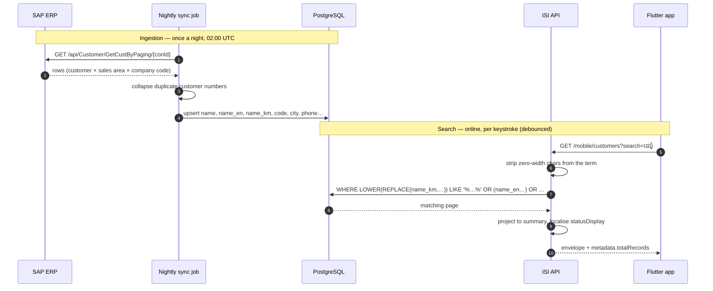

# Search Customers — Mobile

**Purpose:** free-text customer search for the Flutter field sales app.
**Scope:** the `search` parameter on `GET /api/v1/mobile/customers`.
**Status:** Active · **Last updated:** 2026-08-28

Search is not a separate endpoint. It is one parameter on the list endpoint, so
every filter, sort and paging rule in [filter-customer.md](filter-customer.md)
applies unchanged to a search result.

---

## Contents

1. [The request](#the-request)
2. [What is searched](#what-is-searched)
3. [Khmer search and why it needs care](#khmer-search-and-why-it-needs-care)
4. [Flow: SAP → backend → mobile](#flow-sap--backend--mobile)
5. [Combining search with filters](#combining-search-with-filters)
6. [Client implementation](#client-implementation)
7. [Not found locally? Fall back to by-code](#not-found-locally-fall-back-to-by-code)
8. [Performance](#performance)
9. [Checklist](#checklist)

---

## The request

```
GET /api/v1/mobile/customers?search=ដេប៉ូ%20តាំង&pageSize=25
Authorization: Bearer <access_token>
Accept-Language: km-KH
```

`search` is a single free-text term. There is no field-qualified syntax
(`name:foo`), no boolean operator and no wildcard character — the server wraps the
term in `%…%` itself. A term containing `%` or `_` is treated literally.

Response is the ordinary list envelope. `metadata.totalRecords` is the match count,
so a "1,965 results" header costs nothing extra.

---

## What is searched

Seven columns, OR-ed together:

| Column | Matched as | Why |
|---|---|---|
| `name` | contains, case-insensitive | Legal / registered name |
| `nameEn` | contains, case-insensitive | English trading name — what `shopName` renders under `en-US` |
| `nameKm` | contains | Khmer shopfront name — what `shopName` renders under `km-KH` |
| `code` | contains, case-insensitive | Customer number, so a partial paste works |
| `city` | contains, case-insensitive | "Phnom Penh" narrows to a city |
| `sapCustomerId` | contains, case-insensitive | The ERP number when it differs from `code` |
| `phone` | contains | Digits as stored — see below |

**All three name columns are searched, not just the legal name.** This matters more
than it sounds. In the current production extract 5,956 of 6,010 customers have a
Khmer name that differs from their legal name, and `shopName` — the field the list
screen actually renders — comes from `nameKm` under a Khmer locale. Searching only
the legal name meant a representative could read a shop's name off the screen, type
it back, and get nothing.

### Phone matching is on stored digits

Phone numbers are normalised on write: formatting is stripped and only digits and a
leading `+` survive. `012 345 678` is stored as `012345678`. Searching `012 345`
therefore does **not** match, because the space is still in your term.

Strip non-digits client-side before searching a phone number:

```dart
final term = looksLikePhone(input) ? input.replaceAll(RegExp(r'[^0-9+]'), '') : input;
```

### Not searched

`ownerName` (contact person), `territory`, `district`, `province`, contact names, and
the SAP classification codes. Filter on `territory` / `district` / `province`
instead — they are exact-match parameters, which is both faster and unambiguous.

---

## Khmer search and why it needs care

Two properties of the SAP master data shape how this works.

### 1. Zero-width characters

SAP's Khmer names carry zero-width spaces and joiners as word-break hints. In the
current extract **1,130 of 5,990 Khmer names contain at least one**. They are
invisible on screen, and a representative reading a name and typing it back cannot
reproduce them:

```
stored    ដេប៉ូ<ZWSP><ZWSP><ZWSP> រស្មី សៀមរាប
typed     ដេប៉ូ រស្មី សៀមរាប
```

A naive `LIKE` fails on that. The server therefore strips `U+200B`, `U+200C` and
`U+200D` from **both** the search term and the three name columns before comparing,
in SQL. You do not need to pre-process the term — but you must not "helpfully"
insert or preserve them either. Send what the user typed.

### 2. Khmer has no letter case

Lower-casing is a no-op for Khmer script, so case-insensitivity is a property of the
Latin columns only. Nothing for the client to do; it is noted because it explains why
the same code path serves both scripts.

### Verified behaviour

| Term | Results | Note |
|---|---|---|
| `ដេប៉ូ` | 2,552 | The word "depot" — very common |
| `ដេប៉ូ តាំង` | 33 | Two words, matched across a stored zero-width space |
| `រស្មី សៀមរាប` | 1 | Matched a name stored with three zero-width spaces |
| `DEPOT` | 2,612 | The Latin equivalent, from `nameEn` |
| `6100000017` | 1 | Exact customer number |

---

## Flow: SAP → backend → mobile

Search runs entirely against the platform database. SAP is never consulted on the
search path — but SAP is where the searchable text comes from.



Three consequences worth designing around:

- **A customer created in SAP today is not searchable until the next sync runs.**
  For that case use [by-code lookup](#not-found-locally-fall-back-to-by-code), which
  does reach SAP.
- **Search needs connectivity.** It is a server query, not a local one. For offline
  search, run it against the device's own synced copy — see
  [get-customer.md](get-customer.md) for how to build that copy.
- **The text SAP sends is the text you search.** Names arrive as the ERP holds them,
  including the `(No Use)` and `(NO USE)` prefixes on retired records. Filter those
  out with `status` if they should not appear.

---

## Combining search with filters

`search` AND-s with every other parameter. This is the useful pattern for a field
app — narrow to the rep's own active customers, then search within them:

```
GET /api/v1/mobile/customers
      ?search=ដេប៉ូ
      &status=Active
      &territory=PP-CENTRAL
      &pageSize=25
```

Sorting also applies. Note that results are **not** ranked by relevance — there is no
scoring. Ordering is whatever `sort` says, defaulting to `createdAt`. If you want the
closest match first you must rank client-side within the page.

---

## Client implementation

```dart
class CustomerSearch {
  CustomerSearch(this._api);
  final Dio _api;

  Timer? _debounce;
  CancelToken? _inFlight;

  /// Debounced, cancelling. Khmer input arrives one cluster at a time, so an
  /// un-debounced search fires several requests per visible character.
  void onChanged(String raw, void Function(List<CustomerSummary>, int) onResult) {
    _debounce?.cancel();
    _debounce = Timer(const Duration(milliseconds: 350), () async {
      final term = raw.trim();

      // Below two characters the result set is most of the table; not worth a round trip.
      if (term.length < 2) return onResult(const [], 0);

      _inFlight?.cancel('superseded');
      _inFlight = CancelToken();

      try {
        final res = await _api.get(
          '/mobile/customers',
          queryParameters: {
            'search': _normalise(term),
            'pageSize': 25,
            'status': 'Active',       // omit if retired records should show
          },
          cancelToken: _inFlight,
        );
        final body = res.data;
        onResult(
          [for (final c in body['data']['customers']) CustomerSummary.fromJson(c)],
          body['metadata']['totalRecords'],
        );
      } on DioException catch (e) {
        if (!CancelToken.isCancel(e)) rethrow;   // ignore superseded requests
      }
    });
  }

  /// Only phone-looking input is rewritten. Khmer and Latin text is sent verbatim —
  /// the server does the zero-width normalisation.
  String _normalise(String term) =>
      RegExp(r'^[\d\s+()-]{6,}$').hasMatch(term)
          ? term.replaceAll(RegExp(r'[^0-9+]'), '')
          : term;
}
```

Points that matter in the field:

- **Debounce 300–400 ms.** A Khmer keyboard commits a cluster at a time; each commit
  is a change event.
- **Cancel the superseded request.** On a 3G link responses arrive out of order, and
  without cancellation an older response can overwrite a newer one.
- **Two-character minimum.** `ដ` matches thousands of rows.
- **Show `totalRecords`, page the rest.** Do not fetch 2,552 rows to display a count.

---

## Not found locally? Fall back to by-code

When a representative types a full customer number and search returns nothing, the
number may have been created in SAP since the last sync. `GET /customers/by-code/{code}`
checks the database first and asks SAP only on a miss, storing whatever it finds:

```dart
Future<Customer?> resolve(String code) async {
  final hits = await search(code);
  if (hits.isNotEmpty) return hits.first;

  // Portal surface: different envelope and a different customer shape.
  final res = await _api.get('/customers/by-code/$code',
      options: Options(validateStatus: (s) => s == 200 || s == 404));
  return res.statusCode == 404 ? null : PortalCustomer.fromJson(res.data['data']);
}
```

Only on an explicit full-code lookup. Never on the keystroke path — it can reach out
to the ERP, and it answers with the **portal** envelope (`data` + `meta`), not the
mobile one, so it needs its own parser.

---

## Performance

Search is a sequential scan with `LIKE '%term%'` over the name columns. No B-tree
index can serve a leading wildcard, and the zero-width stripping wraps the columns in
`REPLACE`, which would defeat one anyway. At 6,010 customers that is comfortably
fast.

If the table grows past a few tens of thousands of rows, the fix is a trigram index
in a migration:

```sql
CREATE EXTENSION IF NOT EXISTS pg_trgm;
CREATE INDEX ix_customers_name_km_trgm
  ON customers USING gin (lower(replace(name_km, U&'\200B', '')) gin_trgm_ops);
```

Measure first — a GIN index is not free to maintain, and the nightly sync writes
every row.

---

## Checklist

- [ ] Debounced 300–400 ms
- [ ] Superseded requests cancelled
- [ ] Two-character minimum before calling
- [ ] Khmer and Latin terms sent verbatim — no client-side zero-width handling
- [ ] Phone-shaped input stripped to digits before sending
- [ ] `Accept-Language` sent, so `shopName` and search agree on which name they mean
- [ ] `metadata.totalRecords` used for the count, not `customers.length`
- [ ] Results paged, not fetched whole
- [ ] No relevance assumed — order comes from `sort`
- [ ] by-code fallback only on a full-code lookup, with its own parser

---

## See also

- [get-customer.md](get-customer.md) — the list endpoint and offline sync
- [filter-customer.md](filter-customer.md) — filters, sorting, paging
- [mobile.md](mobile.md) — the whole mobile customer surface
