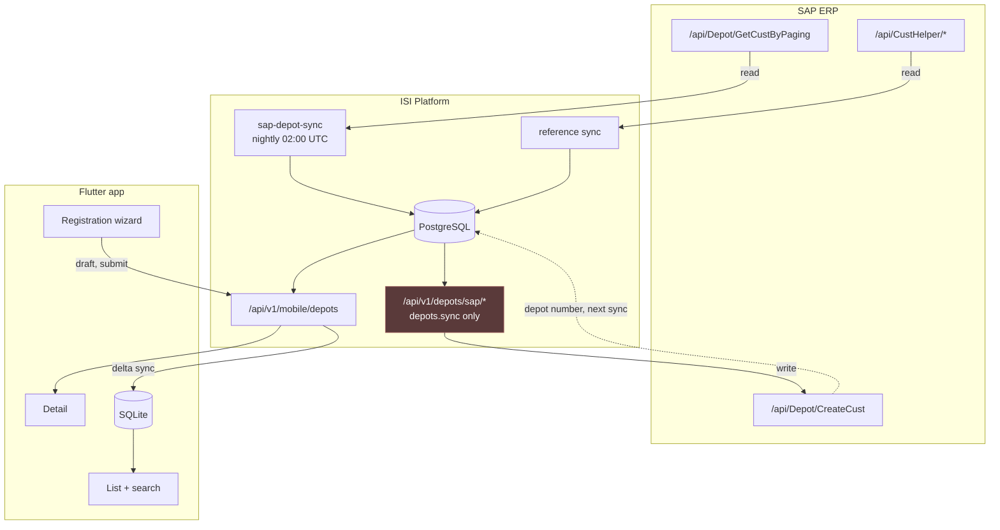

# Depots — Mobile API

Documentation for the depot endpoints consumed by the Flutter field sales app.

**Start with [mobile.md](mobile.md)** — the whole surface in one page, including the
response envelope, localisation, money and error codes. The pages below go deeper on
one operation each.

| Document | Covers |
|---|---|
| [mobile.md](mobile.md) | The whole surface: envelope, localisation, permissions, error codes, Dart model |
| [get-depot.md](get-depot.md) | `GET /mobile/depots` — the paged list and the full offline-sync contract |
| [get-depot-by-id.md](get-depot-by-id.md) | `GET /mobile/depots/{id}` — the 52-field record and its field groups |
| [create-depot.md](create-depot.md) | The three creation paths, the 46-field draft wizard, evidence photos, and delivery to SAP |
| [../registration.md](../registration.md) | **The dropdown catalogues** (`GET references`) plus the draft wizard, request by request |
| [edit-depot.md](edit-depot.md) | `PUT /mobile/depots/{id}` — replace semantics and the contacts rules |
| [search-depot.md](search-depot.md) | The `search` parameter, including Khmer text handling |
| [filter-depot.md](filter-depot.md) | Every filter, sort key and paging rule on the **list** endpoint |

## Reading order for a new integrator

1. **[mobile.md](mobile.md)** — envelope, localisation, error format. Nothing else
   makes sense first.
2. **[get-depot.md](get-depot.md)** — build the sync before any screen. The
   watermark rules are the ones that bite.
3. **[get-depot-by-id.md](get-depot-by-id.md)** — the detail screen.
4. **[search-depot.md](search-depot.md)** and
   **[filter-depot.md](filter-depot.md)** — the list screen's controls.
5. **[create-depot.md](create-depot.md)** — registration. Read the path
   comparison before choosing one. The **dropdown data the form binds to**
   is in [../registration.md](../registration.md) — `GET references`, called once when
   the form opens.
6. **[edit-depot.md](edit-depot.md)** — read the PUT-replaces warning before
   writing the edit screen.

Authentication is separate: see
[../../../authentication/api/mobile.md](../../../authentication/api/mobile.md).

## The three flows in one picture

Read paths are nightly and unattended. The write path to SAP is deliberately **not**
reachable from the field app — it needs `depots.sync`, which representatives do not
hold. A rep's job ends when the record is safely on the server.

## Conventions in these documents

- Every example is verified against a running instance, not written from the contract.
- Counts quoted from data (`6,010 depots`, `5,956 Khmer names`) come from the
  current SAP extract and will drift.
- `status` is a stable code to branch on; `statusDisplay` is a localised label to
  render. Never the reverse.
- All timestamps are UTC ISO-8601.
