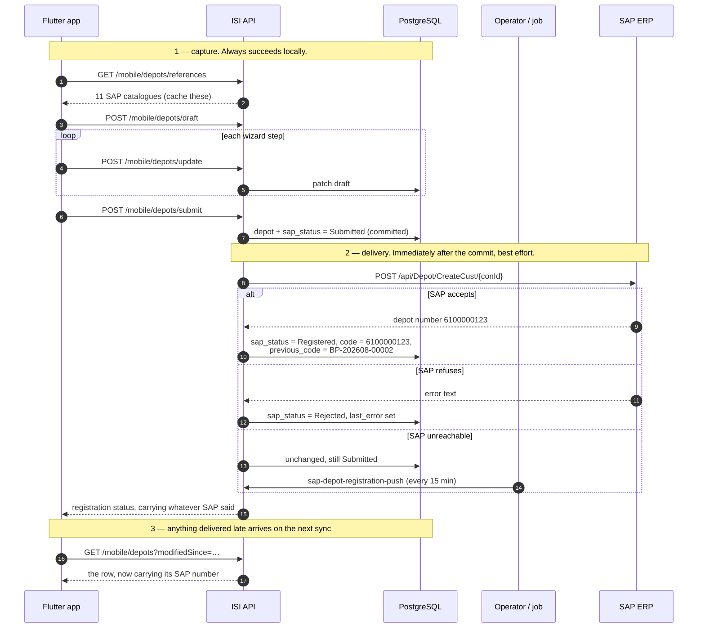

# Create Depot — Mobile

**Purpose:** registering a new depot from the field, including delivery to SAP.
**Scope:** `POST /api/v1/mobile/depots`, `POST /api/v1/mobile/depots/business-partner`,
and the draft wizard under `/api/v1/mobile/depots/draft*`.
**Status:** Active · **Last updated:** 2026-08-28

There are **three** creation paths and they are not interchangeable. Pick by whether
the shop must reach SAP, and whether the form is long enough to lose.

---

## Contents

1. [Which path to use](#which-path-to-use)
2. [Path A — simple create](#path-a--simple-create)
3. [Path B — business partner for SAP](#path-b--business-partner-for-sap)
4. [Path C — the draft wizard](#path-c--the-draft-wizard)
5. [Step 5 — documents and photos](#step-5--documents-and-photos)
6. [Flow: SAP → backend → mobile](#flow-sap--backend--mobile)
7. [Two statuses](#two-statuses)
8. [Validation rules](#validation-rules)
9. [Offline strategy](#offline-strategy)
10. [Checklist](#checklist)

---

## Which path to use

| | Path A `POST /mobile/depots` | Path B `POST …/business-partner` | Path C draft wizard |
|---|---|---|---|
| Vocabulary | Platform (`shopName`, `city`) | **SAP** (`name1`, `salesOrg`) | SAP, 46 fields |
| Accepts `creditLimit` | Yes | Yes | Yes — survives to submission |
| Reaches SAP | No | No — queued for later | No — until submitted |
| Returns | Full depot | Registration status | Draft, then a depot |
| Survives app kill | No | No | **Yes, server-side** |
| Use for | A quick local contact | A shop that must be in the ERP | A long multi-screen form |

**None of the three calls SAP inline.** A representative standing at a counter has no
route to the ERP and often no signal at all, and their registration still has to
succeed. Delivery to SAP is an operator action or a scheduled job.

**Do not build a "sync to SAP now" button.** Everything under `/depots/sap/*`
requires `depots.sync`, which representatives deliberately do not hold — they get a
bare 403 with no `errorCode`, because the pipeline rejects it before a handler runs.

---

## Path A — simple create

`POST /api/v1/mobile/depots` · `depots.create` · **201**

Platform vocabulary, minimal fields. For a depot that does not need to exist in
SAP — a prospect, a cash buyer, a contact captured on a visit.

```json
{
  "depotCode": "ISI-PP0099",
  "shopName": "Sok Heng Hardware",
  "type": "Retailer",
  "phone": "012 345 678",
  "addressLine1": "Street 271, Sangkat Toul Tumpung",
  "city": "Phnom Penh",
  "district": "Chamkarmon",
  "province": "Phnom Penh",
  "ownerName": "Sok Heng",
  "whatsapp": "+85512345678",
  "territory": "PP-CENTRAL",
  "latitude": 11.5449,
  "longitude": 104.9160,
  "creditLimit": 5000,
  "creditTermDays": 30,
  "enName": "Sok Heng Hardware",
  "khName": "ហាង សុខ ហេង",
  "contacts": [
    { "name": "Sok Heng", "phone": "012345678", "position": "Owner", "isPrimary": true }
  ]
}
```

Returns the full depot plus a `Location` header. The depot starts in `Draft`
and cannot trade until someone holding `depots.approve` activates it. Ownership
defaults to the caller, so a rep registering a shop owns that relationship without a
second call.

**`depotCode` must be unique** — a duplicate is `409 Depot.DuplicateCode`. The
SAP block is not accepted here; SAP assigns it.

---

## Path B — business partner for SAP

`POST /api/v1/mobile/depots/business-partner` · `depots.create` · **200**

### Why the field names look like SAP

Because they are SAP's. The app already fills its dropdowns from
`GET /mobile/depots/references` — documented request by request in
[../registration.md](../registration.md) — so the representative is picking real SAP
codes.
Renaming them into platform vocabulary here and back on the push would be two lossy
translations for no gain.

**The body is SAP's `CreateCust` shape, field for field.** All 46 of SAP's fields are
accepted, so a payload written against SAP's own schema can be posted here unchanged. A
test asserts this, so the two cannot drift apart. Four fields are the platform's own
and SAP never sees them: `territory`, `taxNumber`, `submitToSap` and `creditLimit`.

Binding is **case-insensitive**, which is what lets SAP's inconsistent capitalisation
through: `Name1`, `name1`, `SALESBLOCK` and `salesBlock` all bind. Coordinates are
accepted both quoted and unquoted — SAP types them as strings, this API as numbers, and
neither client should have to care.

A ready-to-post body, every code checked against the live catalogues, is kept beside
this page: [create-business-partner-sample.json](create-business-partner-sample.json).

Three fields need explaining:

| Field | Behaviour |
|---|---|
| `creditLimit` | Optional decimal, in the depot's currency. The figure the representative agreed at the counter. **Omit it and the depot stores `0`**, which is what every registration did before the field existed; a deliberate `0` means cash-only trade and is stored as `0`. Bounds are `0` to `1,000,000,000` — outside that is a `400` naming `CreditLimit`. **Not sent to SAP:** `BpCreateRequestDto` has no credit-limit field (its only credit field is `CreditControlArea`, an area key), because in the ERP a limit lives in credit management rather than on the business-partner master. The nightly depot sync overwrites this with SAP's own figure once SAP has one. |
| `DepotNumber` | Must be empty. SAP issues the number; a request that carries one is describing an update, and is **refused** rather than ignored — creating a second business partner for a shop SAP already holds cannot be undone. |
| `Commit` | Passed to SAP verbatim. `false` asks SAP to validate without writing, and the depot stays `Submitted` because SAP created nothing and there is no number to adopt. The platform's own record is written either way. |

```jsonc
{
  "Commit": true,
  "DepotNumber": "",          // must be empty; SAP issues it
  "PartnerCategory": "2",
  "PartnerGroup": "Z001",
  "BpRole": "ZFLCU1",
  "SearchTerm1": "PHNOM PENH",
  "SearchTerm2": "STEELFORCE TEST",
  "Name1": "Doc Sample Hardware",
  "Name2": "",
  "Name3": "ហាងគំរូ",
  "CoName": "",
  "District": "Posen Chey",
  "Country": "KH",
  "Region": "R01",
  "City": "Phnom Penh",
  "Street": "Street 271",
  "HouseNo": "12B",
  "PostalCode": "12000",
  "Latitude": "11.5318716",
  "Longitude": "104.8676985",
  "Language": "E",
  "Telephone": "023456789",
  "MobilePhone": "012345678",
  "OrderBlock": "",
  "SalesOrg": "0001",              // the sales area is not optional in practice -
  "DistributionChannel": "10",     // SAP answers "FAILED - Sales Area maintenance"
  "Division": "10",                // when it is incomplete
  "DepotGroup": "01",
  "SalesOffice": "0001",
  "SalesGroup": "010",
  "PriceGroup": "11",
  "PricingProc": "1",
  "DeliveryPriority": "01",
  "ShippingCondition": "01",
  "Currency": "USD",
  "PaymentTerms": "T014",
  "CreditControlArea": "0001",
  "TaxCountry": "KH",
  "TaxType": "MWST",
  "TaxClass": "0",
  "PartnerFunction": "VE",
  "PartnerCounter": "001",         // three digits - not a personnel number
  "PersonnelNumber": "00001000",
  "AccountGroup": "Z001",
  "SALESBLOCK": "",
  "BLOCKFLAG": "",

  // platform-only, never sent to SAP
  "territory": "PP-CENTRAL",
  "submitToSap": true
}
```

### The response is a status, and it carries SAP's own answer

The depot is pushed to SAP as part of this request, so the response tells you what
the ERP said. **SAP accepted it:**

```json
{
  "success": true,
  "message": "Depot created successfully.",
  "data": {
    "depotId": "01a03189-9670-7599-98ac-45ebaf277899",
    "depotCode": "6100006245",
    "name": "Doc Sample Hardware",
    "sapStatus": "Registered",
    "sapDepotNumber": "6100006245",
    "previousCode": "BP-202608-00002",
    "submittedAt": "2026-09-02T07:30:10Z",
    "registeredAt": "2026-09-02T07:30:12Z",
    "lastError": null,
    "attemptCount": 1,
    "sap": {
      "depotNumber": "6100006245",
      "committed": true,
      "messages": []
    }
  }
}
```

**SAP refused it** — note that the platform's record survives, unchanged and still
editable:

```json
{
  "depotCode": "BP-202608-00002",
  "sapStatus": "Rejected",
  "sapDepotNumber": null,
  "lastError": "FAILED - Sales Area maintenance, sy-subrc: 0",
  "attemptCount": 1,
  "sap": {
    "depotNumber": null,
    "committed": true,
    "messages": [
      { "type": "E", "id": "ZBP", "number": "017",
        "message": "FAILED - Sales Area maintenance, sy-subrc: 0" }
    ]
  }
}
```

**SAP could not be reached** — `sap` is `null`, which is deliberately different from an
empty block. Null means the conversation never happened; an empty `messages` array means
SAP answered and had nothing to say.

```json
{
  "depotCode": "BP-202608-00002",
  "sapStatus": "Submitted",
  "lastError": "All SAP API endpoints are unreachable.",
  "attemptCount": 1,
  "sap": null
}
```

The depot is safe in all three cases. Only the first one changes its code.

### Testing this repeatedly

SAP runs a **duplicate check** before it does anything else, matching on name and
address rather than on a key, and answers `R11/301 - Business partner NNNNNNNNNN is a
duplicate`. So a second create with the same shop details is refused however correct the
payload is.

Change `Name1`, `Street`, `HouseNo` and `MobilePhone` between runs. Reusing them tests
the duplicate check, not the registration.

A rejected create can still leave a business partner behind in SAP — `CreateCust` has no
idempotency key, and a create that fails during sales-area maintenance has been observed
to leave the partner's general data in place. The number appears in the duplicate
message; it needs clearing at the SAP end, and it is why repeated failed attempts are
not free.

**Read `sap.messages` rather than `lastError` when showing a person what went wrong.**
`lastError` is those messages flattened into one line; the array keeps each message's
class and number, which is the part somebody at the SAP end can actually look up.

To render a detail screen straight afterwards, follow up with
`GET /mobile/depots/{depotId}`.

`depotCode` is a **placeholder** (`BP-YYYYMM-NNNNN`). The shop needs *a* code
immediately — documents attach to it, the list screen shows it — but it is not the code
the shop will keep.

**When SAP accepts the record, the depot is renamed to the number SAP issued**, and
from then on `code` and `sapDepotNumber` are the same value:

```text
before   "code": "BP-202608-00002",  "sapDepotNumber": null
after    "code": "6100000123",       "sapDepotNumber": "6100000123"
```

That is what every one of the 6,010 depots synced down from SAP looks like, and a
registered depot is meant to be indistinguishable from them.

**What the app must do about it:** key your local records on `depotId`, never on
`depotCode`. The GUID never changes; the code does, exactly once, without the device
being told. On the next delta sync the depot arrives with its new code and the app
should overwrite the old one.

The placeholder is not lost — `GET /mobile/depots/{depotId}` returns it as
`previousCode`, so a screen can say *"formerly BP-202608-00002"* rather than look like a
different shop. The portal's `GET /depots/by-code/{code}` and the document endpoints
accept it as well, so a code written on a paper form still resolves.

### Only `name1` is required — but five fields decide whether it can ever reach SAP

A blank `name1` is the only thing that fails the request:

```json
{ "status": 400, "errorCode": "Depot.NameRequired" }
```

Everything else is optional, exactly as in SAP. **But a record missing
`accountGroup`, `bpRole`, `partnerGroup`, or the sales area
(`salesOrg` + `distributionChannel` + `division`) cannot be registered later** — the
push marks it `Rejected` without even calling SAP.

Treat those five as required in your form even though the server does not. A record
that saves and can never be delivered is worse than a validation error.

### `submitToSap`

| Value | Effect |
|---|---|
| `true` (default) | `sapStatus: Submitted`. The next operator push delivers it. |
| `false` | `sapStatus: NotSubmitted`. Stays local until somebody queues it. |

Send `true` for a normal field registration. Send `false` only if your flow has a
review step before the shop goes near the ERP.

---

## Path C — the draft wizard

Path B is one request with ~25 fields. The full SAP business partner has **46**. A
form that long, filled on a phone in a market, will be interrupted — so the draft
lives on the server, not in app state.

Seven endpoints, all `depots.create`:

| Method | Route | Purpose |
|---|---|---|
| `POST` | `/mobile/depots/draft` | Start a draft. Returns `draftId` + 46 empty fields |
| `POST` | `/mobile/depots/update` | Patch fields. Call after every step |
| `POST` | `/mobile/depots/submit` | Convert the draft into a depot |
| `GET` | `/mobile/depots/draft/active` | Resume — the caller's open draft |
| `GET` | `/mobile/depots/drafts` | All the caller's drafts |
| `GET` | `/mobile/depots/draft/{draftId}` | One draft |
| `DELETE` | `/mobile/depots/draft/{draftId}` | Discard |

### Starting

`POST /mobile/depots/draft` with an empty body:

```json
{
  "data": {
    "draftId": "01a0477f-2d66-7a62-a564-bda8b1a85648",
    "status": "Draft",
    "isEditable": true,
    "submittedDepotId": null,
    "submittedAt": null,
    "createdAt": "2026-08-28T08:31:52Z",
    "updatedAt": null,
    "fields": { "name1": null, "partnerCategory": "2", "…": "46 in total" }
  }
}
```

`partnerCategory` is pre-set to `2` (organisation) — the common case. The 46 fields
cover names, the business-partner block, address, contact, sales area, pricing, tax
and blocking flags.

### Updating

`POST /mobile/depots/update` — a patch, so send only what changed:

```json
{ "draftId": "01a0477f-…", "fields": { "name1": "Sok Heng Hardware", "city": "Phnom Penh" } }
```

Call it at the end of each wizard step. That is the whole point: the app can be
killed between steps and nothing is lost.

### Resuming

`GET /mobile/depots/draft/active` on app launch. If it returns a draft, offer to
resume:

```dart
Future<void> onOpenRegistration() async {
  final res = await api.get('/mobile/depots/draft/active');
  final draft = res.data['data'];
  if (draft != null && draft['isEditable'] == true) {
    if (await askResume(draft)) return openWizardAt(draft);
    await api.delete('/mobile/depots/draft/${draft['draftId']}');
  }
  final fresh = await api.post('/mobile/depots/draft');
  openWizardAt(fresh.data['data']);
}
```

`isEditable` is false once submitted — a submitted draft is a receipt, not a form.
Check it before opening the wizard.

### Submitting

`POST /mobile/depots/submit` with `{ "draftId": "…" }`. The draft becomes a
depot; `submittedDepotId` is set and `isEditable` goes false. Same five-field
rule as Path B applies for later SAP delivery.

---

## Step 5 — documents and photos

The wizard's last step captures on-site evidence: storefront, inside-store and ID card
photographs, plus an optional patent/tax or VAT certificate.

**Documented separately — see [depot-documents.md](depot-documents.md).** It is
a distinct sub-resource with its own five endpoints, its own per-slot file rules and
its own public-URL policy, so it gets its own page rather than a section here.

The two things that matter for *this* flow:

- **Upload happens after the depot exists**, using the `depotId` the
  registration returned. The endpoint accepts the platform id or, once assigned, the
  SAP depot number.
- **Upload is independent of the depot's status** and of the required-document
  rule. A rep whose upload fails must not lose the registration, so the depot saves
  regardless and `isComplete` on the documents endpoint is what gates the Send button.

---

## Flow: SAP → backend → mobile

Registration is the direction the other documents do not cover: **mobile → backend →
SAP**, with delivery deferred.



The representative's job ends at step 1. Steps 2 and 3 happen without them, and the
outcome reaches the device through the ordinary delta sync — no special polling.

---

## Two statuses

A depot carries both, and they move independently:

| Field | Values | Question it answers |
|---|---|---|
| `status` | `Draft` `PendingApproval` `Active` `Suspended` `Closed` | May this shop trade? |
| `sapStatus` | `NotSubmitted` `Submitted` `Syncing` `Registered` `Rejected` | Does the ERP know about it? |

A depot registered from the field is `status: Draft` **and** `sapStatus: Submitted`
at the same time — awaiting a human approval here, awaiting delivery there. Neither
implies the other.

```dart
String sapLabel(String s) => switch (s) {
      'NotSubmitted' => 'Not sent to SAP',
      'Submitted'    => 'Waiting to reach SAP',
      'Syncing'      => 'Sending to SAP…',
      'Registered'   => 'In SAP',
      'Rejected'     => 'SAP rejected — office will fix',
      _              => 'Unknown',        // never crash on an unfamiliar value
    };
```

Render it **read-only**. The rep cannot retry — that needs `depots.sync`.

Reaching `Registered` also changes the depot's `code` — see
[the response section](#the-response-is-a-status-not-a-depot).

`lastError` is SAP's own English message, kept verbatim so the office can act on it.
Show the label to the rep and log the detail.

---

## Validation rules

Enforced on every path:

| Rule | Failure |
|---|---|
| Name required | `400 Depot.NameRequired` |
| Code unique (Path A) | `409 Depot.DuplicateCode` |
| Latitude and longitude together | `400 General.Validation` |
| `(0,0)` rejected | `400 Depot.CoordinatesMissing` |
| `creditTermDays` 0–180 | `400 Depot.CreditTermInvalid` |
| `creditLimit` ≥ 0 | `400 Depot.CreditLimitNegative` |
| Known `type` | `400 General.Validation` |
| At most 25 contacts | `400 Depot.TooManyContacts` |

**Phone numbers accept human formatting.** `012 345 678` and `+855-12-345-678` both
work — spaces, dashes and brackets are stripped, not rejected. Do not make a
representative retype a number because of a space.

**Send `null` coordinates when the GPS fix fails, never zeros.** `(0,0)` is a valid
point in the Gulf of Guinea and what a device reports on a failed fix:

```dart
final pos = await tryGetPosition();
body['latitude']  = pos?.latitude;    // null, not 0.0
body['longitude'] = pos?.longitude;
```

An unknown `type` and a lone latitude both arrive as `General.Validation` with a
per-field `errors` map, because request validation runs before the domain. Handle
that map as your default error path.

---

## Offline strategy

The draft wizard is server-side, so it needs connectivity. For genuinely offline
capture, queue locally and replay:

```dart
Future<void> register(Map<String, dynamic> body) async {
  final localId = await outbox.enqueue('depots.create', body);
  try {
    final res = await api.post('/mobile/depots/business-partner', data: body);
    await outbox.complete(localId, serverId: res.data['data']['depotId']);
  } on DioException catch (e) {
    final code = e.response?.statusCode;
    if (code != null && code >= 400 && code < 500) {
      // The server will never accept this. Surface it; do not retry forever.
      await outbox.reject(localId, e.response?.data?['errorCode']);
    }
    // 5xx or no connection: leave queued, retry on the next connectivity event.
  }
}
```

Two rules for the outbox:

- **Do not retry a 4xx.** A duplicate code or a blank name will fail identically
  forever. Mark it for the user to fix.
- **Make the replay idempotent.** Generate `depotCode` client-side and keep it
  stable across retries, so a response lost to a dropped connection produces
  `409 Depot.DuplicateCode` on replay rather than a second depot. Treat that
  409 as success and reconcile by code.

---

## Checklist

- [ ] Correct path chosen (A local, B SAP-bound, C long form)
- [ ] Reference catalogues cached and used for every SAP code dropdown
- [ ] `accountGroup`, `bpRole`, `partnerGroup` and the sales area treated as required
- [ ] `submitToSap: true` for normal field registration
- [ ] Draft resumed via `/draft/active` on launch; `isEditable` checked
- [ ] `POST /update` called at the end of every wizard step
- [ ] Path B response read as a status, with a follow-up GET for the record
- [ ] `status` and `sapStatus` shown as separate things; `sapStatus` read-only
- [ ] `lastError` logged, never shown raw to a rep
- [ ] Null coordinates on GPS failure, never `0,0`
- [ ] Phone formatting left alone
- [ ] Outbox does not retry 4xx; replay is idempotent on `depotCode`
- [ ] Evidence upload follows [depot-documents.md](depot-documents.md)
- [ ] No "sync to SAP" button in the field app

---

## See also

- [depot-documents.md](depot-documents.md) — the evidence photos this registration needs

- [edit-depot.md](edit-depot.md) — updating an existing depot
- [../registration.md](../registration.md) — `GET references`, the dropdown catalogues this form binds to
- [../registration.md](../registration.md) — the operator-side registration surface
