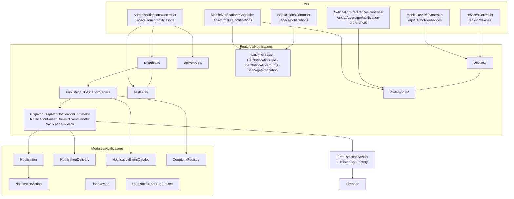

# Notification — Architecture

**Purpose:** where the notification pieces sit and the decisions that shape them.
**Scope:** the feature's internals. System-level view is in
[blueprint/notification-architecture.md](../../blueprint/notification-architecture.md).
**Status:** Active · **Last updated:** 2026-08-27

---

## Where the pieces sit

---

## Six controllers, two of everything

There is a mobile controller *and* a shared controller for notifications, devices
and preferences. This is not accidental duplication:

| Concern | Shared route | Mobile route |
|---|---|---|
| Inbox | `/api/v1/notifications` | `/api/v1/mobile/notifications` |
| Devices | `/api/v1/devices` | `/api/v1/mobile/devices` |
| Preferences | `/api/v1/users/me/notification-preferences` | `/api/v1/mobile/notifications/preferences` |

The shared controllers use `ApiResponse<T>` and `POST` for state changes; the
mobile controllers use the mobile envelope and `PATCH` for read-marking. The
mobile surface is a BFF with a different representation, on the same aggregate.

> This *is* a real cost: two surfaces to keep consistent. It was accepted because
> the alternative — one surface serving both — makes every mobile envelope change a
> breaking change for the portal.

---

## The load-bearing decision: inbox first

`NotificationService` writes the `Notification` row **before** consulting
preferences or attempting any channel.

Every other ordering was rejected:

| Alternative | Why not |
|---|---|
| Attempt push, write the row on success | A Firebase outage loses the notification entirely |
| Write the row only if some channel is enabled | A user who disabled everything gets nothing, including the record they can consult later |
| Write the row asynchronously after dispatch | A crash between dispatch and write means a push with no matching inbox entry — the worst outcome, because the user knows something happened and cannot find it |

---

## Push is not wrapped in `AddHttpClient`

`FirebaseAppFactory` is a singleton; `FirebasePushSender` is scoped. **The Firebase
Admin SDK owns its own transport, including retries** — putting an
`IHttpClientFactory` handler in front of it would fight its retry logic and its
connection reuse.

Without credentials, `DisabledPushSender` is registered. Push becomes a no-op and
the inbox keeps working, so a developer with no Firebase project can still exercise
the whole feature.

---

## Catalogues are server-side data

`NotificationEventCatalog` and `DeepLinkRegistry` are in the **domain**, not in a
client constant file. An event type or deep-link destination is therefore versioned
with the API. The trade is that adding a destination needs a backend deploy — worth
it, because the alternative is three clients disagreeing about what `route` means.

---

## Related

- [Notification architecture](../../blueprint/notification-architecture.md) — the system view
- [Workflow](workflow.md) · [Data model](data-model.md)
- [API architecture § 4](../../blueprint/api-architecture.md#4-controller-organisation) — when a BFF controller is justified
