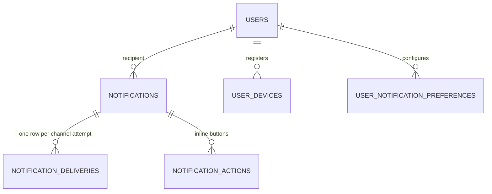

# Notification — Data Model

**Purpose:** the tables, entities and enumerations behind notifications.
**Scope:** four tables and seven enumerations.
**Status:** Active · **Last updated:** 2026-08-27

**Implementation:** `src/ISI.Domain/Modules/Notifications/` ·
`src/ISI.Persistence/Configurations/NotificationConfigurations.cs`

---

## Entities

| Table | Role |
|---|---|
| `Notifications` | The aggregate root: recipient, category, priority, state, payload, deep link |
| `NotificationDeliveries` | One row per channel attempt, with its status |
| `UserDevices` | The push registry: platform and FCM token per device |
| `UserNotificationPreferences` | Per-user, per-category channel opt-in |

`NotificationAction` is owned by the aggregate. Ids are strongly typed —
`NotificationIds.cs`.

---

## Enumerations

| Enum | Values |
|---|---|
| `NotificationCategory` | `Assignment` `Quote` `Order` `Finance` `Kpi` `Approval` `Account` `System` `Announce` `Security` |
| `NotificationPriority` | tiers — see `NotificationEnums.cs` |
| `NotificationState` | `Unread` `Read` `Actioned` `Dismissed` `Expired` `ResolvedElsewhere` |
| `NotificationChannel` | `Inbox` `Push` `Email` `Sms` `Web` |
| `NotificationDeliveryStatus` | `Queued` `Sent` `Delivered` `Failed` `Skipped` |
| `DevicePlatform` | `Unknown` `Android` `IOS` `Web` |
| `NotificationActionType` | `DeepLink` `ApiCall` |

**Wire values are upper-case** (`ASSIGNMENT`); the **enum name is what is stored**.
That split matters: the database stays readable in a query, and the JSON contract
stays stable if an enum is renamed in C#.

`DevicePlatform.Unknown = 0` is deliberate — a device that registers without a
recognised platform is stored rather than rejected, because a push that cannot be
platform-tuned is better than no device row at all.

---

## Catalogues (code, not tables)

| Type | Holds |
|---|---|
| `NotificationEventCatalog` | Every raisable event type |
| `DeepLinkRegistry` | Valid destinations: `route` `stop` `quotation` `order` `customer` `dashboard` `approval` |

These are domain constants, not configuration. Adding a destination is a code
change — see [architecture.md](architecture.md#catalogues-are-server-side-data).

---

## Migration

`AddNotificationsModule` (20260825133400).

---

## Retention

`NotificationSweeps` moves notifications past validity to `Expired` rather than
deleting them, so the delivery history stays explicable. There is **no automatic
purge** of old notifications or delivery rows — a growth consideration once the
event producers ship.

---

## Related

- [Business rules](business-rules.md) · [Architecture](architecture.md)
- [Database architecture](../../blueprint/database-architecture.md)
