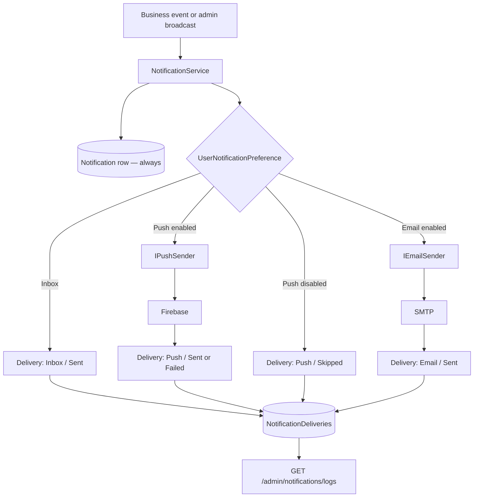
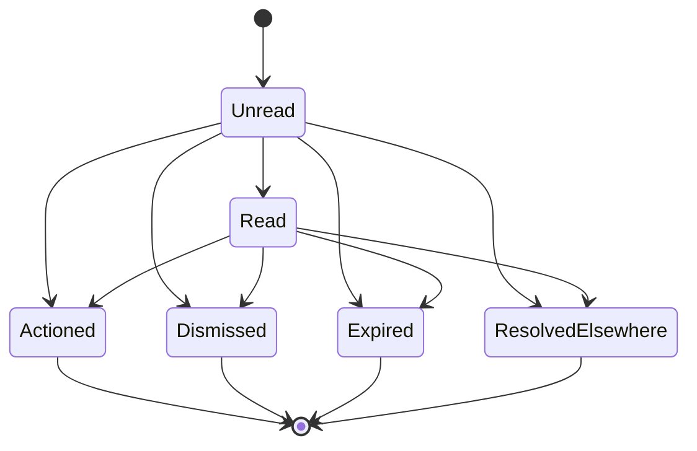
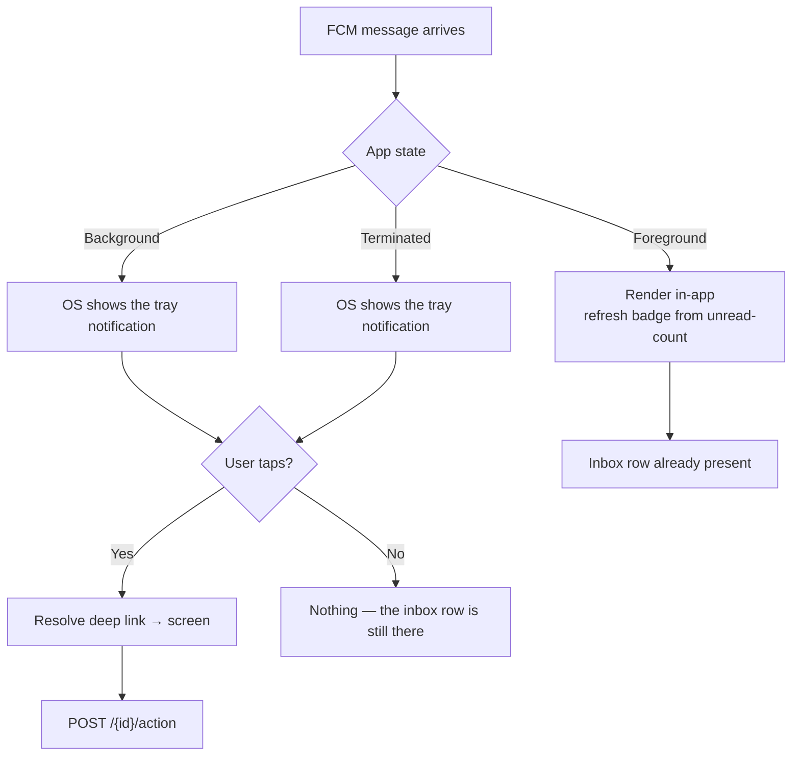
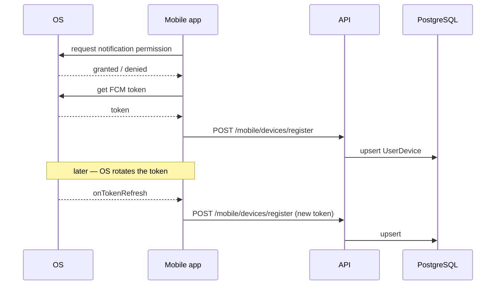
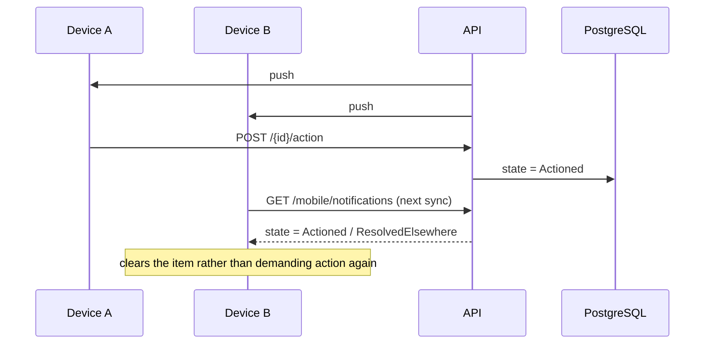

# Notification — Diagrams

**Purpose:** the notification flows in one place.
**Scope:** delivery pipeline, state machine, push handling by app state.
**Status:** Active · **Last updated:** 2026-08-27

---

## 1. Delivery pipeline

---

## 2. State machine

No transition returns to `Unread`.

---

## 3. Push by application state

The right-hand path is the point: **every branch that does not reach the user still
leaves an inbox row.** The client never depends on having received the push.

---

## 4. Device registration and token refresh

A denied permission is not an error state for the backend: no device row, no push
deliveries, inbox unaffected.

---

## 5. Multi-device resolution

---

## Related

- [Workflow](workflow.md) · [Business rules](business-rules.md) · [Architecture](architecture.md)
- [API — mobile](api/mobile.md)
