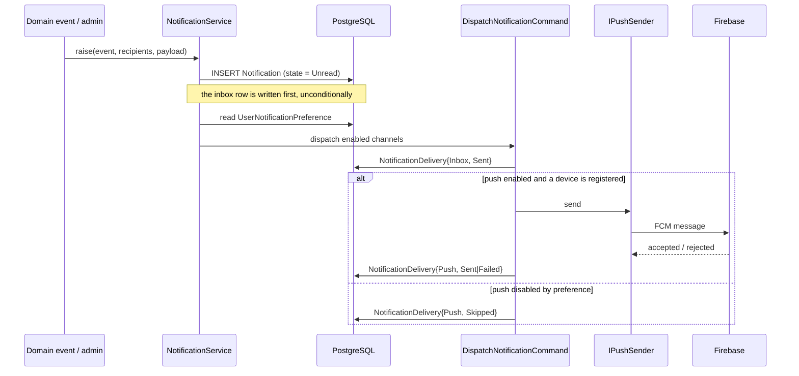
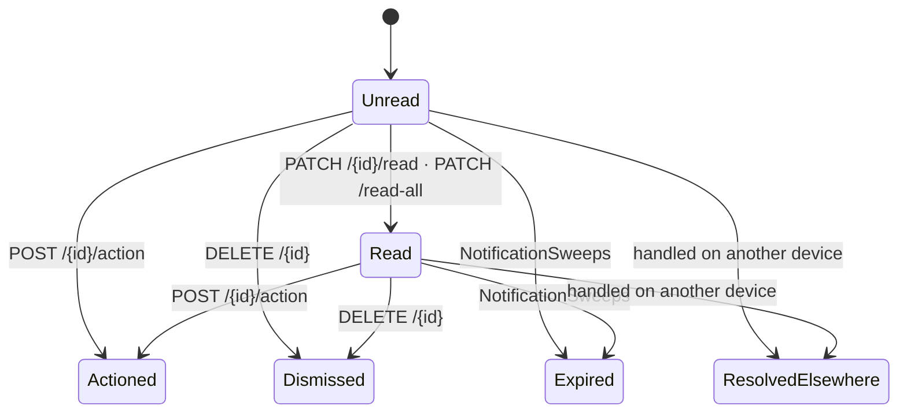
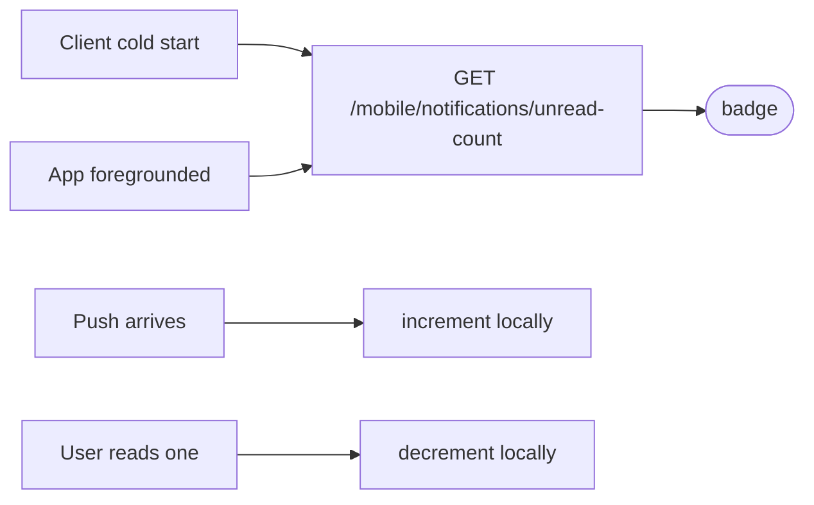
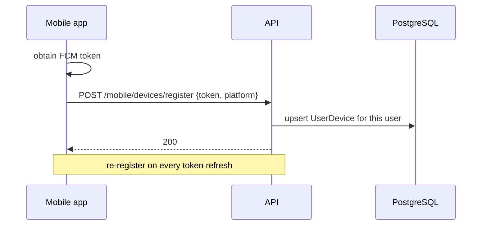

# Notification — Workflow

**Purpose:** the life of a notification, from event to action.
**Scope:** raise, dispatch, deliver, read, action, expire.
**Status:** Active · **Last updated:** 2026-08-27

---

## 1. Raise and dispatch

A channel the user has turned off is recorded as `Skipped`, not omitted. That is
what makes the delivery log able to answer "why didn't I get an email?".

---

## 2. The user reads it

`ResolvedElsewhere` is what makes multi-device work: a notification actioned on one
handset must not still demand attention on another.

**Read and actioned are different.** Reading is "I saw it"; actioning is "I did the
thing". A route-assignment notification that is read but not actioned is still
outstanding work.

---

## 3. Badge counts

The count endpoint is the authority; local increments are an optimisation between
calls. Re-fetch on foreground rather than trusting an accumulated local count
across a background period.

---

## 4. Device registration

`GET /mobile/devices` lists the user's devices; `DELETE /mobile/devices/{deviceId}`
removes one. A token FCM rejects marks the *delivery* `Failed` — it does not fail
the notification.

---

## 5. Housekeeping

`NotificationSweeps` expires notifications past their validity and performs
retention housekeeping. Expiry is a state (`Expired`), not a delete, so a delivery
log remains explicable after the notification stops being actionable.

---

## Related

- [Business rules](business-rules.md) · [Diagram](diagram.md)
- [API — mobile](api/mobile.md) · [API — admin](api/admin.md)
