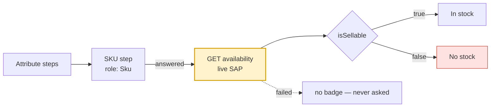

# Stock — Implementation Notes

How the app reads stock for the order flow. See [`api.md`](api.md) §4 for the
server side.

That document describes the server. This one describes **our side**: which of
the two stock endpoints we call and why, when it fires, what is rendered, and
what it gates.

---

## Two endpoints, one of them usable today

| | `GET /mobile/materials/{material}/stock` | `GET /materials/{material}/availability` |
|---|---|---|
| Answers | a band (`High`/`Medium`/`Low`/`None`) + per-plant breakdown | a sales-area sellability verdict + SAP's checks |
| Needs a sales area | **no** | yes — `salesOrg`, `disChannel`, `division` |
| Usable now | **yes** | no — the session carries no sales area |

**The order flow calls `/stock`.** `/availability` without the sales-area
triple answers HTTP 200 with `isSellable: false` and `INPUT_VKORG` /
`INPUT_VTWEG` checks — the validation never ran. Gating the quantity stepper on
that would disable every `+` button in the app for a reason that has nothing to
do with the material.

`/availability` stays implemented and tested, for a commit-time confirmation
once the rep's sales area is resolved. See the `TODO(release-gate)` in
`MaterialAvailabilityRepositoryImpl`.

### The payload

```jsonc
{ "material": "1100000042", "band": "High", "isSellable": true,
  "baseUnit": "KG",
  "plants": [{ "plant": "KMH2", "band": "High", "isSellable": true }],
  "checkedAt": "2026-08-27T07:51:39Z" }
```

### Debug logging

Every stock read prints one line in debug builds:

```
[isi.stock] material=1100000042 band=High isSellable=true baseUnit=KG plants=[KMH2:High] checkedAt=2026-08-27T07:51:39Z
```

A failure prints `FAILED status=… type=…`. This endpoint decides whether a rep
may set a quantity, and when it is wrong the symptom on screen — "the plus
button does nothing" — says nothing about why. The payload carries no customer,
no price and no PII, so it is safe to print in full.

## When it fires

**When the terminal read comes back with three rows or fewer** — in practice
one, immediately after the rep answers the SKU step. That is the moment they
stop narrowing and name a material, which is the commitment worth a live SAP
round trip. It is never called while browsing a full page of results.

It is driven off the **returned rows**, not off the SKU step's answer, and that
matters: the facet option's value and the material row's number come from two
different queries. Keying the verdict by the first and reading it back by the
second is a mismatch waiting to happen — which is exactly the bug that made the
badge never appear. Resolving from `product.code` means the key that goes in is
the key the card looks up.



Re-asking is suppressed: the verdict concerns a material in a sales area, and
neither changes while the rep is on the screen.

---

## Four states, not a boolean

| Condition | Badge | Why |
|---|---|---|
| Never asked | **nothing** | The rep is browsing. Rendering "No stock" here would make them decline a sale over a question the handset had not asked. |
| In flight | spinner | Asked, waiting. A live ERP hop is slow enough to be worth acknowledging. |
| `isSellable: true` | **the band** — High / In stock / Low | SAP will accept the order line. |
| `isSellable: false` | **No stock** | SAP will not. |

The band is **advisory, never enforced**. `Low` warns about how much; it is not
a refusal, and the `+` stays live. Gating on it would block orders SAP would
happily accept. Only `isSellable: false` disables the stepper.

An unrecognised band degrades to `unknown`, never to `none` — inventing "there
is no stock" from a string this build has not seen would stop a sale that
should have gone ahead.

The failing check's own message is attached as a long-press tooltip. "Material
is not extended to sales area 1000/10" is something a rep can act on by phoning
the right person; "cannot sell this" is not.

`MaterialAvailability.reason` deliberately prefers the first **blocking** check
over the verdict check, because the verdict only restates the summary.

---

## The compromise on record: `INPUT_*` renders as "No stock"

SAP requires `salesOrg`, `disChannel` and `division`. **The session does not
carry them yet**, so none is sent, and SAP answers:

```jsonc
{
  "isSellable": false,
  "summary": "Validation not performed. Mandatory input parameters are missing.",
  "checks": [
    { "checkId": "INPUT_VKORG", "status": "E", "message": "Sales Organization is required." },
    { "checkId": "INPUT_VTWEG", "status": "E", "message": "Distribution Channel is required." },
    { "checkId": "RESULT",      "status": "E", "isVerdict": true }
  ]
}
```

**HTTP 200.** The request succeeded; the validation never ran.

The integration guide says to treat `INPUT_*` as a client bug rather than as
"out of stock". **We render it as "No stock" anyway**, by explicit product
decision, and the reasoning is worth stating because it is a trade rather than
an oversight:

- It is the **safe** direction. The check never invents a yes, so no rep is
  told a blocked material is sellable.
- It is **not silent**. `MaterialAvailability.isInputIncomplete` is true for
  exactly this case, the failing check messages survive into the tooltip, and
  `MaterialAvailabilityRepositoryImpl` carries a `TODO(release-gate)`.

The cost is real and should not be forgotten: **until the sales area is wired,
every material reads "No stock"**, so the badge carries no information. Closing
that gap means resolving the signed-in rep's sales area and passing it into
`MaterialAvailabilityRepositoryImpl`'s `salesOrg` / `disChannel` / `division`.

Two tests pin the distinction so it cannot quietly collapse:
`missing sales-area parameters is still distinguishable from a business refusal`
and `surfaces which parameters SAP wanted`.

---

## A failed call is not a refusal

Network down, middleware down, timeout, 403 — all record **nothing**, which
renders as no badge at all. "We could not ask" and "the answer is no" are
different claims, and only the second should stop a rep from quoting.

Offline is checked before the call rather than discovered at the socket, so the
result is an honest "not asked" rather than a transport error.

---

## Related: what this API does *not* have

Two absences shape the cards, and both are rendered as absences rather than as
zeros:

| Missing | Where it shows |
|---|---|
| **On-hand quantity** — a band, never a figure | `Product.stockKnown == false`; the local quantity band is suppressed, and the stepper's `max` is **unbounded** rather than zero |
| **Price** — no list, no condition, no currency. `priceGroup` is a classification code, never an amount | `ProductPricing.unpriced()`; cards read "Price not available" |

`$0.00` and "Out of stock" are claims. A rep cannot tell a confident wrong
answer from a missing one, so neither is rendered.

---

## Files

| Concern | Path |
|---|---|
| Entity, four states, `INPUT_*` detection | `lib/features/order/domain/entities/material_availability.dart` |
| Wire → domain | `lib/features/order/data/models/material_api_mapper.dart` |
| Repository + the sales-area gap | `lib/features/order/data/repositories/material_availability_repository_impl.dart` |
| The HTTP call | `lib/features/order/data/remote/api_material_selection_remote_data_source.dart` |
| Trigger on the SKU step | `lib/features/order/presentation/bloc/product_filter_flow/product_filter_flow_bloc.dart` |
| The badge | `lib/features/order/presentation/widgets/catalog/stock_availability_badge.dart` |
| Stepper enable/max | `lib/features/order/presentation/widgets/filter_flow/product_result_card.dart` |
| Tests, with the live payload pinned | `test/features/order/material_availability_test.dart` |


---

## What gates the quantity stepper

This was the defect that made `+` unusable for every material from the
selection API, and it was not the verdict — it was the cap:

```dart
max: product.isMto || !product.stockKnown
    ? null                                  // unbounded
    : product.availableQuantity.floor(),    // the local catalog's real figure
```

`availableQuantity` is `0` for an API material because there is no figure to
carry. Read as a cap, zero means "you may not add one", so `+` was disabled
before the stock call had said anything at all. **An absent quantity is not a
limit of zero.**

Enablement is separate, and follows the live verdict where there is one:

```dart
final available = availability?.canOrder ?? product.isAvailable;
```

`canOrder` is true for `available`, **and also for `unknown` and `checking`** —
a rep is not blocked on a question that has not been answered yet.
