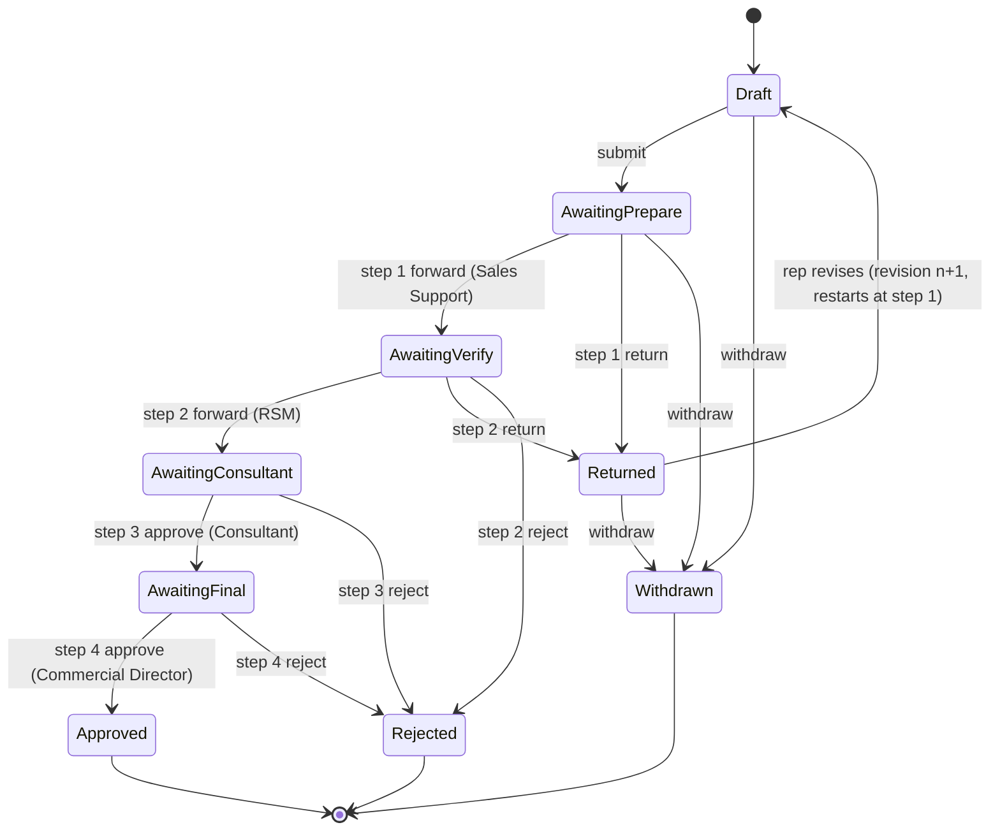
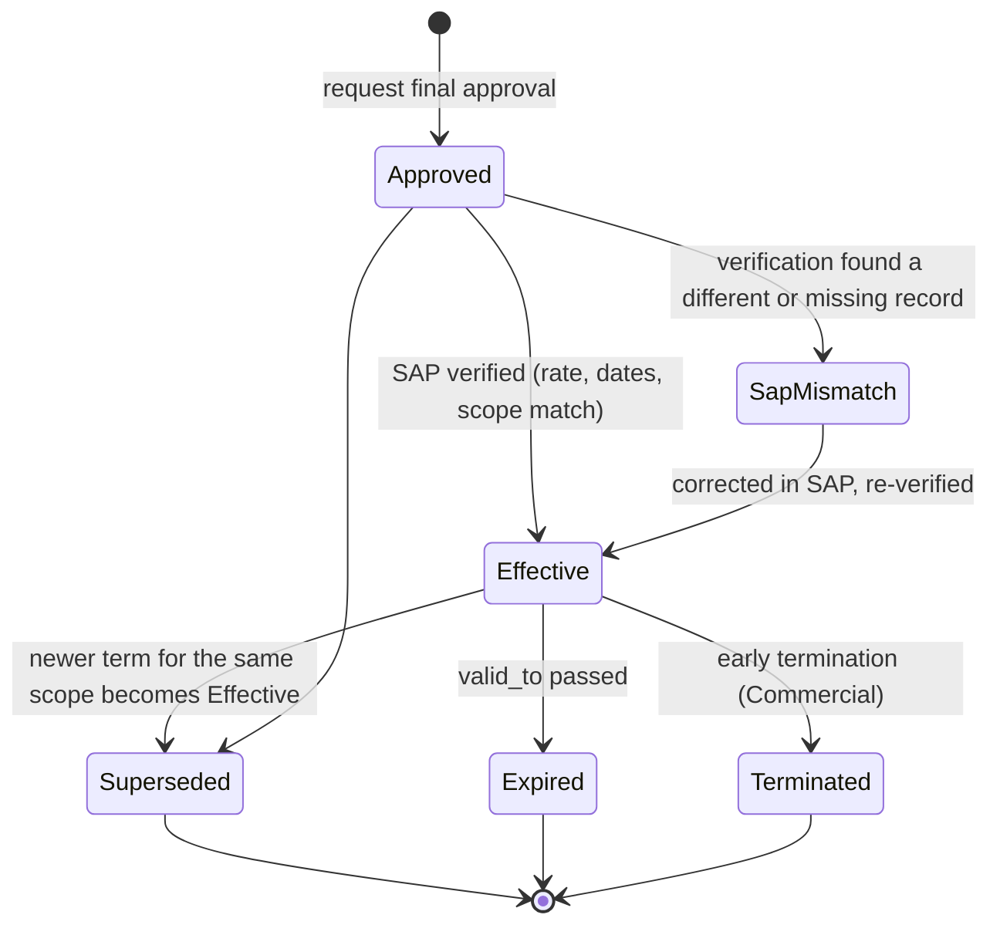
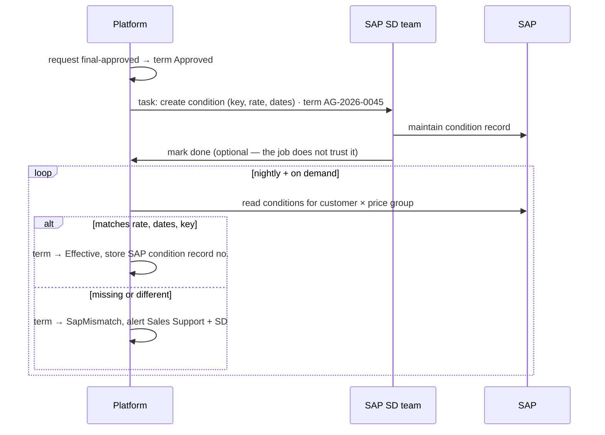

# Promotions & Discounts — Analysis, Plan and Strategy

**Purpose:** one design for every price reduction SteelForce offers — standing depot
agreements, order terms, rep discretion, price requests, rebates and free goods — so the
mobile app, the admin portal and SAP all show and charge the same thing.
**Scope:** incentive definitions, the depot-agreement request and approval workflow, the
calculation rules, how each incentive reaches SAP, data model, APIs, screens, roadmap.
Quotation and order mechanics are in the companion
[quotation-orders-plan.md](../quotation-orders/quotation-orders-plan.md); this document does not repeat them.
**Status:** Proposal · **Date:** 2026-09-11 · **Inputs:** Promotions BRD/SRS v1.0 (with
ERD and workflow), Flutter `docs/feature/promotions/` README + workflow (branch `web`),
the Create Quotation diagram, the Pricing feature docs.

> Decisions are numbered in **one register shared with the quotation plan**. D1–D18 are
> defined there; this document adds **D19–D33** (§13).

> [!NOTE]
> **Partly built as of 2026-09-12.** This remains the design document; it is not a
> description of current behaviour. Phase **P1** and the option-B route to `Effective`
> are implemented, along with quotation consumption — see [README.md](README.md) for
> what exists, [business-rules.md](business-rules.md) for the rules actually enforced,
> and [data-model.md](data-model.md) for the nine tables that were built out of the 22
> in §7.
>
> Three places where the build deliberately differs from this document:
>
> - **§5.1 approval templates** are a reviewable catalogue in code
>   (`AgreementApprovalTemplate`), not `approval_template_steps` rows. **D15 is settled
>   as the BRD's matrix.**
> - **§7.2 `discount_authorities` / `discount_policies`** are the existing validated
>   `Quotations` configuration, not tables.
> - **§8.2 `POST /agreement-terms/{id}/verify`** is not implemented: it needs a SAP
>   condition-record read that does not exist. Effectiveness is granted through
>   `POST /sap-tasks/{id}/done` instead.

---

## 0. The short version

1. **Three sources, three different models.** The BRD describes *depot agreements*
   approved by four people. The app describes *in-cart incentives* the rep sees while
   building a quotation. The diagram has a *pickup discount*. None is wrong; each is
   partial. §2 merges them into one catalogue of eight incentives, each with one owner,
   one approval path and one home in SAP.
2. **The key axis is *when* a discount is earned.** At the invoice line (on-invoice
   agreement, pickup, rep discount), at payment (immediate-payment), at month end
   (volume tier), or in goods rather than money (free goods). The BRD's
   `FLAT / TIERED / NO_TARGET` modes blur this; §2.2 separates them. It decides
   everything downstream: a month-end rebate can never be deducted on a quotation.
3. **A discount is real only when SAP applies it.** Approved agreements must become SAP
   condition records. Until the middleware can write them, the SAP team keys them in and
   the platform **verifies** before calling an agreement *Effective* (§6).
4. **Approvers need data the platform does not have.** The BRD asks the Regional Sales
   Manager to judge requests against *targets* and the Consultant against *margin*. The
   platform holds neither sales history, targets nor cost. Without them, four signatures
   become four rubber stamps. §5.4 lists what each step needs and where it comes from.
5. **Day one needs the agreements that already exist.** Today's active Excel agreements
   must be imported before the first quotation, or every depot loses its discount on
   launch day. The BRD does not mention migration. It is Phase P1 work (§14).
6. **The app's arithmetic moves to the server; its UI stays.** Chips, summary grouping,
   promo cards and badges are kept and fed by real data. The mock promotions, the
   client-side caps and the VAT toggle go (§11).

---

## 1. The problem in one paragraph

Today a Sales Employee fills an Excel sheet proposing, for one depot, a rate per product
category — flat, tiered on monthly purchases, or for immediate payment. Four people sign
it. Someone then makes SAP charge it, and someone else works out rebates at month end.
Separately, reps give line discounts and take pickup discounts at their discretion, and
sometimes quote prices HQ has not set. None of it is linked: no one can answer *"why did
this depot pay this price on this invoice?"* without opening three spreadsheets. The
feature exists to make that question answerable — every reduction traceable to a rule or
an approval, and every approval traceable to what SAP actually charged.

---

## 2. The incentive catalogue

### 2.1 Eight incentives, four natures

| # | Incentive | Nature | Earned | Created by | Approved by | Home in SAP |
|---|---|---|---|---|---|---|
| 1 | **On-invoice depot discount** | Standing agreement | At the invoice line | Rep request | 4-step chain | Condition record: customer × material price group |
| 2 | **Volume-tier rebate** | Standing agreement | At month end | Rep request | 4-step chain | Rebate agreement / condition contract |
| 3 | **Immediate-payment discount** | Standing agreement | At payment | Rep request | 4-step chain | Payment terms (cash discount) — or a conditional condition (D22) |
| 4 | **Pickup discount** | Order term (rule) | At the invoice line, if collected | Commercial (rule) | Once, when the rule is set | Condition keyed on shipping condition (D13) |
| 5 | **Rep line discount** | Transactional | At the invoice line | Rep, per quotation | By authority level (D4) | Manual item condition |
| 6 | **Price request** | Transactional | Replaces a missing price | Rep, per quotation | Always approved (D7) | Manual price condition + request to maintain a real price |
| 7 | **Free goods** | Non-monetary | Extra units on the order | Commercial (rule) | Once, when the rule is set | Free-goods determination → zero-price item (D17) |
| 8 | **Campaign** | Standing, segment-wide | As 1–3, for many depots | Commercial | Shortened chain (D27) | Same as 1–3, keyed on a segment |

The app's "Summer Promotion 3 %" and its countdown promo cards imply campaigns exist in
the business's vocabulary; the BRD's `PROMOTION` umbrella (`period_label` "Jan-2026")
points the same way. A campaign is modelled as an agreement whose scope is a **segment**
(depot type, region, category) rather than one depot — same engine, same SAP homes.

### 2.2 The BRD's modes, re-read by *when the discount is earned*

The BRD offers three discount modes per line: `FLAT_PERCENT`, `TIERED` and `NO_TARGET`,
plus `has_target` and `target_amount`. Reading the Excel examples ("12 % no target",
tiers on monthly amount) gives a cleaner reading:

| BRD line | Condition on earning | So it is | Deducted on quotation? |
|---|---|---|---|
| `NO_TARGET` + flat % | None | **On-invoice discount** (#1) | Yes |
| `FLAT_PERCENT` + target amount | Depot must reach the monthly target | **Volume rebate with one tier** (#2) | No |
| `TIERED` | Rate depends on monthly amount | **Volume rebate** (#2) | No |
| Immediate-payment type | Paid immediately | **Payment discount** (#3) | Only if D22 makes it a cash-sale condition |

The domain stores **what is earned when**, not the BRD's labels. The request form can
keep the BRD's words for familiarity; the stored term is typed by nature. Confirm this
reading with Sales Support using real spreadsheets (§15) — it is the single most
consequential interpretation in this document.

### 2.3 Incentive specifications

Each card is the contract a developer builds against. *Open* rows are decisions.

#### #1 On-invoice depot discount

| | |
|---|---|
| Scope | One depot × one product category (or a segment, for campaigns) |
| Value | Percentage of line gross. Fixed-amount variant only if Sales confirms it exists (the app mentions "Fixed USD") — D25 |
| Validity | `valid_from`, optional `valid_to`; server clock |
| Uniqueness | At most one Effective term per depot × category × date. A new approval supersedes (§4.3) |
| Applies to | Every eligible line in that category, on app and counter orders alike — the reason it must live in SAP |
| Rep can | See it; not change it on a quotation |
| Open | Fixed amounts (D25); whether scrap materials are excluded here too, or only from volume targets (D24) |

#### #2 Volume-tier rebate

| | |
|---|---|
| Scope | One depot × one category (BRD) — or all categories combined (D23) |
| Period | Calendar month (BRD `period_label`) |
| Basis | Net billed value in the month — definition in §3.4, decided by D24 |
| Tiers | Half-open `[min, max)`, contiguous from 0, last tier may be open, currency stated |
| Rate application | **Whole-month amount at the achieved tier** (retroactive) — or marginal per band (D19) |
| Paid as | Credit note after month end (D16) |
| Quotation shows | Progress: "USD 2,340 this month → 3 % at 3,000 (660 to go)"; never a deduction |
| Open | D16, D19, D23, D24 |

#### #3 Immediate-payment discount

| | |
|---|---|
| Meaning to confirm | (a) paid in cash / transfer **at order** — a cash-sale price; or (b) paid within *N* days of invoice — a settlement discount (D22) |
| If (a) | Condition applied when the order's payment term is "immediate"; deductible on a quotation whose payment term is immediate |
| If (b) | Cash discount in the SAP payment term; applied at payment clearing, never on the invoice line; quotation shows "+x % if paid within N days" |
| Watch for | The app's "COD / Pickup" label. COD is a payment method; the app itself says COD alone does not earn the pickup discount. #3 and #4 must not be the same discount counted twice |

#### #4 Pickup discount

| | |
|---|---|
| Trigger | Shipment type = Pickup (goods collected at depot / factory). COD alone does not qualify (app rule, kept) |
| Value | The app shows 1–1.5 %; so the rate varies — by region, category or depot type? (D13) |
| Level | Order-level rule, allocated to each eligible line (SAP prices it per item) |
| Counter sales | Walk-in counter sales are pickup by nature. If SAP does not hold this rule, counter staff apply it by hand today — which is exactly the inconsistency the feature should end |
| Open | D13 — rate table, scope, and whether SAP holds it |

#### #5 Rep line discount

| | |
|---|---|
| Value | % of line gross, per line |
| Limit | By authority level (D4). The app's 0–10 % cap becomes a server-returned limit |
| Above limit | Allowed to submit; routes the quotation to the level that can approve it |
| Not allowed | On a price-request line (D26) — a negotiated price is not discounted again |
| SAP | Manual item condition; type from `GetPriceType?QuotationOnly=true` |

#### #6 Price request

| | |
|---|---|
| Allowed when | SAP **answered** and holds no price for this customer × material (`erpAnswered: true`, empty `items`). Never when SAP was unreachable. Never over an existing SAP price (the app's rule, kept) |
| Value | Proposed unit price **with currency, pricing unit and condition unit** — not "USD" |
| Approval | Always; level by rule (D7) |
| Effect | Line priced at the approved figure; agreement discounts still apply on top (D26) |
| Afterwards | Creates a task for HQ pricing to maintain a real ZP01 price — otherwise the next quotation asks again. Repeated requests for one material are a report (§12) |

#### #7 Free goods

| | |
|---|---|
| Rule | Buy *X* of material/category, get *Y* units free |
| Ladder or repeat | The app's `tierFor` returns the highest rung reached — at 80 sheets with "buy 40 get 1" it gives 1. Most businesses expect 2. D20 |
| Free item | Same material or a named one; its own unit; needs stock like any other unit |
| Money | **Never converted to a discount** (app rule, kept) |
| SAP | Free-goods determination, exclusive — a separate zero-price item, so it is delivered and stock-counted |
| Open | D17 (in scope at all), D20 |

#### #8 Campaign

| | |
|---|---|
| Scope | Segment: depot type (`GENERAL_DEPOT` / `PARTNER_DEPOT` / `OUT_OF_LIST`), region, category — any combination |
| Value | As #1, #2 or #3 |
| Overlap with a depot agreement | Best-of, stack, or depot agreement wins (D21) |
| Approval | Commercial-initiated; shortened chain (D27) |
| App | Feeds the existing `promo_card` / countdown UI, which today reads mock data |

---

## 3. Calculation rules

### 3.1 Principles

1. **Server computes; client sends intent.** Percentages, codes, quantities go up; every
   amount comes down from `IQuotationCalculator` (quotation plan §9).
2. **Origin is always visible.** Every deduction records its incentive number, source
   (term id, rule id, user id) and SAP condition type. The app's Invoice / SKU / Free
   grouping is kept as the display.
3. **Free goods are never money.** (App rule.)
4. **Discounts reduce the base before tax.** (App rule.)
5. **Mirror SAP's pricing procedure.** Where SAP stacks, rounds or bases a condition
   differently, the platform follows SAP (D12). The worked examples below use the
   *proposed default* until the SD session confirms it.
6. **Server clock** for every validity check — never a handset's date.

### 3.2 Line calculation (default proposal)

```text
base      = SAP price  (or approved price-request price, #6)
gross     = quantity × base ÷ pricingUnit               quantity in conditionUnit
− #1  on-invoice agreement %   × gross
− #8  campaign %               × gross      (per D21: best-of / stack / depot wins)
− #4  pickup %                 × gross      (if shipment = Pickup)
− #3  immediate-payment %      × gross      (only if D22 = cash-sale condition and payment term = immediate)
− #5  rep %                    × gross      (not on a price-request line)
= net                            cap: Σ % ≤ policy maximum per line (D28)
+ tax                           SAP tax determination (D18)
#7 free goods                   separate zero-price line
#2 volume rebate                not on the line — month end
```

Percentages are additive on gross. Rounding per line to the currency's scale (`US3` 3,
`USD` 2), then summed. A net below zero is an error, never `max(0, …)`.

### 3.3 Worked example — a quotation

Depot PNP-Walk In, Pickup, material `1500000017` at the live **0.475 US3 / 1 KG**.
Agreement and rule rates are illustrative.

```text
Quantity                    10,000 KG
Gross       10,000 × 0.475 ÷ 1          = 4,750.000 US3
#1 Agreement AG-2026-0045  5.0 %        =  -237.500
#4 Pickup                  1.0 %        =   -47.500
#5 Rep discount            1.5 %        =   -71.250    within rep authority?
Net (Σ 7.5 %)                             4,393.750 US3
Tax                        SAP-determined, estimate shown
#2 Rebate progress         "this month 18,400 → 3 % tier at 20,000"   (not deducted)
```

If the policy cap were 7 %, submit is refused with `Quotation.DiscountCapExceeded`
naming the line, rather than trimming the rep's discount silently.

### 3.4 Worked example — a month-end rebate

Depot agreement, category Roofing Profile, tiers `[0, 2,000) 0 %`, `[2,000, 3,000)
1.5 %`, `[3,000, ∞) 3 %`, whole-month rule (D19), basis per D24:

```text
Billed in September, category Roofing Profile (net of on-invoice discounts, excl. VAT)
  Invoices                                   3,420.000
  Credit note (return)                        -310.000
  Scrap items (excluded, BRD §9)             -  95.000
Basis                                        3,015.000   → tier [3,000, ∞) = 3 %
Rebate                                          90.450   → credit note in October
```

Under a *marginal* rule (D19) the same month earns `1,000 × 1.5 % + 15 × 3 % = 15.450`
— one sixth of the whole-month figure. **This one decision changes rebate cost
six-fold** at this boundary, which is why it is listed first in §13.

### 3.5 Worked example — free goods

Rule "buy 40 sheets Palm 70, get 1 free". Order of 85 sheets:

| Rule (D20) | Free units |
|---|---|
| Ladder (app today) | 1 |
| Repeating | 2 |

The free unit is a separate zero-price item; the 85 sheets are charged in full.

---

## 4. Depot agreement lifecycle

Two objects, deliberately separate (quotation plan §8.5, BRD review #3):

- **Agreement request** — what the rep asked for. Editable while Draft or Returned;
  carries revisions and the approval trail.
- **Agreement term** — what was approved. Created on final approval, **immutable**, and
  the only thing quotations, SAP sync and rebate runs ever read.

### 4.1 Request



Outcomes follow the BRD's approval **matrix** (step 1 cannot reject; steps 3–4 cannot
return). FR-06 says any step may do either — D15 picks one. Because allowed outcomes are
**data in the step template** (§5.1), resolving D15 is a settings change, not code.

`Withdrawn` is new: a rep must be able to pull a request that is no longer needed,
before it consumes four people's time. Allowed until step 2 acts.

### 4.2 Term



Only `Effective` terms are applied to quotations. `Approved` terms are shown greyed:
"approved, not yet active in SAP".

**Early termination is missing from the BRD.** A depot that stops paying, closes, or is
found abusing a rate needs its discount stopped before `valid_to`. Proposed: Commercial
Director only, mandatory reason, sets `valid_to` to today, pushes the end date to SAP
through the same A/B path (D29).

### 4.3 Supersede — the date arithmetic

BRD: *at most one active per depot per category; a new approved request supersedes the
previous*. Precisely:

```text
existing Effective term   E: valid 2026-01-01 → open
new request approved      N: valid 2026-10-01 → 2026-12-31

on N becoming Effective:  E.valid_to := 2026-09-30   (state stays Effective until then)
                          N is Effective from 2026-10-01
on 2026-10-01:            E → Superseded
```

Rules: `N.valid_from` must be ≥ today (no retroactive agreements without Finance — D30);
if `N` ends before `E` would have, `E` does **not** resume — the gap is explicit, and the
request form warns *"after 31 Dec this depot will have no agreement for Roofing
Profile"*. Overlap validation (FR-04) runs at submit against **Effective terms and other
pending requests** for the same scope, and again at final approval — the world may have
changed in the days the request spent in the chain.

### 4.4 Revisions

A returned request becomes a new revision; the previous revision and every signature on
it are kept. Approvers see a **diff against the last revision they saw** and against the
depot's current Effective term — the question an approver actually asks is "what is
changing?", not "what is the whole request?".

### 4.5 Renewal

`period_label` "Jan-2026" suggests today's agreements are **monthly**. If so, four
signatures a month per depot × category is 12 chains a year for every line — a load
that will kill adoption. D31 asks whether terms are open-ended until superseded
(recommended) with a periodic review report, or genuinely monthly (in which case the
form offers "renew unchanged" that goes through a shortened chain).

---

## 5. Approval engine

Shared with quotation approval (quotation plan §8.11). One engine, templates as data.

### 5.1 Template

| Field | Example for depot agreements |
|---|---|
| `subject_type` | `AgreementRequest` |
| `step_order` | 1 … 4 |
| `label` | Prepared / Verified / Approved (Consultant) / Approved (Final) |
| `permission` | `agreements.prepare` / `.verify` / `.approve-consultant` / `.approve-final` |
| `scope_rule` | How the step finds its approvers: *region of depot*, *RSM of depot's team*, *any holder* |
| `allowed_outcomes` | `forward, return` / `forward, return, reject` / `approve, reject` / `approve, reject` |
| `step_up_above_percent` | e.g. 10 — re-authenticate above it (BRD NFR; threshold D32) |
| `sla_hours` | e.g. 24 — reminder, then escalation |
| `skip_rule` | Optional, e.g. campaign template skips step 1 (D27) |

### 5.2 Routing

Approvals go to a **role within a scope**, not a named person. Step 2 goes to the RSM of
the depot's team (`TEAM.regional_manager_id` in the BRD); step 1 to the Sales Support
Supervisors of the depot's region. Anyone holding the step's permission in that scope
may act — so one person on leave does not freeze the chain.

### 5.3 Controls

| Control | Rule |
|---|---|
| Four eyes | Requester never approves; one user acts on at most one step of a request |
| Delegation | Approver may delegate a step permission to a named user for a date range; the audit records both names. Not in the BRD — needed on day one for leave |
| SLA | Reminder at `sla_hours`, escalation to the step's manager at 2×. The BRD measures notification speed but not approval speed; Sales will ask why requests sit for a week |
| Step-up | Password / PIN on approve above threshold |
| Stale check | Final approval re-runs overlap validation (§4.3) |

### 5.4 What each approver needs to see

Each BRD step has a question. Most answers need data the platform does not have yet.

| Step | BRD question | Data needed | Available today? | Source |
|---|---|---|---|---|
| 1 Sales Support | Is the request complete and correctly mapped (BP, cost center, team)? | Depot master, current terms | **Yes** | Platform |
| 2 RSM | Is it justified against targets? | Depot's purchases last 6–12 months by category; monthly target | **No** | SAP billing read (endpoint needed); targets — today in Excel |
| 3 Consultant | What is the margin impact? | Estimated discount cost; margin by category | **Partly** | Cost estimate = history × rate change (needs billing read); margin needs cost price from SAP |
| 4 Commercial Director | Final call | All of the above, summarised | — | — |

**Minimum viable context**, buildable once a billing read exists: for each requested
line, last-6-months net purchases, current rate, proposed rate, and *estimated annual
cost of the change* (`purchases × Δrate × 2`). That one number makes steps 2–4
meaningful. Targets and margin can follow (D33; §14 phases them).

---

## 6. How each incentive reaches SAP

### 6.1 The mapping

Condition type names below are placeholders for the SD consultant to replace; the
*mechanism* is the part that matters.

| # | SAP mechanism | Written by | Read back to verify | Endpoint status |
|---|---|---|---|---|
| 1 | Discount condition record, key customer × material price group, validity dates | A: middleware · B: SD team | Condition read for that key | **Missing** (write and read) |
| 2 | Rebate agreement / condition contract with scale | SD team (volume is low, set-up is complex) | Agreement read | **Missing** |
| 3 | Payment term with cash discount — or a condition tied to payment term (D22) | SD / Finance | Customer's payment terms | **Missing** |
| 4 | Condition keyed on shipping condition (+ region/category if D13 needs it) | SD team, once | Condition read | **Missing** (but one-off) |
| 5 | Manual item condition on the quotation / order | Platform, in `CreateQuot` | Readback of the quotation items | Declared (`CreateQuot`, `GetQuotItemByPaging`) |
| 6 | Manual price condition on the item; later a real ZP01 record by HQ | Platform / HQ | Pricing read | Declared / live |
| 7 | Free-goods master record, exclusive | SD team | Order readback shows the free item | **Missing** |
| 8 | As 1–3 with a segment key (customer group, sales office…) | As 1–3 | As 1–3 | As 1–3 |

Only #5 and #6 can be built end to end with endpoints that exist on paper today.
**Every standing incentive depends on a SAP read the middleware does not expose.** That
is the dependency to raise first (§15).

### 6.2 Option B in practice — the verification loop



The same loop runs for **every Effective term every night**, not only new ones: someone
changing a rate directly in SAP is detected the next morning as a mismatch, instead of
silently diverging from what four people approved. That report alone may justify the
feature to Commercial.

### 6.3 Option A later

When the middleware can write conditions, the loop gains one step before the read: the
platform writes, then verifies exactly as above. Nothing else changes — which is the
reason to build B's verification first.

---

## 7. Data model & schema ERD

Platform conventions apply: UUIDv7 keys (`uuid`), EF Core mappings, UTC timestamps (`timestamptz`), strict financial precision (`numeric(18,6)` for currency amounts, `numeric(9,4)` for percentages and tax rates), and audit columns (`created_at`, `created_by`, `updated_at`, `updated_by`) on every mutable table.

The BRD's `ROLE`, `USER_ACCOUNT`, `CUSTOMER` and `TEAM` tables are **not** duplicated here: the platform's existing Identity and `Customer` aggregates own them. Missing customer attributes (`team_id`, `cost_center`, `depot_type`, `region_code`) are extended on the customer record. The BRD's `INVOICE*` tables are omitted because the platform does not issue legal invoices (SAP owns billing).

---

### 7.0 Entity Relationship Diagram (ERD)

```mermaid
erDiagram
    CUSTOMERS ||--o{ AGREEMENT_REQUESTS : "initiates for"
    CUSTOMERS ||--o{ AGREEMENT_TERMS : "holds active"
    CUSTOMERS ||--o{ BILLING_SNAPSHOTS : "aggregates"
    CUSTOMERS ||--o{ QUOTATIONS : "orders via"

    AGREEMENT_REQUESTS ||--|{ AGREEMENT_REQUEST_LINES : "contains"
    AGREEMENT_REQUEST_LINES ||--o{ AGREEMENT_REQUEST_TIERS : "scales into"
    AGREEMENT_REQUESTS ||--o| AGREEMENT_TERMS : "finalizes into"
    AGREEMENT_REQUESTS ||--o| APPROVAL_INSTANCES : "routes via"

    AGREEMENT_TERMS ||--o{ AGREEMENT_TERM_TIERS : "applies"
    AGREEMENT_TERMS ||--o{ SAP_VERIFICATIONS : "audited by"
    AGREEMENT_TERMS ||--o{ SAP_TASKS : "provisioned via"
    AGREEMENT_TERMS ||--o{ REBATE_ACCRUALS : "accrues"

    REBATE_ACCRUALS ||--o| REBATE_SETTLEMENTS : "settles via"
    BILLING_SNAPSHOTS ||--o{ REBATE_ACCRUALS : "feeds"

    CATEGORY_MAPPINGS ||--o{ AGREEMENT_REQUEST_LINES : "classifies"
    CATEGORY_MAPPINGS ||--o{ AGREEMENT_TERMS : "classifies"

    PROMOTIONS ||--|{ PROMOTION_TIERS : "defines ladder"
    PROMOTIONS ||--o{ PROMOTION_CUSTOMER_SCOPES : "targets"
    PROMOTIONS ||--o{ PROMOTION_MATERIAL_SCOPES : "targets"

    FREE_GOODS_RULES ||--|{ FREE_GOODS_RULE_TIERS : "specifies"

    APPROVAL_TEMPLATES ||--|{ APPROVAL_TEMPLATE_STEPS : "configures"
    APPROVAL_INSTANCES ||--|{ APPROVAL_STEPS : "executes"
    APPROVAL_TEMPLATE_STEPS ||--o{ APPROVAL_STEPS : "defines"
    APPROVAL_STEPS ||--o{ APPROVAL_DELEGATIONS : "delegates to"

    QUOTATIONS ||--|{ QUOTATION_LINES : "contains"
    QUOTATION_LINES ||--o{ QUOTATION_LINE_DISCOUNTS : "itemizes"
    AGREEMENT_TERMS ||--o{ QUOTATION_LINE_DISCOUNTS : "authorizes"
    PICKUP_RULES ||--o{ QUOTATION_LINE_DISCOUNTS : "triggers"
    PROMOTIONS ||--o{ QUOTATION_LINE_DISCOUNTS : "applies"

    CUSTOMERS {
        uuid id PK
        varchar code UK "SAP BP Number"
        varchar name "Depot or Business Name"
        varchar depot_type "GENERAL_DEPOT | PARTNER_DEPOT"
        varchar region_code "Cost Center / Region"
        uuid sales_rep_id "Assigned representative"
    }

    AGREEMENT_REQUESTS {
        uuid id PK
        varchar request_number UK "AGR-2026-XXXXXX"
        varchar scope_type "DEPOT | SEGMENT"
        uuid customer_id FK "Null if segment-wide"
        varchar segment_filter "JSONB criteria if SEGMENT"
        uuid requested_by FK "Sales representative"
        varchar status "Draft | AwaitingPrepare | AwaitingVerify | AwaitingConsultant | AwaitingFinal | Approved | Returned | Rejected | Withdrawn"
        int revision "Revision counter (starts 1)"
        int current_step "1..4 or null"
        varchar source_channel "Mobile | Portal | Import"
        varchar client_request_id UK "Idempotency UUID from device"
        text remarks "Business rationale"
        timestamptz created_at
        timestamptz updated_at
    }

    AGREEMENT_REQUEST_LINES {
        uuid id PK
        uuid request_id FK
        varchar category_code FK "Material category e.g. REBAR, PROFILE"
        varchar entry_mode "FLAT_PERCENT | TIERED | NO_TARGET"
        varchar nature "ON_INVOICE | VOLUME_REBATE | IMMEDIATE_PAYMENT"
        numeric percent "Rate if flat percentage"
        numeric amount "Fixed amount if D25 approved"
        varchar currency "US3 | USD"
        date valid_from "Start date (>= today)"
        date valid_to "End date (null = open-ended)"
        timestamptz created_at
    }

    AGREEMENT_REQUEST_TIERS {
        uuid id PK
        uuid line_id FK
        int tier_order "1-indexed order"
        numeric min_amount "Inclusive lower bound"
        numeric max_amount "Exclusive upper bound (null = open)"
        numeric percent "Rebate rate for this tier"
    }

    AGREEMENT_TERMS {
        uuid id PK
        varchar term_number UK "AG-2026-XXXX"
        varchar scope_type "DEPOT | SEGMENT"
        uuid customer_id FK "Null if segment-wide"
        varchar segment_filter "JSONB criteria"
        varchar category_code FK
        varchar nature "ON_INVOICE | VOLUME_REBATE | IMMEDIATE_PAYMENT"
        numeric percent "Approved percentage"
        numeric amount "Approved fixed amount"
        varchar currency "US3 | USD"
        date valid_from "Effective start date"
        date valid_to "Effective end date (null = open)"
        varchar state "Approved | Effective | SapMismatch | Superseded | Expired | Terminated"
        uuid source_request_id FK "Traceability back to request"
        int source_revision "Revision approved"
        varchar sap_condition_record "KNUMH from SAP read"
        timestamptz verified_at "Last verification timestamp"
        uuid terminated_by FK "Commercial Director if early"
        text termination_reason
        timestamptz created_at
    }

    AGREEMENT_TERM_TIERS {
        uuid id PK
        uuid term_id FK
        int tier_order
        numeric min_amount
        numeric max_amount
        numeric percent
    }

    SAP_VERIFICATIONS {
        uuid id PK
        uuid term_id FK
        timestamptz checked_at
        varchar check_channel "NightlyJob | OnDemand | Webhook"
        varchar result "Match | Missing | ValueMismatch | DateMismatch"
        jsonb sap_payload "Raw payload returned by SAP"
        text difference_summary
    }

    SAP_TASKS {
        uuid id PK
        uuid term_id FK
        varchar task_type "CREATE_CONDITION | END_DATE_CONDITION"
        varchar status "Pending | InProgress | Completed | Failed"
        uuid assigned_to FK "SAP SD team member"
        timestamptz due_at
        timestamptz completed_at
        text resolution_notes
    }

    PROMOTIONS {
        uuid id PK
        varchar code UK "PROMO-2026-XXX"
        varchar title "Display title"
        varchar subtitle "Localized subtitle"
        varchar promo_kind "BUY_X_GET_Y | SPECIAL_RATE"
        varchar unit_label "BAGS | KG | SHEETS"
        date valid_from
        date valid_until
        boolean is_active
        boolean is_pickup_required "Order must be collected"
        boolean is_immediate_payment "Requires cash/COD"
        timestamptz created_at
    }

    PROMOTION_TIERS {
        uuid id PK
        uuid promotion_id FK
        int tier_order
        int min_quantity "Buy X requirement"
        int free_quantity "Get Y free units"
        varchar free_material_code "Free material number"
    }

    PROMOTION_CUSTOMER_SCOPES {
        uuid id PK
        uuid promotion_id FK
        uuid customer_id FK "Targeted customer (empty = all)"
    }

    PROMOTION_MATERIAL_SCOPES {
        uuid id PK
        uuid promotion_id FK
        varchar material_code "Targeted material (empty = all)"
        varchar category_code "Targeted category"
    }

    PICKUP_RULES {
        uuid id PK
        varchar name "Depot Pickup Rule"
        varchar region_code "Region scope (null = nationwide)"
        varchar category_code "Category scope (null = all)"
        numeric percent "1.0000 % default"
        date valid_from
        date valid_to
        boolean is_active
        varchar sap_condition_type "ZPKP"
    }

    FREE_GOODS_RULES {
        uuid id PK
        varchar code UK "FG-RULE-XXXX"
        varchar description
        varchar category_code
        varchar material_code
        varchar mode "LADDER | REPEATING"
        date valid_from
        date valid_to
        boolean is_active
    }

    FREE_GOODS_RULE_TIERS {
        uuid id PK
        uuid rule_id FK
        int min_qty
        int free_qty
        varchar free_material_code
    }

    DISCOUNT_AUTHORITIES {
        uuid id PK
        int level UK "1..4"
        varchar role_name "Representative | RSM | Consultant | Commercial Director"
        numeric max_manual_percent "Maximum line discount allowed"
        numeric line_discount_cap_percent "Maximum combined discount cap"
        varchar currency "US3 | USD"
    }

    DISCOUNT_POLICIES {
        uuid id PK
        varchar category_code UK "Material category"
        numeric max_total_discount_percent "Policy cap per line"
        numeric step_up_threshold_percent "Triggers PIN re-auth"
        int sla_hours "Default step SLA"
    }

    CATEGORY_MAPPINGS {
        uuid id PK
        varchar category_code UK "Mobile Category Name"
        varchar sap_material_price_group UK "SAP KONDM (2-char code)"
        varchar description
        boolean is_active
    }

    REBATE_ACCRUALS {
        uuid id PK
        uuid term_id FK
        varchar period "YYYY-MM"
        numeric basis_amount "Net qualifying billed value"
        int tier_reached "Earned tier index"
        numeric rebate_percent "Applicable percentage"
        numeric rebate_amount "Accrued credit amount"
        timestamptz computed_at
        uuid snapshot_id FK
    }

    REBATE_SETTLEMENTS {
        uuid id PK
        uuid accrual_id FK
        varchar status "Proposed | Approved | CreditNoteGenerated | Settled"
        varchar sap_credit_memo_no "SAP Billing Document No"
        uuid approved_by FK "Commercial Director"
        timestamptz settled_at
    }

    BILLING_SNAPSHOTS {
        uuid id PK
        uuid customer_id FK
        varchar period "YYYY-MM"
        varchar category_code
        numeric gross_billed
        numeric on_invoice_discounts
        numeric returns_and_credits
        numeric scrap_deductions
        numeric net_qualifying_basis
        timestamptz captured_at
    }

    APPROVAL_TEMPLATES {
        uuid id PK
        varchar subject_type "AgreementRequest | Campaign | PriceRequest"
        varchar name "Depot Agreement 4-Step Template"
        boolean is_active
    }

    APPROVAL_TEMPLATE_STEPS {
        uuid id PK
        uuid template_id FK
        int step_order "1..4"
        varchar label "Sales Support | RSM | Consultant | Commercial Director"
        varchar required_permission "agreements.prepare | .verify | .approve-consultant | .approve-final"
        varchar scope_rule "REGION_SUPERVISOR | DEPOT_RSM | ANY_HOLDER"
        varchar allowed_outcomes "JSON array: ['Forward', 'Return', 'Reject']"
        int sla_hours "Step deadline"
    }

    APPROVAL_INSTANCES {
        uuid id PK
        uuid template_id FK
        varchar subject_type "AgreementRequest"
        uuid subject_id UK "agreement_request.id"
        varchar status "InProgress | Completed | Terminated"
        int current_step_order
        timestamptz initiated_at
        timestamptz completed_at
    }

    APPROVAL_STEPS {
        uuid id PK
        uuid instance_id FK
        uuid template_step_id FK
        int step_order
        varchar status "Pending | Approved | Returned | Rejected | Skipped"
        uuid acted_by_user_id FK "User who executed action"
        uuid delegated_from_user_id FK "Original approver if delegated"
        varchar outcome "Forward | Approve | Return | Reject"
        text comment "Mandatory on Return / Reject"
        timestamptz due_at "SLA deadline"
        timestamptz acted_at
    }

    APPROVAL_DELEGATIONS {
        uuid id PK
        uuid delegator_user_id FK
        uuid delegate_user_id FK
        varchar permission "agreements.*"
        date valid_from
        date valid_to
        boolean is_active
    }

    AUDIT_LOGS {
        uuid id PK
        varchar entity_name "agreement_request | agreement_term | ..."
        uuid entity_id
        varchar action "CREATE | UPDATE | TRANSITION | TERMINATE"
        uuid actor_id
        varchar actor_name
        jsonb old_values "State snapshot before change"
        jsonb new_values "State snapshot after change"
        varchar ip_address
        timestamptz timestamp
    }

    QUOTATIONS {
        uuid id PK
        varchar number UK "QT-2026-XXXXXX"
        uuid customer_id FK
        varchar status "Draft | Quoted | Ordered | ..."
    }

    QUOTATION_LINES {
        uuid id PK
        uuid quotation_id FK
        int line_number
        varchar material_number
        varchar category
        numeric quantity
        numeric net
    }

    QUOTATION_LINE_DISCOUNTS {
        uuid id PK
        uuid quotation_line_id FK
        int kind "0: Manual, 1: Agreement, 2: Pickup, 3: Campaign"
        numeric percent
        varchar source_reference "FK to agreement_terms, pickup_rules, etc."
        varchar sap_condition_type "ZP01 | ZAGR | ZPKP | ZCMP"
        numeric estimate_amount
        numeric sap_amount
        boolean editable
    }
```



---

### 7.1 Agreements domain — table specifications

#### 1. `agreement_requests`
Carries the representative's discount proposals, revisions, and current approval step.
- `id` (`uuid`, PK, default `gen_random_uuid()`): Unique identifier.
- `request_number` (`varchar(32)`, UK, NOT NULL): Formatted document code (e.g. `AGR-2026-000045`).
- `scope_type` (`varchar(16)`, NOT NULL): `DEPOT` (specific customer) or `SEGMENT` (campaign / depot group).
- `customer_id` (`uuid`, FK → `customers.id`, NULLABLE): Target customer; mandatory when `scope_type = 'DEPOT'`.
- `segment_filter` (`jsonb`, NULLABLE): Segment criteria (`{"depot_type": "GENERAL_DEPOT", "region": "NORTH"}`) when `scope_type = 'SEGMENT'`.
- `requested_by` (`uuid`, FK → `users.id`, NOT NULL): Sales representative authoring the request.
- `status` (`varchar(32)`, NOT NULL): `Draft`, `AwaitingPrepare`, `AwaitingVerify`, `AwaitingConsultant`, `AwaitingFinal`, `Approved`, `Returned`, `Rejected`, `Withdrawn`.
- `revision` (`int`, NOT NULL, default 1): Monotonically increasing revision number for returned and re-submitted requests.
- `current_step` (`int`, NULLABLE): Step number (1..4) currently evaluating the request; `null` when terminal.
- `source_channel` (`varchar(16)`, NOT NULL, default `'Mobile'`): `'Mobile'`, `'Portal'`, or `'Import'`.
- `client_request_id` (`varchar(64)`, UK, NOT NULL): Device-generated idempotency key for resilient offline synchronization.
- `remarks` (`text`, NULLABLE): Representative's explanation / commercial reasoning.
- `created_at` (`timestamptz`, NOT NULL), `created_by` (`uuid`, NOT NULL), `updated_at` (`timestamptz`, NOT NULL), `updated_by` (`uuid`, NOT NULL).

#### 2. `agreement_request_lines`
Specific category discount terms proposed inside an agreement request.
- `id` (`uuid`, PK, default `gen_random_uuid()`): Unique identifier.
- `request_id` (`uuid`, FK → `agreement_requests.id` ON DELETE CASCADE, NOT NULL): Owning request header.
- `category_code` (`varchar(32)`, FK → `category_mappings.category_code`, NOT NULL): Material category (e.g. `REBAR`, `ROOFING_PROFILE`).
- `entry_mode` (`varchar(24)`, NOT NULL): `FLAT_PERCENT`, `TIERED`, or `NO_TARGET` (UI representation matching BRD terminology).
- `nature` (`varchar(24)`, NOT NULL): Domain calculation classification: `ON_INVOICE`, `VOLUME_REBATE`, or `IMMEDIATE_PAYMENT`.
- `percent` (`numeric(9,4)`, NULLABLE): Proposed rate (e.g. `2.5000` = 2.5 %). Mandatory for flat/on-invoice lines; `null` if tiered. CHECK: `percent >= 0.0000 AND percent <= 100.0000`.
- `amount` (`numeric(18,6)`, NULLABLE): Proposed fixed monetary discount (if D25 is confirmed).
- `currency` (`varchar(4)`, NOT NULL, default `'US3'`): Currency unit (`US3` or `USD`).
- `valid_from` (`date`, NOT NULL): Proposed effective date. CHECK: `valid_from >= CURRENT_DATE` (for new proposals, non-retroactive per D30).
- `valid_to` (`date`, NULLABLE): Proposed end date; `null` denotes open-ended until superseded. CHECK: `valid_to IS NULL OR valid_to >= valid_from`.
- `created_at` (`timestamptz`, NOT NULL).

#### 3. `agreement_request_tiers`
Volume rebate purchase tiers attached to a tiered request line.
- `id` (`uuid`, PK, default `gen_random_uuid()`): Unique identifier.
- `line_id` (`uuid`, FK → `agreement_request_lines.id` ON DELETE CASCADE, NOT NULL): Parent request line.
- `tier_order` (`int`, NOT NULL): Tier sequence index (1, 2, 3...).
- `min_amount` (`numeric(18,6)`, NOT NULL): Minimum qualifying billed net spend (inclusive). CHECK: `min_amount >= 0`.
- `max_amount` (`numeric(18,6)`, NULLABLE): Upper ceiling of tier (exclusive); `null` for open-ended top tier. CHECK: `max_amount IS NULL OR max_amount > min_amount`.
- `percent` (`numeric(9,4)`, NOT NULL): Rebate rate applied when this volume is reached. CHECK: `percent >= 0.0000 AND percent <= 100.0000`.
- UNIQUE CONSTRAINT: `(line_id, tier_order)`.

#### 4. `agreement_terms`
**Immutable, legally approved commercial terms.** Generated exclusively on final step-4 approval. Never updated in place except for lifecycle state transitions (`state`) and early end-dating (`valid_to`).
- `id` (`uuid`, PK, default `gen_random_uuid()`): Unique identifier.
- `term_number` (`varchar(32)`, UK, NOT NULL): Public contract reference (e.g. `AG-2026-0045`).
- `scope_type` (`varchar(16)`, NOT NULL): `DEPOT` or `SEGMENT`.
- `customer_id` (`uuid`, FK → `customers.id`, NULLABLE): Target customer.
- `segment_filter` (`jsonb`, NULLABLE): Segment criteria if segment-wide.
- `category_code` (`varchar(32)`, FK → `category_mappings.category_code`, NOT NULL): Material category code.
- `nature` (`varchar(24)`, NOT NULL): `ON_INVOICE`, `VOLUME_REBATE`, or `IMMEDIATE_PAYMENT`.
- `percent` (`numeric(9,4)`, NULLABLE): Approved discount percentage.
- `amount` (`numeric(18,6)`, NULLABLE): Approved fixed amount per unit.
- `currency` (`varchar(4)`, NOT NULL, default `'US3'`).
- `valid_from` (`date`, NOT NULL): Effective start date.
- `valid_to` (`date`, NULLABLE): Effective end date; updated when superseded or terminated early.
- `state` (`varchar(24)`, NOT NULL): `Approved` (waiting for SAP read), `Effective` (verified in SAP), `SapMismatch` (rate or dates diverge in SAP), `Superseded` (replaced by newer term), `Expired` (`valid_to` passed), `Terminated` (manually cancelled).
- `source_request_id` (`uuid`, FK → `agreement_requests.id`, NOT NULL): Originating request.
- `source_revision` (`int`, NOT NULL): The specific revision number that was approved.
- `sap_condition_record` (`varchar(32)`, NULLABLE): KNUMH condition record number retrieved from SAP condition read.
- `verified_at` (`timestamptz`, NULLABLE): Timestamp of most recent successful SAP verification check.
- `terminated_by` (`uuid`, FK → `users.id`, NULLABLE): Commercial Director who authorized early termination.
- `termination_reason` (`text`, NULLABLE): Reason logged for audit upon termination.
- `created_at` (`timestamptz`, NOT NULL), `created_by` (`uuid`, NOT NULL).
- **PostgreSQL Exclusion Constraint**:
  ```sql
  ALTER TABLE agreement_terms
  ADD CONSTRAINT exclude_overlapping_effective_terms
  EXCLUDE USING gist (
      customer_id WITH =,
      category_code WITH =,
      nature WITH =,
      daterange(valid_from, COALESCE(valid_to, 'infinity'::date), '[]') WITH &&
  ) WHERE (state = 'Effective' AND scope_type = 'DEPOT');
  ```

#### 5. `agreement_term_tiers`
Snapshot of volume tiers tied to an immutable agreement term.
- `id` (`uuid`, PK, default `gen_random_uuid()`): Unique identifier.
- `term_id` (`uuid`, FK → `agreement_terms.id` ON DELETE RESTRICT, NOT NULL): Parent immutable term.
- `tier_order` (`int`, NOT NULL): Tier sequence index.
- `min_amount` (`numeric(18,6)`, NOT NULL): Inclusive minimum spend.
- `max_amount` (`numeric(18,6)`, NULLABLE): Exclusive upper spend ceiling.
- `percent` (`numeric(9,4)`, NOT NULL): Rebate rate.
- UNIQUE CONSTRAINT: `(term_id, tier_order)`.

#### 6. `sap_verifications`
Historical audit trail of all verification checks performed against SAP condition records.
- `id` (`uuid`, PK, default `gen_random_uuid()`): Unique identifier.
- `term_id` (`uuid`, FK → `agreement_terms.id` ON DELETE CASCADE, NOT NULL): Evaluated term.
- `checked_at` (`timestamptz`, NOT NULL, default `clock_timestamp()`): Verification run timestamp.
- `check_channel` (`varchar(24)`, NOT NULL): `'NightlyJob'`, `'OnDemand'`, or `'Webhook'`.
- `result` (`varchar(24)`, NOT NULL): `'Match'`, `'Missing'`, `'ValueMismatch'`, or `'DateMismatch'`.
- `sap_payload` (`jsonb`, NOT NULL): Full raw JSON response returned by SAP condition read API.
- `difference_summary` (`text`, NULLABLE): Explanation of discrepancies (e.g. `Expected 2.5000%, SAP returned 2.0000%`).

#### 7. `sap_tasks`
Operational work queue for the SAP SD team (Option B workflow) when condition maintenance is manual.
- `id` (`uuid`, PK, default `gen_random_uuid()`): Unique identifier.
- `term_id` (`uuid`, FK → `agreement_terms.id` ON DELETE CASCADE, NOT NULL): Term requiring SAP maintenance.
- `task_type` (`varchar(24)`, NOT NULL): `'CREATE_CONDITION'` (new approval) or `'END_DATE_CONDITION'` (superseded/terminated).
- `status` (`varchar(24)`, NOT NULL): `'Pending'`, `'InProgress'`, `'Completed'`, or `'Failed'`.
- `assigned_to` (`uuid`, FK → `users.id`, NULLABLE): Assigned SD engineer.
- `due_at` (`timestamptz`, NOT NULL): SLA completion deadline (e.g. 24 hours post approval).
- `completed_at` (`timestamptz`, NULLABLE): Completion timestamp.
- `resolution_notes` (`text`, NULLABLE): Reference notes (e.g. VK11 record ID entered).

---

### 7.2 Campaigns & rules domain — table specifications

#### 8. `promotions`
Catalog of customer-facing campaigns and free-goods promotions.
- `id` (`uuid`, PK, default `gen_random_uuid()`): Unique identifier.
- `code` (`varchar(32)`, UK, NOT NULL): Human-readable promo code (e.g. `PROMO-2026-SUMMER`).
- `title` (`varchar(128)`, NOT NULL): Primary promotional title (e.g. `Camstar Free Goods Promotion`).
- `subtitle` (`varchar(256)`, NULLABLE): Descriptive subtitle or eligibility summary.
- `promo_kind` (`varchar(24)`, NOT NULL): `'BUY_X_GET_Y'`, `'SPECIAL_RATE'`, or `'DISCOUNT_PERCENT'`.
- `unit_label` (`varchar(24)`, NOT NULL, default `'BAGS'`): Display unit (e.g. `BAGS`, `KG`, `SHEETS`).
- `valid_from` (`date`, NOT NULL): Campaign start date.
- `valid_until` (`date`, NOT NULL): Campaign expiry date.
- `is_active` (`boolean`, NOT NULL, default true): Master kill switch.
- `is_pickup_required` (`boolean`, NOT NULL, default false): Order must be collected (`shipmentType = 'Pickup'`).
- `is_immediate_payment` (`boolean`, NOT NULL, default false): Requires immediate cash or COD terms.
- `created_at` (`timestamptz`, NOT NULL), `created_by` (`uuid`, NOT NULL).

#### 9. `promotion_tiers`
Free-goods quantity ladder for `BUY_X_GET_Y` promotions.
- `id` (`uuid`, PK, default `gen_random_uuid()`): Unique identifier.
- `promotion_id` (`uuid`, FK → `promotions.id` ON DELETE CASCADE, NOT NULL): Parent promotion.
- `tier_order` (`int`, NOT NULL): Tier sequence index (1, 2, 3...).
- `min_quantity` (`int`, NOT NULL): Minimum qualifying purchase quantity (e.g. 40). CHECK: `min_quantity > 0`.
- `free_quantity` (`int`, NOT NULL): Number of free units earned (e.g. 3). CHECK: `free_quantity > 0`.
- `free_material_code` (`varchar(32)`, NULLABLE): Material code of bonus item; `null` if identical to purchased item.
- UNIQUE CONSTRAINT: `(promotion_id, tier_order)`.

#### 10. `promotion_customer_scopes` & `promotion_material_scopes`
Explicit customer account or material exclusions/inclusions.
- `promotion_customer_scopes`: `id` (`uuid`, PK), `promotion_id` (`uuid`, FK), `customer_id` (`uuid`, FK → `customers.id`). Empty table implies promotion applies to all customer accounts.
- `promotion_material_scopes`: `id` (`uuid`, PK), `promotion_id` (`uuid`, FK), `material_code` (`varchar(32)`, NULLABLE), `category_code` (`varchar(32)`, NULLABLE). Empty table implies blanket applicability across all catalog lines.

#### 11. `pickup_rules`
Standing business rules governing the factory/depot collection discount (#4).
- `id` (`uuid`, PK, default `gen_random_uuid()`): Unique identifier.
- `name` (`varchar(64)`, NOT NULL): e.g. `Standard Customer Pickup Discount`.
- `region_code` (`varchar(32)`, NULLABLE): Scope by region; `null` = nationwide.
- `category_code` (`varchar(32)`, NULLABLE): Scope by product category; `null` = all categories.
- `percent` (`numeric(9,4)`, NOT NULL, default `1.0000`): Pickup discount percentage (e.g. 1.00 %).
- `valid_from` (`date`, NOT NULL), `valid_to` (`date`, NULLABLE).
- `is_active` (`boolean`, NOT NULL, default true).
- `sap_condition_type` (`varchar(8)`, NOT NULL, default `'ZPKP'`): SAP pricing condition code.

#### 12. `free_goods_rules` & `free_goods_rule_tiers`
Standing commercial rules for automatic free-goods determination (#7).
- `free_goods_rules`: `id` (`uuid`, PK), `code` (`varchar(32)`, UK), `description` (`text`), `category_code` (`varchar(32)`), `material_code` (`varchar(32)`), `mode` (`varchar(16)`: `'LADDER'` vs `'REPEATING'`), `valid_from` (`date`), `valid_to` (`date`), `is_active` (`boolean`).
- `free_goods_rule_tiers`: `id` (`uuid`, PK), `rule_id` (`uuid`, FK), `min_qty` (`int`), `free_qty` (`int`), `free_material_code` (`varchar(32)`).

#### 13. `discount_authorities`
Discretionary discount thresholds per role (#5), driving approval level routing on quotations.
- `id` (`uuid`, PK, default `gen_random_uuid()`): Unique identifier.
- `level` (`int`, UK, NOT NULL): 1 (Representative), 2 (Regional Sales Manager), 3 (Consultant), 4 (Commercial Director).
- `role_name` (`varchar(64)`, NOT NULL): Descriptive authority title.
- `max_manual_percent` (`numeric(9,4)`, NOT NULL): Upper threshold the user can grant without escalating (e.g. Rep = 3.00 %, RSM = 6.00 %, Consultant = 10.00 %, Director = 15.00 %).
- `line_discount_cap_percent` (`numeric(9,4)`, NOT NULL): Combined cumulative discount cap per line.
- `currency` (`varchar(4)`, NOT NULL, default `'US3'`).

#### 14. `discount_policies`
Category-specific caps and approval triggers.
- `id` (`uuid`, PK, default `gen_random_uuid()`): Unique identifier.
- `category_code` (`varchar(32)`, UK, NOT NULL): Product category code.
- `max_total_discount_percent` (`numeric(9,4)`, NOT NULL): Policy maximum total discount permitted per line (D28).
- `step_up_threshold_percent` (`numeric(9,4)`, NOT NULL, default `10.0000`): Rate exceeding this threshold requires step-up PIN verification.
- `sla_hours` (`int`, NOT NULL, default 24): Target resolution SLA in hours per approval step.

#### 15. `category_mappings`
Bridges platform product categories to SAP material price groups (D14).
- `id` (`uuid`, PK, default `gen_random_uuid()`): Unique identifier.
- `category_code` (`varchar(32)`, UK, NOT NULL): Platform category name (e.g. `REBAR`, `ROOFING_PROFILE`, `PIPE`).
- `sap_material_price_group` (`varchar(8)`, UK, NOT NULL): SAP 2-character condition key `KONDM` (e.g. `01`, `02`).
- `description` (`varchar(128)`, NOT NULL).
- `is_active` (`boolean`, NOT NULL, default true).

---

### 7.3 Rebates domain — table specifications

#### 16. `rebate_accruals`
Monthly running and finalized volume rebate calculations (#2).
- `id` (`uuid`, PK, default `gen_random_uuid()`): Unique identifier.
- `term_id` (`uuid`, FK → `agreement_terms.id` ON DELETE RESTRICT, NOT NULL): Customer rebate agreement term.
- `period` (`varchar(7)`, NOT NULL): Billing period formatted `YYYY-MM` (e.g. `2026-09`).
- `basis_amount` (`numeric(18,6)`, NOT NULL): Net qualifying spend accumulated within the period.
- `tier_reached` (`int`, NOT NULL, default 0): Order index of tier achieved (0 = no tier reached).
- `rebate_percent` (`numeric(9,4)`, NOT NULL, default `0.0000`): Applied percentage.
- `rebate_amount` (`numeric(18,6)`, NOT NULL, default `0.000000`): Total rebate liability calculated.
- `computed_at` (`timestamptz`, NOT NULL): Computation timestamp (updated daily during month, frozen at month close).
- `snapshot_id` (`uuid`, FK → `billing_snapshots.id`, NULLABLE): Direct link to underlying billing aggregate.
- UNIQUE CONSTRAINT: `(term_id, period)`.

#### 17. `rebate_settlements`
Workflow and authorization for month-end rebate credit notes.
- `id` (`uuid`, PK, default `gen_random_uuid()`): Unique identifier.
- `accrual_id` (`uuid`, FK → `rebate_accruals.id` ON DELETE RESTRICT, NOT NULL, UK): Accrual record being settled.
- `status` (`varchar(32)`, NOT NULL): `Proposed`, `Approved`, `CreditNoteGenerated`, or `Settled`.
- `sap_credit_memo_no` (`varchar(32)`, NULLABLE): SAP Billing Document number generated for the credit note.
- `approved_by` (`uuid`, FK → `users.id`, NULLABLE): Commercial Director who signed off the credit note.
- `settled_at` (`timestamptz`, NULLABLE): Timestamp credit memo cleared in SAP.

#### 18. `billing_snapshots`
Cached billing aggregates fetched from SAP for rebate evaluation and approver context.
- `id` (`uuid`, PK, default `gen_random_uuid()`): Unique identifier.
- `customer_id` (`uuid`, FK → `customers.id`, NOT NULL): Depot customer.
- `period` (`varchar(7)`, NOT NULL): Billing period (`YYYY-MM`).
- `category_code` (`varchar(32)`, NOT NULL): Product category code.
- `gross_billed` (`numeric(18,6)`, NOT NULL): Total gross invoiced amount.
- `on_invoice_discounts` (`numeric(18,6)`, NOT NULL): Value of on-invoice discounts deducted.
- `returns_and_credits` (`numeric(18,6)`, NOT NULL): Credit notes issued for returns.
- `scrap_deductions` (`numeric(18,6)`, NOT NULL): Billed value of scrap materials (excluded per D24).
- `net_qualifying_basis` (`numeric(18,6)`, NOT NULL): Qualifying spend basis (`gross - on_invoice - returns - scrap`).
- `captured_at` (`timestamptz`, NOT NULL): Snapshot sync timestamp.
- UNIQUE CONSTRAINT: `(customer_id, period, category_code)`.

#### 19. `scrap_materials`
Exclusion table defining scrap or low-grade materials excluded from rebate qualification.
- `id` (`uuid`, PK, default `gen_random_uuid()`): Unique identifier.
- `material_code` (`varchar(32)`, UK, NOT NULL): SAP material number.
- `description` (`varchar(128)`, NOT NULL).

---

### 7.4 Multi-step approval engine & audit domain

#### 20. `approval_templates` & `approval_template_steps`
Configurable multi-step approval workflows stored as relational data.
- `approval_templates`: `id` (`uuid`, PK), `subject_type` (`varchar(32)`, UK: `'AgreementRequest'`, `'Campaign'`, `'PriceRequest'`), `name` (`varchar(64)`), `is_active` (`boolean`).
- `approval_template_steps`: `id` (`uuid`, PK), `template_id` (`uuid`, FK), `step_order` (`int`: 1..4), `label` (`varchar(64)`), `required_permission` (`varchar(64)`: e.g. `'agreements.verify'`), `scope_rule` (`varchar(32)`: `'REGION_SUPERVISOR'`, `'DEPOT_RSM'`, `'ANY_HOLDER'`), `allowed_outcomes` (`jsonb`: `["Forward", "Return", "Reject"]`), `sla_hours` (`int`, default 24). UNIQUE: `(template_id, step_order)`.

#### 21. `approval_instances` & `approval_steps`
Execution state of an approval workflow for a given entity.
- `approval_instances`: `id` (`uuid`, PK), `template_id` (`uuid`, FK), `subject_type` (`varchar(32)`), `subject_id` (`uuid`, UK), `status` (`varchar(24)`: `'InProgress'`, `'Completed'`, `'Terminated'`), `current_step_order` (`int`), `initiated_at` (`timestamptz`), `completed_at` (`timestamptz`).
- `approval_steps`: `id` (`uuid`, PK), `instance_id` (`uuid`, FK), `template_step_id` (`uuid`, FK), `step_order` (`int`), `status` (`varchar(24)`: `'Pending'`, `'Approved'`, `'Returned'`, `'Rejected'`, `'Skipped'`), `acted_by_user_id` (`uuid`, FK → `users.id`), `delegated_from_user_id` (`uuid`, FK → `users.id`), `outcome` (`varchar(24)`), `comment` (`text`), `due_at` (`timestamptz`), `acted_at` (`timestamptz`).

#### 22. `approval_delegations` & `audit_logs`
- `approval_delegations`: `id` (`uuid`, PK), `delegator_user_id` (`uuid`, FK), `delegate_user_id` (`uuid`, FK), `permission` (`varchar(64)`), `valid_from` (`date`), `valid_to` (`date`), `is_active` (`boolean`).
- `audit_logs`: `id` (`uuid`, PK), `entity_name` (`varchar(64)`), `entity_id` (`uuid`), `action` (`varchar(32)`), `actor_id` (`uuid`), `actor_name` (`varchar(128)`), `old_values` (`jsonb`), `new_values` (`jsonb`), `ip_address` (`varchar(45)`), `timestamp` (`timestamptz`, default `clock_timestamp()`).

---

### 7.5 Quotation integration linkage

The quotation aggregate interacts with the promotions database through `quotation_line_discounts` (already established in the Quotations release):

```sql
-- Existing quotation_line_discounts schema seam:
-- kind: 0 = Manual, 1 = Agreement, 2 = Pickup, 3 = Campaign
ALTER TABLE quotation_line_discounts
ADD CONSTRAINT fk_line_discount_agreement_term
FOREIGN KEY (source_reference) REFERENCES agreement_terms(term_number)
ON DELETE RESTRICT;
```

When pricing an order line:
1. Category lookup: `quotation_lines.category` is mapped to `category_mappings.category_code`.
2. Agreement lookup: Active `agreement_terms` where `customer_id = quotation.customer_id AND category_code = line.category AND state = 'Effective' AND valid_from <= CURRENT_DATE AND (valid_to IS NULL OR valid_to >= CURRENT_DATE)`.
3. If an on-invoice agreement exists, a `quotation_line_discounts` record is created with:
   - `kind = 1` (`Agreement`)
   - `percent = agreement_terms.percent`
   - `source_reference = agreement_terms.term_number`
   - `sap_condition_type = 'ZAGR'`
   - `editable = false`

---

### 7.6 Database constraints & integrity invariants

1. **Non-overlapping Effective Terms (PostgreSQL `btree_gist`)**:
   Enforced at the database level so two active agreements for the same depot and category can never co-exist.
2. **Strict Tier Contiguity**:
   Enforced via domain validation and trigger: Tier 1 `min_amount` must equal `0.000000`. Each subsequent tier `min_amount` must strictly equal the previous tier's `max_amount`. The final tier may have `max_amount IS NULL`.
3. **Immutability of `agreement_terms`**:
   No `UPDATE` privileges are granted on rate, currency, nature, or category columns for the API user role. Only `state` and `valid_to` transitions are permitted through audited stored procedures.
4. **Append-Only Audit Logs**:
   The `audit_logs` table has `REVOKE UPDATE, DELETE ON audit_logs FROM PUBLIC, api_user`.

---

## 8. API design & mobile integration contracts

All endpoints adhere to the standard envelope:
- Mobile: `MobileApiResponse<T>`: `{"success": true, "data": T, "error": null}`
- Portal: `ApiResponse<T>`: `{"success": true, "data": T, "error": null, "metadata": {...}}`
- Error: `{"success": false, "data": null, "error": {"code": "Agreement.NotFound", "message": "...", "details": [...]}}`

---

### 8.1 Mobile endpoints & exact JSON payloads

#### 1. Incentives feed (`GET /api/v1/mobile/customers/{customerId}/incentives?shipment={method}`)
Powers `PromotionSectionWidget`, `PromoGroup`, `PromoCard`, `PromoView`, and `PromotionDetailScreen`.

**Query Parameters**:
- `shipment`: String (`Pickup` or `Delivery`). Influences `isAvailableFor` and `unmetRequirement`.

**Response Payload (`MobileApiResponse<IncentivesFeedDto>`)**:
```json
{
  "success": true,
  "data": {
    "groups": [
      {
        "id": "depot_discount",
        "titleKey": "promotions.group.depot_discount",
        "badgeLabel": "Active Agreements",
        "promos": [
          {
            "id": "AG-2026-0045",
            "code": "AG-2026-0045",
            "title": "On-Invoice Discount — Rebar",
            "summary": "Applies to every rebar line on the quotation.",
            "kind": "onInvoice",
            "value": {
              "type": "percent",
              "percent": 2.0
            },
            "status": "active",
            "startsOn": "2026-01-01T00:00:00Z",
            "endsOn": "2026-12-31T23:59:59Z",
            "category": "Rebar",
            "depots": "All Depots",
            "requires": []
          },
          {
            "id": "AG-2026-0046",
            "code": "AG-2026-0046",
            "title": "On-Invoice Discount — Roofing Profile",
            "summary": "Applies to all roofing profile sheets.",
            "kind": "onInvoice",
            "value": {
              "type": "percent",
              "percent": 1.5
            },
            "status": "active",
            "startsOn": "2026-01-01T00:00:00Z",
            "endsOn": "2026-10-08T23:59:59Z",
            "category": "Roofing Profile",
            "depots": "All Depots",
            "requires": []
          }
        ]
      },
      {
        "id": "cod_pickup",
        "titleKey": "promotions.group.cod_pickup",
        "badgeLabel": "Order Term",
        "promos": [
          {
            "id": "RULE-PKP-01",
            "code": "PICKUP-1PCT",
            "title": "Pickup Discount — All Categories",
            "summary": "Earned by collecting goods directly from the depot/factory.",
            "kind": "paymentTerm",
            "value": {
              "type": "percent",
              "percent": 1.0
            },
            "status": "active",
            "startsOn": "2026-01-01T00:00:00Z",
            "endsOn": "2026-12-31T23:59:59Z",
            "category": "All Categories",
            "depots": "All Depots",
            "requires": ["pickup"]
          }
        ]
      },
      {
        "id": "depot_requests",
        "titleKey": "promotions.group.depot_requests",
        "badgeLabel": "In Review",
        "promos": [
          {
            "id": "AGR-2026-0012",
            "code": "AGR-2026-0012",
            "title": "Pipe Discount Request (1.50 %)",
            "summary": "Waiting for Regional Sales Manager review.",
            "kind": "depotRequest",
            "value": {
              "type": "percent",
              "percent": 1.5
            },
            "status": "pending",
            "startsOn": "2026-10-01T00:00:00Z",
            "endsOn": "2026-12-31T23:59:59Z",
            "category": "Pipe",
            "depots": "PP, ST Depots",
            "requires": []
          }
        ]
      },
      {
        "id": "free_goods",
        "titleKey": "promotions.group.free_goods",
        "badgeLabel": "Bonus Units",
        "promos": [
          {
            "id": "PROMO-FG-01",
            "code": "FG-CAMSTAR",
            "title": "Camstar Cement Promotion",
            "summary": "Free bags are added to the delivery, not the invoice total.",
            "kind": "buyXGetY",
            "value": {
              "type": "buyGet",
              "buy": 40,
              "get": 3,
              "unit": "BAGS"
            },
            "status": "active",
            "startsOn": "2026-09-01T00:00:00Z",
            "endsOn": "2026-10-31T23:59:59Z",
            "category": "Cement",
            "depots": "All Depots",
            "requires": []
          }
        ]
      }
    ],
    "activeAgreementsCount": 2,
    "pendingRequestsCount": 1
  },
  "error": null
}
```

---

#### 2. Customer agreements list (`GET /api/v1/mobile/customers/{customerId}/agreements`)
Powers customer detail screens, visit views, and the quotation builder's standing terms loader.

**Response Payload (`MobileApiResponse<List<CustomerAgreementDto>>`)**:
```json
{
  "success": true,
  "data": [
    {
      "id": "AG-2026-0045",
      "category": "Rebar",
      "percent": 2.0,
      "kind": "onInvoice",
      "status": "Active",
      "effectiveFrom": "2026-01-01T00:00:00Z",
      "endsOn": "2026-12-31T23:59:59Z",
      "depots": "All Depots",
      "targetAmount": null,
      "rebateTiers": []
    },
    {
      "id": "AG-2026-0048",
      "category": "Roofing Profile",
      "percent": 3.0,
      "kind": "volumeTier",
      "status": "Active",
      "effectiveFrom": "2026-01-01T00:00:00Z",
      "endsOn": "2026-12-31T23:59:59Z",
      "depots": "Phnom Penh Central",
      "targetAmount": 3000.0,
      "rebateTiers": [
        { "minAmount": 0.0, "maxAmount": 2000.0, "percent": 0.0 },
        { "minAmount": 2000.0, "maxAmount": 3000.0, "percent": 1.5 },
        { "minAmount": 3000.0, "maxAmount": null, "percent": 3.0 }
      ]
    },
    {
      "id": "AG-2026-0052",
      "category": "Coil",
      "percent": 1.5,
      "kind": "onInvoice",
      "status": "ApprovedNotEffective",
      "effectiveFrom": "2026-10-01T00:00:00Z",
      "endsOn": "2026-12-31T23:59:59Z",
      "depots": "All Depots",
      "targetAmount": null,
      "rebateTiers": []
    }
  ],
  "error": null
}
```

---

#### 3. Free goods evaluation (`POST /api/v1/mobile/promotions/evaluate`)
Evaluates line item quantities against free-goods ladders. Powers `PromotionEvaluation`, progress indicators, and bonus quantity prompts.

**Request Payload**:
```json
{
  "customerId": "3fa85f64-5717-4562-b3fc-2c963f66afa6",
  "materialCode": "1500000017",
  "categoryCode": "CEMENT",
  "quantity": 85
}
```

**Response Payload (`MobileApiResponse<PromotionEvaluationDto>`)**:
```json
{
  "success": true,
  "data": {
    "materialCode": "1500000017",
    "quantity": 85,
    "earnedTier": {
      "minQuantity": 80,
      "freeQuantity": 6,
      "freeMaterialCode": "1500000017"
    },
    "nextTier": {
      "minQuantity": 120,
      "freeQuantity": 10,
      "freeMaterialCode": "1500000017"
    },
    "freeQuantity": 6,
    "quantityToNextTier": 35,
    "progressToNextTier": 0.125,
    "hasMultipleTiers": true,
    "promotion": {
      "id": "PROMO-FG-01",
      "title": "Camstar Cement Free Goods",
      "unitLabel": "BAGS",
      "validFrom": "2026-09-01T00:00:00Z",
      "validUntil": "2026-10-31T23:59:59Z"
    }
  },
  "error": null
}
```

---

#### 4. Representative discount authority (`GET /api/v1/mobile/me/discount-authority`)
Powers the `LineDiscountChips` widget and sets bounds for manual quotation discounting.

**Response Payload (`MobileApiResponse<DiscountAuthorityDto>`)**:
```json
{
  "success": true,
  "data": {
    "level": 1,
    "roleName": "Sales Representative",
    "maxManualDiscountPercent": 3.0,
    "lineDiscountCapPercent": 7.0,
    "currency": "US3",
    "suggestedChips": [0.5, 1.0, 1.5, 2.0, 2.5, 3.0]
  },
  "error": null
}
```

---

#### 5. Create agreement request (`POST /api/v1/mobile/agreement-requests`)
Powers the mobile "Request Discount" sheet. Supports offline drafting via `clientRequestId`.

**Request Payload**:
```json
{
  "clientRequestId": "e89d1b09-2423-45ab-8c9a-4630a9bd021e",
  "customerId": "3fa85f64-5717-4562-b3fc-2c963f66afa6",
  "scopeType": "DEPOT",
  "remarks": "Customer opening second retail branch in Kampong Cham; requesting volume assistance.",
  "lines": [
    {
      "categoryCode": "ROOFING_PROFILE",
      "entryMode": "FLAT_PERCENT",
      "nature": "ON_INVOICE",
      "percent": 2.5,
      "validFrom": "2026-10-01",
      "validTo": "2026-12-31"
    },
    {
      "categoryCode": "REBAR",
      "entryMode": "TIERED",
      "nature": "VOLUME_REBATE",
      "validFrom": "2026-10-01",
      "validTo": null,
      "tiers": [
        { "tierOrder": 1, "minAmount": 0.0, "maxAmount": 2500.0, "percent": 0.0 },
        { "tierOrder": 2, "minAmount": 2500.0, "maxAmount": 5000.0, "percent": 1.5 },
        { "tierOrder": 3, "minAmount": 5000.0, "maxAmount": null, "percent": 3.0 }
      ]
    }
  ]
}
```

**Response Payload (`MobileApiResponse<AgreementRequestDetailDto>`)**:
```json
{
  "success": true,
  "data": {
    "id": "9b1deb4d-3b7d-4bad-9bdd-2b0d7b3dcb6d",
    "requestNumber": "AGR-2026-000104",
    "customerId": "3fa85f64-5717-4562-b3fc-2c963f66afa6",
    "customerName": "PNP Walk-in Depot",
    "status": "Draft",
    "revision": 1,
    "currentStep": null,
    "clientRequestId": "e89d1b09-2423-45ab-8c9a-4630a9bd021e",
    "linesCount": 2,
    "createdAt": "2026-09-12T04:45:00Z",
    "timeline": []
  },
  "error": null
}
```

---

#### 6. Agreement request detail & timeline (`GET /api/v1/mobile/agreement-requests/{id}`)
Retrieves request details alongside the 4-step approval history trail.

**Response Payload (`MobileApiResponse<AgreementRequestDetailDto>`)**:
```json
{
  "success": true,
  "data": {
    "id": "9b1deb4d-3b7d-4bad-9bdd-2b0d7b3dcb6d",
    "requestNumber": "AGR-2026-000104",
    "customerId": "3fa85f64-5717-4562-b3fc-2c963f66afa6",
    "customerName": "PNP Walk-in Depot",
    "status": "AwaitingConsultant",
    "revision": 1,
    "currentStep": 3,
    "lines": [
      {
        "id": "line-01",
        "categoryCode": "ROOFING_PROFILE",
        "categoryName": "Roofing Profile",
        "nature": "ON_INVOICE",
        "percent": 2.5,
        "validFrom": "2026-10-01",
        "validTo": "2026-12-31"
      }
    ],
    "timeline": [
      {
        "stepOrder": 1,
        "label": "Prepared (Sales Support)",
        "status": "Approved",
        "actorName": "Vannak Keo",
        "comment": "Depot master verified. Cost center 4100 matching.",
        "actedAt": "2026-09-12T05:10:00Z"
      },
      {
        "stepOrder": 2,
        "label": "Verified (RSM)",
        "status": "Approved",
        "actorName": "Sophea Meng",
        "comment": "Target expansion confirmed. Approved.",
        "actedAt": "2026-09-12T06:30:00Z"
      },
      {
        "stepOrder": 3,
        "label": "Consultant Review",
        "status": "Pending",
        "actorName": null,
        "comment": null,
        "actedAt": null,
        "slaDueAt": "2026-09-13T06:30:00Z"
      },
      {
        "stepOrder": 4,
        "label": "Commercial Director Final Approval",
        "status": "Waiting",
        "actorName": null,
        "comment": null,
        "actedAt": null
      }
    ]
  },
  "error": null
}
```

---

### 8.2 Admin portal endpoints

| Method | Endpoint | Permission | Description |
|---|---|---|---|
| `GET` | `/api/v1/agreement-requests` | `agreements.prepare` / `.verify` | Paged approvals inbox filtered by `step`, `region`, `status`, `slaBreached`. |
| `GET` | `/api/v1/agreement-requests/{id}` | step permission / `agreements.readall` | Full revision diff, depot 6-month purchasing history, proposed cost impact. |
| `POST` | `/api/v1/agreement-requests/{id}/steps/{stepOrder}/{outcome}` | step permission | Submit step decision: `Forward`, `Approve`, `Return`, or `Reject` (comment required). |
| `GET` | `/api/v1/agreement-terms` | `agreements.readall` | Terms matrix per customer and category with status badges (`Effective`, `Mismatch`). |
| `POST` | `/api/v1/agreement-terms/{id}/terminate` | `agreements.terminate` | Early termination of effective term with mandatory justification comment. |
| `GET` | `/api/v1/sap-tasks` | `agreements.sap` | Work queue for SAP SD team (Option B condition maintenance). |
| `POST` | `/api/v1/sap-tasks/{id}/done` | `agreements.sap` | Marks SAP maintenance complete with KNUMH condition record number. |
| `POST` | `/api/v1/agreement-terms/{id}/verify` | `agreements.sap` | Triggers immediate real-time condition readback against SAP. |
| `POST` | `/api/v1/rebates/{period}/close` | `rebates.manage` | Closes rebate period, freezes billing aggregates, and generates settlement proposals. |
| `POST` | `/api/v1/rebate-settlements/{id}/approve` | `rebates.manage` | Approves credit memo creation in SAP for finalized rebate. |

---

### 8.3 Typed domain errors

Errors returned in RFC 7807 problem detail format with typed domain codes:

| HTTP Status | Error Code | Description |
|---|---|---|
| `404 Not Found` | `Agreement.NotFound` | Requested agreement or customer does not exist or falls outside caller's audience scope. |
| `409 Conflict` | `Agreement.InvalidTransition` | Attempted invalid workflow state transition (e.g. approving a Withdrawn request). |
| `409 Conflict` | `Agreement.OutcomeNotAllowed` | Outcome requested is not permitted by this step's template configuration. |
| `409 Conflict` | `Agreement.AlreadyActedByYou` | Four-eyes policy violation: requester cannot approve; same user cannot act on two steps. |
| `409 Conflict` | `Agreement.OverlapsEffective` | Proposed term overlaps in date range with an already Effective agreement for this scope. |
| `409 Conflict` | `Agreement.OverlapsPending` | Another agreement request is currently pending in the approval chain for the same scope. |
| `422 Unprocessable` | `Agreement.TiersInvalid` | Volume rebate tiers have gaps, overlaps, or do not start contiguous from `0.000000`. |
| `422 Unprocessable` | `Agreement.RetroactiveNotAllowed` | Proposed `valid_from` is in the past without Finance Director override authorization. |
| `422 Unprocessable` | `Agreement.CategoryUnmapped` | Category has no active SAP material price group mapping in `category_mappings`. |
| `422 Unprocessable` | `Quotation.DiscountCapExceeded` | Total combined discount on quotation line exceeds `max_total_discount_percent`. |
| `401 Unauthorized` | `Auth.StepUpRequired` | Discount or cost exceeds policy threshold; user must verify PIN / step-up credentials. |

---

### 8.4 Real-time push & SignalR events

1. **`AgreementRequestChanged`**:
   - Sent to requester upon step progression, return, or rejection.
   - Sent to next step's authorized approvers when a request lands in their inbox.
   - Payload: `{"requestId": "...", "requestNumber": "...", "status": "AwaitingVerify", "currentStep": 2}`.
2. **`AgreementTermChanged`**:
   - Sent when a term becomes `Effective`, `Superseded`, or `Terminated`.
   - Connected mobile apps holding active draft quotations for that customer trigger a background re-preview (`GET /quotations/{id}/preview`) to refresh line pricing.
   - Payload: `{"customerId": "...", "termId": "...", "category": "REBAR", "state": "Effective"}`.


---

## 9. Admin portal screens

| Screen | For | Contents |
|---|---|---|
| **My approvals** | Every approver | Requests at my step in my scope, SLA age, filters (FR-13); bulk-open, never bulk-approve |
| **Request detail** | Approvers | Diff vs last seen revision and vs current terms; §5.4 context; timeline; outcome buttons from the template; comment mandatory on return/reject |
| **Depot terms matrix** | Sales Support, Commercial | One row per depot, one column per category, current Effective rate, badges for pending / mismatch / expiring in 30 days |
| **SAP sync** | Sales Support, SD team | Task queue (option B), mismatches, last verification per term |
| **Rules** | Commercial | Pickup rules, free-goods rules, discount authority, caps, approval templates |
| **Rebates** | Finance, Commercial | Month-to-date accruals per depot, month close, settlement approval |
| **Reports** | Commercial Director | §12 |
| **Import** | Admin | Opening agreements from Excel (§14, P1), with a dry-run report |

---

## 10. Security

| Concern | Rule |
|---|---|
| Permissions | `agreements.request`, `.prepare`, `.verify`, `.approve-consultant`, `.approve-final`, `.readall`, `.terminate`, `.sap`; `rebates.manage`; `reports.discounts`; `settings.manage`. Shipped **with the migration that grants them** (Pricing's lesson about ungranted permissions) |
| Scope | Reps: their customers (existing ownership rule). Approvers: their region / team by `scope_rule`. Out of scope = 404 |
| Four eyes, delegation, step-up | §5.3 |
| Intent only | The app sends rates and codes; the server validates against caps, authority, tiers, overlaps |
| Immutability | Terms immutable; audit append-only; the database role used by the API has no UPDATE/DELETE on `audit_log` |
| Commercial terms are sensitive | A depot's rates are another depot's negotiating ammunition. Notifications carry ids only; logs carry ids and counts; the promo card for depot A is never cached where depot B's session can read it (the app's `setCustomer` reset is right — keep it) |

---

## 11. Flutter app — file by file

The app's promotion UI is good work built ahead of its backend. The plan keeps the
screens and swaps what feeds them.

| File | Today | Becomes |
|---|---|---|
| `promotions_mock_data.dart`, `demo_cart_promotions.dart` | Invented depot and term promotions | **Deleted from release builds**, CI check that no release imports them |
| `promotion_repository.dart`, `get_promotions.dart` | Customer-scoped list from mock | `GET /customers/{id}/incentives` |
| `evaluate_promotion.dart`, `promotion.dart#tierFor` | Free-goods ladder evaluated on the phone | Deleted; earned tier, next tier and gap come from the quotation preview. The *display* models (`PromotionEvaluation`, progress bar) stay |
| `promotion_cubit.dart` | 220 ms debounce per material | Folded into the single quotation-preview debounce; **keep** the `setCustomer` reset |
| `cart_item.dart` | Holds `discountPercent`, computes `lineDiscount`, holds `unitPriceOverride` | Holds intents; `lineDiscount` and totals read from the preview |
| `line_discount_chips.dart` | Fixed chips up to 10 % | Chips from `GET /me/discount-authority`; above-limit chip allowed with "needs approval" |
| `manual_price_input_sheet.dart` | "Input Price (USD)" when `!hasAmount` | **Price request** sheet: price + currency + unit; opens only when SAP answered with no price; labelled "needs approval" |
| `shipment_widget_section.dart` | Pickup / COD terms and **Type of Invoice** toggle | Pickup kept, relabelled *Pickup discount* (not "COD / Pickup"); VAT toggle removed (D18) |
| `discount_summary_section.dart` | Invoice / SKU / Free groups | Kept; add **"Conditional"** (immediate-payment, if paid within N days) and **"Rebate progress — not deducted"** |
| `promo_card.dart`, `promo_filter_bar.dart`, `promo_view.dart` | Countdown and urgency over mock data | Kept; fed by `/incentives`; countdown from server `valid_to`; greyed state for Approved-not-Effective |
| `my_visits/…/promotions_screen.dart` | Outlet visit promotion browser | Same screen over `/agreements` + `/incentives` — the rep sees the depot's terms during the visit |
| `quotation_pdf_*` | PDF from cart numbers | Estimate watermark until SAP has priced; discount column shows origin |

**New: Request Discount** (the BRD's mobile half).

- Opened from a depot, and **pre-filled with the depot's current Effective terms** per
  category. Most requests change one or two rates; retyping ten categories is how the
  2-minute target (BRD NFR) is missed.
- Category chips, entry mode in the BRD's words (flat / tiered / no target), a tier
  editor that refuses gaps and overlaps as you type, validity dates, remark.
- A diff strip before submit: *"Roofing Profile 3 % → 5 %; Coil unchanged"*.
- Drafts saved offline and synced with `client_request_id`; submit requires a
  connection.
- Status timeline with each signer and comment; push on every change (BRD FR-07).

Existing Flutter tests that assert arithmetic move to .NET calculator tests; the Flutter
side keeps rendering tests over fixture preview DTOs.

---

## 12. Reporting and controls

| Report | Question it answers | Needs |
|---|---|---|
| Terms coverage | Which depots have which rate per category; what expires in 30 days | Platform |
| SAP mismatch | Where does SAP charge something other than what was approved? | Condition read |
| Approval cycle time | How long at each step; SLA breaches; who is the bottleneck | Platform |
| Rep discount distribution | Share of lines discounted, average %, share above authority — per rep | Platform |
| Price requests by material | Which materials HQ should price properly | Platform |
| Estimate vs SAP drift per incentive | Which rule the platform models differently from SAP | Quotation readback |
| Rebate liability | Accrued rebate this month, by depot and category | Billing read |
| Discount cost | Money given away per incentive per month | Billing read with conditions |
| Invoice trace (BRD acceptance) | For an invoice, which term / rule / approval produced each discount | Billing read **with condition lines** + term `sap_ref` |

The last row is the BRD's own acceptance criterion; it is unreachable without a SAP
billing read that returns condition lines. List it with the middleware asks now.

---

## 13. Decision register (continues D1–D18 from the quotation plan)

Central to this feature from the quotation plan: **D2** (how terms reach SAP), **D4**
(rep authority), **D7** (price requests), **D12** (stacking), **D13** (pickup), **D14**
(category ↔ SAP), **D15** (step outcomes), **D16** (rebate payment), **D17** (free goods),
**D18** (VAT).

| # | Decision | Options | Recommendation | Blocks |
|---|---|---|---|---|
| **D19** | Tier rate applies to | Whole month's amount · marginal per band | **Ask Finance; show them §3.4** — six-fold cost difference at a boundary | P3 |
| **D20** | Free goods | Ladder (highest rung) · repeating per multiple | Repeating, unless Sales says the app's ladder is intended | P4 |
| **D21** | Campaign and depot agreement on the same line | Best-of · stack · depot wins | **Best-of** — predictable, and cannot compound beyond anything approved | P4 |
| **D22** | "Immediate payment" means | Paid at order (cash-sale condition) · paid within N days (cash discount) | Whatever today's spreadsheets mean — confirm from real examples | P3 |
| **D23** | Volume tier measured | Per category (BRD) · across categories | Per category (BRD) | P3 |
| **D24** | Rebate basis | Net of on-invoice discounts? excl. VAT? minus credit notes? excl. scrap? by billing date? | Net of discounts, excl. VAT, minus credit notes, excl. scrap, billing date in month | P3 |
| **D25** | Fixed-amount discounts | % only · % or fixed | % only at launch unless real requests use fixed | P1 |
| **D26** | Price-request lines | Agreements apply, rep % not allowed · nothing else applies | **Agreements apply; no rep % on top** | Q2 |
| **D27** | Campaign approval chain | Full 4 steps · Commercial Director only · Consultant + Director | Consultant + Director | P4 |
| **D28** | Cap on total discount per line | None · % cap · per category | A % cap per category, set by Commercial | Q2 |
| **D29** | Early termination | Not allowed · Commercial Director with reason | Commercial Director, reason, pushed to SAP | P2 |
| **D30** | Retroactive agreements | Never · with Finance approval | Never at launch | P1 |
| **D31** | Renewal cadence | Monthly re-approval · open-ended until superseded | **Open-ended** + quarterly review report | P1 |
| **D32** | Step-up threshold | A % · an estimated cost | Estimated annual cost of the change (§5.4), once billing data exists; a % until then | P1 |
| **D33** | Approver context data | Billing history · targets · margin | Billing history first (needs endpoint), targets by import, margin later | P2 |

---

## 14. Roadmap

Aligned with the quotation plan's tracks: its Q2 delivers the transactional incentives
(#5 rep discount, #6 price request, #4 pickup in the calculator); this track delivers
the standing ones.

| Phase | Scope | Depends on | Exit criteria |
|---|---|---|---|
| **P0 — Discovery** (shared Phase 0) | §15 | — | §2.2 reading confirmed on real spreadsheets; D15, D19, D22, D24, D31 decided; middleware answer on condition read |
| **P1 — Requests and approvals** | Approval engine (shared), request form, 4-step chain, delegation, SLA, push, audit, portal inbox and detail, terms matrix, **opening import** of today's active agreements, category mapping | P0, D14, D15 | BRD acceptance criteria 1–3 and 5 (§17); every active Excel agreement exists as a term |
| **P2 — Effective in SAP** | Option B tasks and nightly verification, Effective / SapMismatch, supersede and termination end-dating, quotation consumption, approver context v1 (billing history) | P1, condition read, billing read | An approved term is charged by SAP on a **counter** order; a rate changed directly in SAP appears as a mismatch next morning |
| **P3 — Rebates and payment discounts** | Month-to-date accruals, month close, settlement approval and credit in SAP, immediate-payment per D22 | P2, billing read, SAP rebate / payment-term set-up | September's rebates computed by the platform match Finance's spreadsheet to the cent |
| **P4 — Campaigns, free goods, depth** | Segment-scoped terms, free-goods rules (if D17), targets import, margin context, option A writes when the endpoint exists | P3 | — |

**The opening import** is its own small project: parse today's spreadsheets (or a
cleaned template), map depots and categories, dry-run with a mismatch report, one
Commercial Director sign-off for the batch rather than four signatures per line, then
run the P2 verification against SAP — which doubles as the first audit of whether SAP
matches the spreadsheets today.

---

## 15. Phase 0 — first two weeks

1. **Collect real spreadsheets.** The last three months of Depot Discount requests and
   the current list of active agreements. They settle §2.2, D22 and D24, size the
   import, and become the test data. Handle them as commercially sensitive.
2. **Walk through them with Sales Support.** Confirm the "earned when" reading, the tier
   rule (D19), what "no target" and "immediate payment" mean, and how many depots ×
   categories are active.
3. **SAP SD session (promotions half).** How depot discounts, pickup, rebates, cash
   discounts and free goods are maintained today; the condition types and keys; whether
   material price group is the category (D14); the pricing procedure's stacking (D12).
4. **Middleware asks, in priority order:** condition-record **read** (blocks P2),
   billing aggregate read with condition lines (blocks approver context, rebates,
   invoice trace), payment-term read, condition-record write (option A), rebate agreement
   read.
5. **Decision workshop:** D15, D19, D22, D24, D31 first; then D13, D25, D26, D28, D30.
6. **Org mapping.** Regions (cost centers) ↔ teams ↔ RSMs ↔ SAP sales orgs / offices, so
   approval routing (§5.2) and SAP condition keys agree.
7. **Flutter hygiene now.** Exclude the promotion mocks from release builds today — the
   cheapest risk reduction in either plan.

---

## 16. Testing

| Area | Cases |
|---|---|
| Tier validation | Gap `[0,2000)`, `[2500,…)` refused · overlap refused · first tier not starting at 0 refused · open last tier accepted · currency required |
| Tier maths | Boundary exactly at 2,000 and 3,000 · whole-month vs marginal (§3.4 as golden values) · zero-purchase month · month with credit notes exceeding invoices (basis floors at 0, no negative rebate) |
| Rebate basis | Scrap excluded · credit note in the following month for goods billed this month (per D24) · billing-date boundary at 23:59 vs 00:00 server time |
| Supersede | New term starts later → old end-dated the day before · new ends earlier → gap reported, old not resumed · approval while another request pending → final-approval re-validation catches it |
| Workflow | Every *(state, step, outcome)* — allowed by template succeeds, others `OutcomeNotAllowed` · requester approving → refused · same user two steps → refused · delegated approver acts → audit shows both · SLA escalation fires |
| Revisions | Return → revise → restarts at step 1 · approver sees diff vs last seen revision |
| Calculator | §3.3 golden case · cap exceeded → refused, not trimmed · price-request line has no rep % · campaign vs depot best-of · Approved-not-Effective not applied · immediate-payment only with qualifying payment term |
| Free goods | Ladder vs repeat at 39, 40, 79, 80, 85 · free item priced 0 · never reduces the paid line |
| SAP verification | Match → Effective · missing → SapMismatch · rate differs by 0.001 → mismatch · SAP end date differs → mismatch · SAP changed later → nightly flags it |
| Security | Other rep's depot → 404 · approver outside scope → 404 · step-up required above threshold |
| Import | Dry run on a real spreadsheet → mismatch report; re-run is idempotent |

---

## 17. Acceptance criteria — the BRD's, corrected

| BRD | Revised |
|---|---|
| Submit a multi-product request in < 2 min | Same, **starting from the depot's current terms pre-filled** |
| A request cannot skip a step; each step recorded | Same, plus: no user acts on two steps; delegation recorded with both names |
| Rejected / returned request notifies within 1 min | Same, by **push** when the app is closed, SignalR when open |
| Approved promotion applied to the next matching invoice automatically | **An approved term becomes Effective only when SAP holds it; from then on SAP applies it to every matching order, app or counter; any divergence is reported within 24 h** |
| Every action visible in the audit log with old/new values | Same; audit is append-only at the database level |
| Reports reconstruct which request produced an invoice's discount | Same — **contingent on a SAP billing read with condition lines** (§12) |
| *(new)* | Month-end rebates computed by the platform equal Finance's calculation for a reference month |
| *(new)* | No price reduction appears on a quotation without an origin (term, rule, rep, or approved price request) |
| *(new)* | No mock or client-computed discount exists in a release build |

---

## 18. Risks

| Risk | Likelihood | Impact | Mitigation |
|---|---|---|---|
| No SAP condition read | High | Terms can never be Effective; the core promise fails | Ask first (§15.4); option B still needs a read |
| §2.2 reading of the BRD is wrong | Medium | Rebates deducted as discounts, or vice versa | Validate on real spreadsheets before P1 |
| Tier rule misunderstood (D19) | Medium | Rebate cost off by multiples | Finance signs off §3.4-style examples |
| Approval chain too slow, reps route around it | High | Excel returns in parallel | Pre-filled form, SLA escalation, delegation, open-ended terms (D31), cycle-time report |
| Opening import incomplete | Medium | Depots lose discounts on launch day | Dry-run report, batch sign-off, SAP verification as reconciliation |
| Pickup and immediate-payment double-counted | Medium | Two discounts for one behaviour | D13 + D22 decided together; distinct names in UI |
| Approvers lack data (§5.4) | High | Rubber-stamp approvals, unchanged commercial risk | Billing history in P2; cost-of-change figure on every request |
| Mocks reach production | Medium | Invented terms honoured at a counter | Release exclusion + CI check, now |
| Direct SAP changes bypass the platform | Medium | Platform and SAP disagree silently | Nightly verification of every Effective term |
