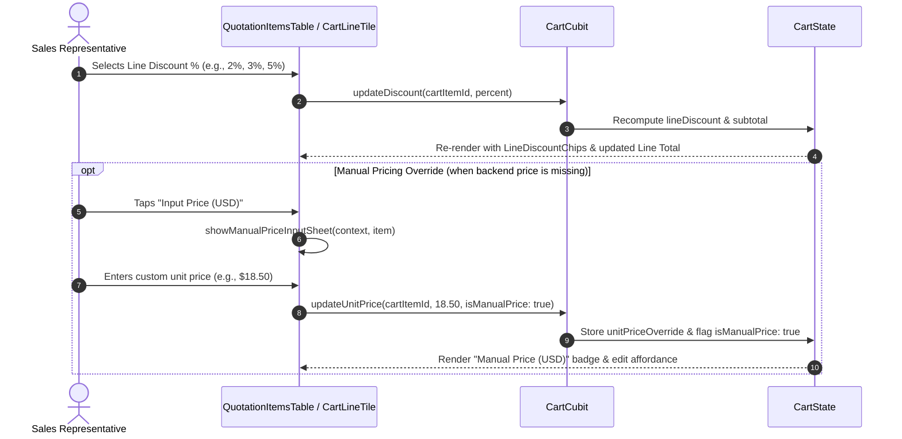
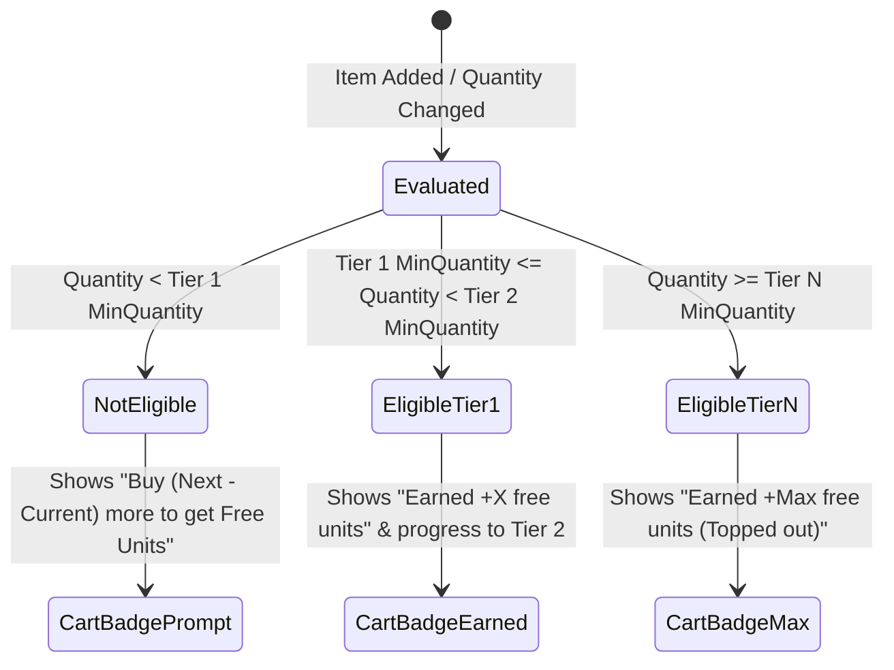
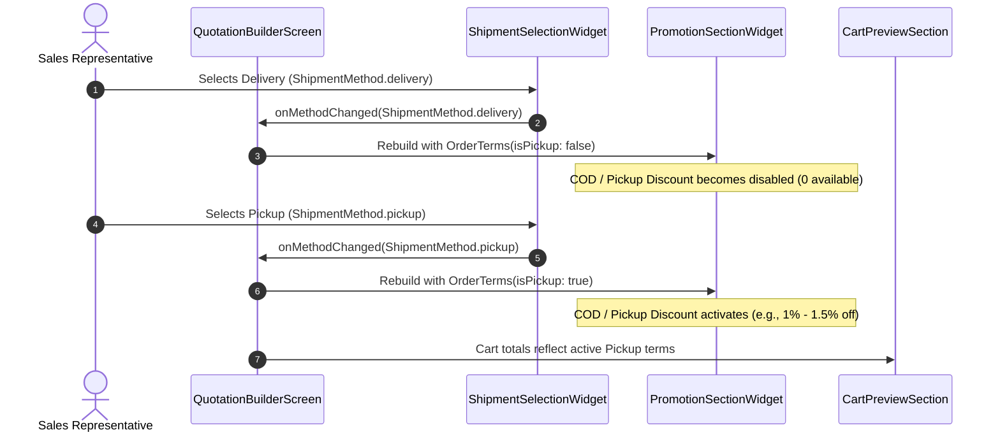
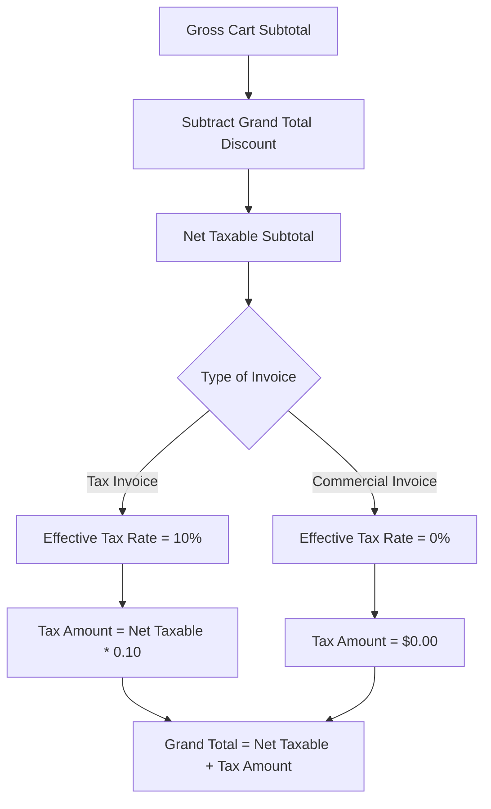

# Promotions & Discounts — Workflows & Integration

> **Document:** Detailed Operational Flows, Formulas, and Component Lifecycles  
> **Location:** `docs/feature/promotions/workflow.md`  
> **Companion Document:** [README.md](README.md)


> [!WARNING]
> **This documents the Flutter mobile application, not the backend**, and was copied
> into the backend repository from the mobile one (`lib/…`, branch `web`). Its file
> paths do not resolve here.
>
> **Parts of it are superseded.** The backend now owns the arithmetic it describes:
>
> | This document says | What the server does now |
> |---|---|
> | Rep line discount `0% – 10%` | The limit is served by `GET /api/v1/mobile/me/discount-authority` (3% by default) and enforced server-side. Exceeding it is *accepted* and escalates |
> | Manual USD price override when unpriced | Refused. The quotation API prices every line from SAP; a SAP outage answers `502`, never an input box |
> | Free-goods ladder evaluated on the phone | Not built anywhere. `POST /promotions/evaluate` does not exist |
> | On-invoice depot discount as a client-side scheme | Applied by the server from an **effective** agreement term, and never from an approved-but-unconfirmed one |
> | COD / Pickup as one discount | Two different things. Pickup is who moves the goods; COD is how the customer pays. Only pickup earns the rate |
>
> For the endpoints and their actual behaviour see [../api/mobile.md](../api/mobile.md);
> for what is built see [../README.md](../README.md).

---

## Table of Contents

1. [Line-Level Rep Discount & Manual Pricing Flow](#1-line-level-rep-discount--manual-pricing-flow)
2. [Free-Goods Incentive Flow (Buy X Get Y)](#2-free-goods-incentive-flow-buy-x-get-y)
3. [Order Terms & Depot Pickup Discount Flow](#3-order-terms--depot-pickup-discount-flow)
4. [Structured Discount Breakdown & Summary Aggregation](#4-structured-discount-breakdown--summary-aggregation)
5. [Type of Invoice & Tax Interaction Flow](#5-type-of-invoice--tax-interaction-flow)
6. [PDF Generation & Commercial Document Flow](#6-pdf-generation--commercial-document-flow)
7. [Verification & Test Matrix](#7-verification--test-matrix)

---

## 1. Line-Level Rep Discount & Manual Pricing Flow

Sales representatives have discretionary authority to apply percentage discounts to individual line items within designated caps, or provide manual unit prices when catalog products lack backend SAP pricing.



### 1.1 Mathematical Formulas for Line Items

For each item $i$ in the cart:

$$\text{Gross Line Subtotal}_i = \text{Quantity}_i \times \text{Effective Unit Price}_i$$

Where:
$$\text{Effective Unit Price}_i = \begin{cases} 
\text{unitPriceOverride}_i & \text{if } \text{isManualPrice}_i = \text{true} \\
\text{standardPrice}_i & \text{otherwise}
\end{cases}$$

$$\text{Line Discount Amount}_i = \text{Gross Line Subtotal}_i \times \left(\frac{\text{discountPercent}_i}{100}\right)$$

$$\text{Net Line Total}_i = \text{Gross Line Subtotal}_i - \text{Line Discount Amount}_i$$

### 1.2 Price Override Governance Rules

1. **Disallow Manual Override for Backend-Priced Items:**  
   If a valid price exists from the SAP pricing service (`PricingCubit.state[materialNumber] != null && price.hasAmount`), manual price input is prohibited.
2. **Persistence Across Rebuilds:**  
   `_manualPrices[materialNumber]` is retained in `QuotationBuilderScreen` state so recalculations or line deletions do not wipe user-entered quotes.

---

## 2. Free-Goods Incentive Flow (Buy X Get Y)

Free goods incentivize volume purchases without discounting invoice line prices.



### 2.1 Tier Evaluation Logic (`PromotionEvaluation`)

Given a ladder of rungs $T = [T_1, T_2, \dots, T_n]$ sorted ascending by `minQuantity`:

```dart
// Promotion.tierFor(quantity)
PromotionTier? earned;
for (final tier in tiers) {
  if (quantity >= tier.minQuantity) {
    earned = tier;
  } else {
    break;
  }
}
```

- **Gap to Next Tier:**
  $$\text{quantityToNextTier} = T_{\text{next}}.\text{minQuantity} - \text{quantity}$$
- **Progress to Next Tier:**
  $$\text{progress} = \frac{\text{quantity} - T_{\text{earned}}.\text{minQuantity}}{T_{\text{next}}.\text{minQuantity} - T_{\text{earned}}.\text{minQuantity}} \quad (0.0 \le \text{progress} \le 1.0)$$

### 2.2 Visual Representation on Mobile

- **Cart Preview & Line Tiles:** Display `LineDiscountChips` with a gift icon: `Buy 40 Free 1` and promotion campaign name.
- **Summary Breakdown:** Aggregated at bottom as `+N free units` in `DiscountSummarySection`.

---

## 3. Order Terms & Depot Pickup Discount Flow

Commercial discount schemes often depend on fulfillment logistics (e.g. factory/depot collection saves delivery freight costs).



> [!IMPORTANT]
> **Pickup vs. COD:** The discount requires actual depot collection (`isPickup: true`). Cash on Delivery (COD) alone does *not* qualify for this discount scheme.

---

## 4. Structured Discount Breakdown & Summary Aggregation

The `DiscountSummarySection` aggregates all discounts applied to the quotation into three transparent sections:

```
┌────────────────────────────────────────────────────────────────────────┐
│                        DISCOUNT SUMMARY                                │
├────────────────────────────────────────────────────────────────────────┤
│ Invoice Discounts:                                                     │
│  • COD / Pickup Discount — 1% → -$2.50                                 │
│  • Summer Promotion — 3% → -$3.00                                      │
├────────────────────────────────────────────────────────────────────────┤
│ SKU Discounts:                                                         │
│  • Deformed Rebar SD390 / RB-SD390-D16                                 │
│    • Promotion: Rep Discount — 2% → -$13.60                            │
│  • Roofing Sheet Palm / RF-PALM-035                                    │
│    • Promotion: Roofing Sheet Free Goods — Buy 40 Free 1 → 1 free unit │
├────────────────────────────────────────────────────────────────────────┤
│ Total Discount: -$19.10                          [ +1 free unit ]      │
└────────────────────────────────────────────────────────────────────────┘
```

### 4.1 Grand Discount Aggregation Formula

$$\text{Total Invoice Discount} = \sum_{j} \text{InvoiceDiscountAmount}_j$$

$$\text{Total SKU Monetary Discount} = \sum_{i} \text{LineDiscountAmount}_i$$

$$\text{Grand Total Monetary Discount} = \text{Total Invoice Discount} + \text{Total SKU Monetary Discount}$$

$$\text{Total Free Goods Units} = \sum_{i} \text{FreeQuantity}_i$$

---

## 5. Type of Invoice & Tax Interaction Flow

In the quotation builder, the user selects the **Type of Invoice** in `ShipmentSelectionWidget`:

- **Tax Invoice:** Full VAT (10%) applied to the net taxable base.
- **Commercial Invoice:** Tax exempt (0% VAT).



### 5.1 Tax Calculation Equations

$$\text{Net Taxable Base} = \max\left(0, \text{Gross Subtotal} - \text{Grand Total Monetary Discount}\right)$$

$$\text{Tax Amount} = \begin{cases}
\text{Net Taxable Base} \times 0.10 & \text{if Type of Invoice is Tax Invoice} \\
0.00 & \text{if Type of Invoice is Commercial Invoice}
\end{cases}$$

$$\text{Grand Total} = \text{Net Taxable Base} + \text{Tax Amount}$$

---

## 6. PDF Generation & Commercial Document Flow

When generating the quotation PDF via `QuotationPdfGenerator` and `QuotationPdfData.fromCart(...)`:

1. **Dedicated DISCOUNT Column:**  
   The line items table renders a distinct column displaying discount percentages and amounts (e.g., `3% / -$0.60`) or free units (e.g., `Free 20`). Products without discounts display `—`.
2. **Itemized Invoice Totals:**  
   - Gross Subtotal
   - Itemized SKU Discount Total
   - Itemized Invoice Discounts (e.g., `COD / Pickup Discount (5%): -$2.00`)
   - Combined Total Discount (`- $X.XX`)
   - Tax row rendered as either:
     - `Tax (VAT 10%)` with calculated tax amount, OR
     - `Tax (Exempt)` with `$0.00`
   - Final Grand Total in USD

---

## 7. Verification & Test Matrix

The promotions and discount flows are validated by automated test suites in `test/features/order/`:

| Test Target | Test File | Key Assertions Covered |
|---|---|---|
| **Type of Invoice Selection** | `quotation_tax_and_discount_summary_test.dart` | Confirms header renders as `Type of Invoice` with `Tax Invoice` and `Commercial Invoice` toggles under COD. |
| **Tax Exemption vs. 10%** | `quotation_tax_and_discount_summary_test.dart` | Validates that `Tax Invoice` applies 10% VAT and `Commercial Invoice` results in `$0.00` and displays the `Exempt` badge. |
| **Structured Summary Display** | `quotation_tax_and_discount_summary_test.dart` | Ensures Invoice Discounts and SKU Discounts render with itemized bullets and separated free units. |
| **PDF DTO Mapping** | `quotation_tax_and_discount_summary_test.dart` | Validates `QuotationPdfData.fromCart` preserves SKU discount column strings, invoice discounts, and tax states. |
| **Manual Price Override** | `cart_manual_pricing_test.dart` | Confirms manual pricing flow, disallowing backend-priced items, and updating cart line subtotals. |
