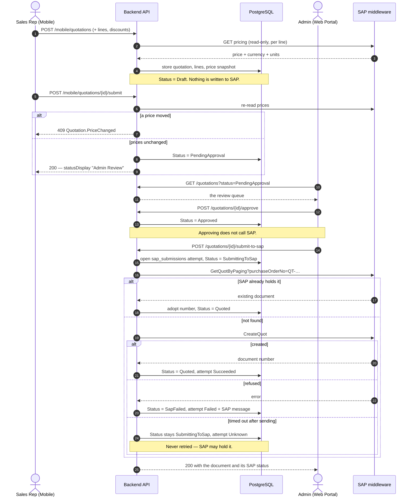

# Quotations — Overview

**What it is:** the platform's priced offer to a customer, from an empty draft to an
approved document.
**Status:** Active · **Last updated:** 2026-09-11

---

## The guarantee

> **The phone computes nothing, and every figure is an estimate until SAP prices it.**

Two halves, both load-bearing.

**The phone computes nothing.** One `IQuotationCalculator` in `ISI.Application`
produces every amount. It is called by the preview, by every write (each returns the
recalculated document), by the detail read, and by the admin queue. The Flutter app
renders its output. Four implementations would be four chances to disagree about a
number a customer is looking at — which is the failure Pricing spent a week removing.

**Every figure is an estimate until SAP prices it.** `totals.isEstimate` is `true` for
the whole of this release, because no quotation reaches SAP yet. When the submission
job exists it will read SAP's net back and the flag will flip. Anything printed while
it is true says so on the page.

---

## The flow that is built

**Two halves, two surfaces, one hand-off.** A representative authors and submits for
review; an administrator reviews and, as a separate act, puts the document into SAP.
The mobile app has no route that reaches SAP — not as a rule somebody enforces, but
because no such route exists and no mobile role holds the permission.

```text
MOBILE                                        ADMIN PORTAL
──────                                        ────────────
POST /mobile/quotations            → Draft
POST   .../lines                              (server prices each line from SAP)
PUT    .../discounts                          (percentage intents only)
GET    .../preview                            (one call, whole draft)
POST   .../submit                  → PendingApproval  ← shown as "Admin Review"
                                              GET  /quotations?status=PendingApproval
                                              POST /quotations/{id}/approve   → Approved
                                              POST /quotations/{id}/return    → Returned
                                              POST /quotations/{id}/reject    → Rejected
                                              POST /quotations/{id}/submit-to-sap
                                                      ↓
                                              SubmittingToSap → Quoted | SapFailed
```

### End to end



**Why the hand-off is structural, not procedural.** Three independent things would each
have to be undone for a handset to reach SAP: the `quotations.sap` permission (held by
no mobile role), the absence of any mobile route dispatching the command, and the
aggregate's refusal to begin a submission from anything but `Approved`.

---

## Status: four dimensions, one derived answer

| Dimension | Values | Reachable today |
|---|---|---|
| Approval | `NotSubmitted` · `Pending` · `Approved` · `Returned` · `Rejected` | all |
| SAP quotation | `NotSent` · `Sending` · `Unknown` · `Created` · `Failed` | **all five** |
| SAP order | same | `NotSent` only |
| Customer answer | `Undecided` · `Accepted` · `Declined` | `Undecided` only |
| Closure | `Cancelled` · `Expired` | `Cancelled` only |

`Quotation.RecomputeStatus()` folds those into one of fifteen `QuotationStatus`
values. Nine are reachable: `Draft`, `PendingApproval`, `Returned`, `Approved`, `Rejected`,
`Cancelled`, `SubmittingToSap`, `Quoted` and `SapFailed`. The remaining six belong to
the customer decision and sales-order phases, which are not built. The rest are declared so the derivation was written once rather than widened later.

**`PendingApproval` is what the business calls "Admin Review".** The stored value and
the wire value stay `PendingApproval`; `statusDisplay` carries the label, localised, so
renaming the step never breaks a client that switches on the code. Adding a second
status for the same state would have meant two names, stored integers to migrate, and
somewhere switching on the wrong one.

The handset does not show fifteen states. `QuotationStatusGroups` maps them onto five
tabs — **Drafts**, **Waiting**, **With customer**, **Won**, **Closed** — and the
grouping is decided on the server so every client shows the same thing.

---

## Where the money comes from

Nothing in this feature reads SAP directly. A line is priced through
`IQuotationLinePricer`, which calls the existing `IPricingService` — the same service
behind `GET /api/v1/mobile/pricing/customers/{id}` and the SignalR publisher. A price
on a quotation is therefore the price the representative saw on the pricing screen, by
construction.

The pricer keeps three outcomes apart, and that separation is most of its value:

| SAP said | Outcome |
|---|---|
| One price | The line is built, with the four price fields snapshotted onto it |
| No price | `422 Quotation.MaterialNotPriced` — a business condition |
| More than one price | `422 Quotation.MultiplePrices` — blocked, never `items[0]` |
| Nothing (unreachable, 5xx, unmapped row) | `502 Quotation.PriceUnavailable` |

The snapshot on the line is **evidence of an offer, not a cache**. It is never served
as a current price, and `POST .../submit` re-reads every line against SAP before the
document moves.

---

## Layering

```text
Flutter app                                Admin portal
  /api/v1/mobile/quotations                  /api/v1/quotations
            │                                        │
            └────────────────┬───────────────────────┘
                             ▼
        MobileQuotationsController · QuotationsController      (ISI.Api)
                             ▼
        Commands / queries  →  QuotationWorkspace              (ISI.Application)
                                 ├ IQuotationCalculator   (the only source of a total)
                                 ├ IQuotationLinePricer ──► IPricingService (existing)
                                 └ IPricingAudienceResolver (existing ownership rule)
                             ▼
        Quotation aggregate — transitions, invariants, status  (ISI.Domain)
                             ▼
        quotations · quotation_lines · quotation_line_discounts (ISI.Persistence)
```

`IPricingAudienceResolver` is reused rather than duplicated. Its name says pricing, but
what it answers is *"may this caller see this customer?"* — the platform's one
ownership rule — so a permission change takes effect on quotations with nothing to
remember. The plan proposes renaming it `ICustomerAudienceResolver` when a third
feature needs it.

---

## What this is phase one of

[quotation-orders-plan.md](quotation-orders-plan.md) sets out the whole programme:
SAP quotation creation with an outbox and honest "unknown" outcomes, sales orders,
customer accept/decline, expiry, and the promotions track in
[../prom-discount/promotions-discounts-plan.md](../prom-discount/promotions-discounts-plan.md).
This release is its **Q1** (server draft and calculator) plus the approval transitions
from **Q3**. Everything from **Q4** onward is blocked on SAP endpoints and business
decisions that do not exist yet — the README lists them.
