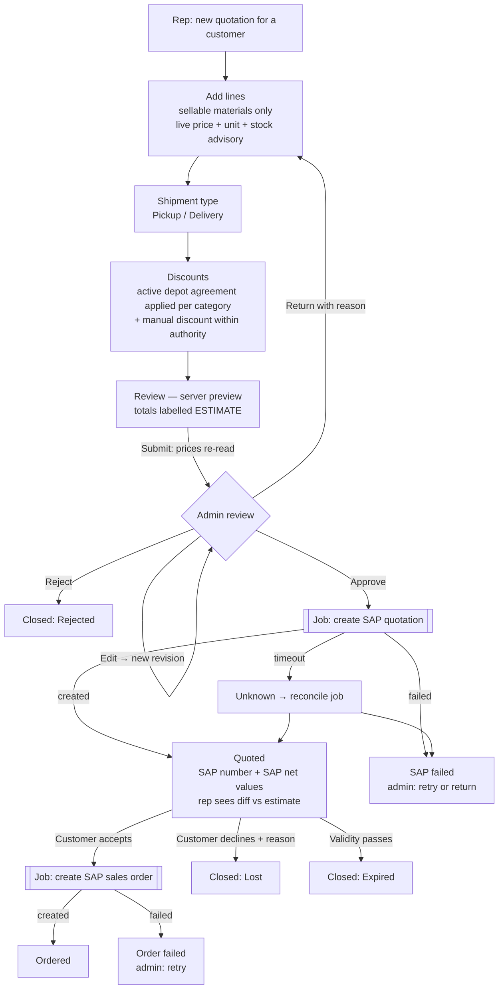
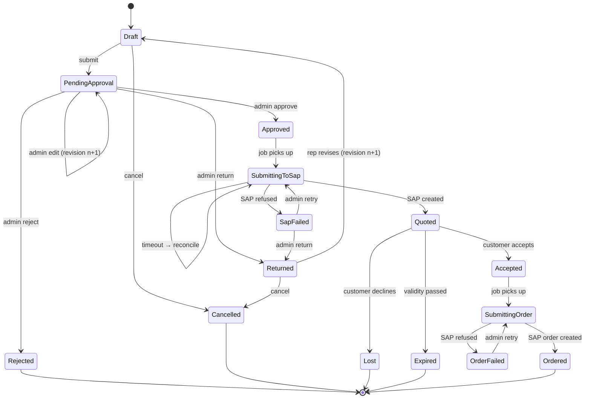
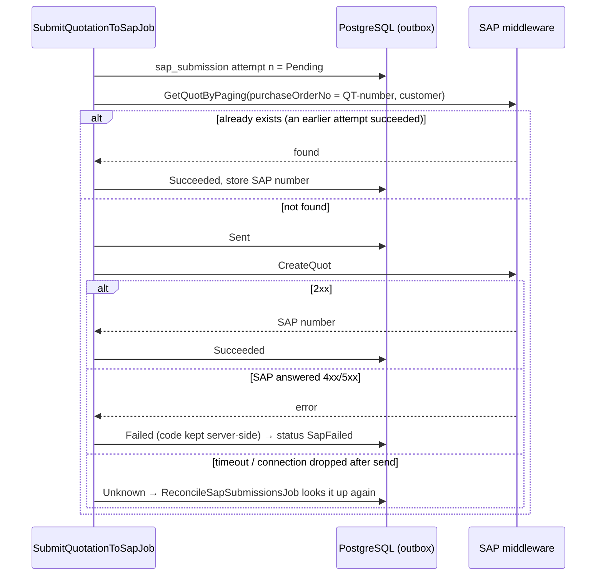

# Quotation & Orders (with Promotion & Discount) — Analysis, Plan and Strategy

**Purpose:** decide *how* SteelForce builds quotations, customer orders, promotions and
discounts before a line of Flutter or .NET is written.
**Scope:** mobile quotation authoring, admin approval, promotion and discount rules, SAP
quotation and sales-order creation.
**Status:** Proposal · **Date:** 2026-09-11 · **Inputs reviewed:** the "Create Quotations
or Orders" diagram, the SAP `06. Quotation` / `07. Quotation Helper` spec excerpt, the
earlier AI write-up of the flow, the whole `feature/pricing/` folder, and the
*Promotions & Depot Discount Management* BRD/SRS v1.0 (with its ERD and workflow),
and the Flutter `docs/feature/promotions/` README and workflow (branch `web`, 2026-09-11).

---

## 0. The short version

1. **The diagram has the right steps but the wrong seams.** It reads data with `POST`,
   bypasses the `/api/v1` conventions the platform already has, lets the phone call
   `submit-to-sap`, and has no failure, expiry or cancel paths. Most of the "read"
   boxes in it **already exist** as live endpoints — the quotation feature should reuse
   them, not re-invent them.
2. **The earlier write-up misread the diagram.** In the diagram SAP is called *after the
   Sales Rep confirms with the customer*, not directly after admin approval. That
   difference is the single biggest business decision in this plan (§5, D1).
3. **SAP must stay the price authority.** The Pricing feature's guarantee — *a price
   shown is a price SAP holds right now* — has to extend to quotations. So promotions
   and discounts are **proposed** by the platform and **priced** by SAP. Every total the
   platform shows before SAP has priced the document is labelled an estimate.
4. **Promotions are a separate feature that quotation consumes.** The Promotions BRD
   (v1.0 draft) defines them as **depot discount agreements** — per customer, per
   product category, flat / tiered / immediate-payment — approved through four steps
   (Sales Support → RSM → Consultant → Commercial Director). The rep does not pick a
   promotion on a quotation; the customer's approved agreement applies automatically.
   So Promotions is built as its own aggregate and workflow, and quotation reads it (§8).
5. **The BRD promises something the platform cannot do alone.** It says approved
   discounts are "automatically applied to sales invoices" — but invoices are created in
   **SAP**, and the BRD itself puts SAP invoicing out of scope. A discount only reaches a
   SAP invoice if SAP's pricing holds it. The approved agreement must therefore be
   **written into SAP as condition records** (or rebate agreements for volume tiers), and
   no middleware endpoint for that has been seen. This is the most important open item in
   the whole plan (§8.4).
6. **"Orders" has no SAP endpoint either.** The spec excerpt has create/update/read for
   quotations only. A sales-order endpoint is on the critical path for the "Orders" half
   of this feature and must be requested from the middleware team now.
7. **The Flutter app already computes quotations on the phone — that is the largest
   implementation risk.** Its builder multiplies quantity by price with no unit or
   `pricingUnit`, labels everything USD, keys one price per material, lets the rep type a
   USD price whenever a price is "missing" (which a SAP outage also looks like), reads
   promotions from a mock file, picks VAT with a toggle, and prints a PDF from its own
   numbers. The UI is worth keeping; the arithmetic has to move to the server (§1.1, §15).
8. **Phase 0 is not optional.** The quotation response contract is unverified, the
   request DTO schemas were not shared, `CreateQuot` writes real documents into what is
   called `Live110`, and `dotnet test` cannot run in the repository today. Pricing lost
   days to four silent contract defects; quotation moves money and cannot afford that.

---

## 1. What already exists — the foundation this feature stands on

| Capability | Surface today | State | What quotation takes from it |
|---|---|---|---|
| Customer + sales area | `CustomerSalesArea` (sales org, price group), synced from SAP | Live | Sold-to, sales area, ownership |
| Row-level scoping | `IPricingAudienceResolver` over the platform's ownership rule | Live | Who may quote which customer |
| Material catalogue + sellability | `GET /mobile/materials[/search]?customerId=`, selection facets | Live | Material picker that only offers what the customer can buy |
| Stock | `GET /materials/{materialNumber}/stock` | Live | Advisory availability on a line |
| Pricing | `GET /api/v1/mobile/pricing/customers/{id}?materialNumber=` | **Live, verified 2026-09-10** | List price per line — never re-fetched from SAP by quotation code directly |
| Realtime | `WS /hubs/pricing`, `PricingUpdated` | Live | "Price changed while you were quoting" |
| Background jobs | `ISI.BackgroundJobs`, `AddOrUpdateRecurring` | Live | SAP submission, reconciliation, expiry |
| SAP client pattern | Failover, shared token, one re-auth on 401, 404 classification | Live | `SapQuotationService` copies it |
| SAP quotation endpoints | `GetQuotByPaging`, `GetQuotItemByPaging`, `CreateQuot`, `UpdateQuot` | **Declared, unused, response unverified** | The document itself |
| SAP quotation helpers | `GetPriceType`, `GetReason`, `GetSalesStock` | **Declared, unused** | Manual condition types, order reasons, ATP |
| Promotions | BRD/SRS v1.0 draft; nothing built | **Specified, not built** | Active depot agreement per line category (§8) |
| Push notifications | — | **Not seen** in any doc | BRD requires push within 1 minute; SignalR only reaches an open app |
| Sales order | — | **No endpoint seen** | Blocks the "Orders" half |
| Customer credit | — | **No endpoint seen** | The diagram's `get-credit` has nothing behind it |
| Test suite | `dotnet test` | **Cannot run** (pre-existing customer-schema breakage) | Must be fixed first |
| Flutter quotation builder | `lib/features/order/…/quotation/`, `CartCubit`, `PromotionCubit`, PDF generator | **Built, client-side, partly mock** | UI, summary layout, PDF layout — not the arithmetic (§1.1) |

> [!IMPORTANT]
> `overview.md` for Pricing states **"No quotation logic. SAP's `Quotation` endpoints
> remain unused."** and `sap-integration.md` records that on 2026-09-04 the Quotation and
> Pricing groups were *both* missing from the deployed middleware. Pricing was re-checked
> on 2026-09-10; **Quotation was not.** Confirm the six Quotation routes are live before
> planning around them.

### 1.1 The Flutter app today — what to keep, what must change

The app's promotions docs describe a working builder with good instincts — it separates
discount *origins* (rep, depot, order term, price request), resets promotion state when
the customer changes, and treats a pending depot request as not quotable. Its
arithmetic, though, predates the verified Pricing contract and contradicts it in ways
that produce **plausible wrong numbers**, the failure mode Pricing spent a week removing.

| # | App today | Why it is a problem | Change |
|---|---|---|---|
| 1 | `CartCubit`: `subtotal = Σ qty × unitPrice` | Ignores `pricingUnit` and `conditionUnit`; wrong by a factor of 100 the day SAP prices "per 100 KG" | Server preview (§9); the cubit renders it |
| 2 | Totals and PDF "in USD"; manual price input "USD" | 3,867 of 3,869 live prices are `US3` | Carry currency from the price; never assert USD |
| 3 | `PricingCubit.state[materialNumber]` — one price per material | `2400000466` has two; a map keeps whichever arrived last | Keep the list; D5 decides |
| 4 | Manual price allowed when `!price.hasAmount` | A SAP outage (`erpAnswered` false / 5xx) and "no price" can look the same — the rep would type a price over a material SAP *does* price | Allow only when SAP **answered** and returned no price, and only as an approval-gated price request (D7) |
| 5 | `promotions_mock_data.dart` feeds depot and term promotions | Invented commercial terms shown to real customers; Pricing deleted its mock for exactly this reason | Real agreements endpoint; the mock cannot ship |
| 6 | Rep line discount capped at 10 % in the client | A client-side cap is a suggestion | Server-side authority (D4); the app shows the limit it is told |
| 7 | Free-goods ladder ("buy 40 get 1") evaluated on the phone | No source in the BRD, the diagram or SAP endpoints reviewed | D17 |
| 8 | "Type of Invoice" toggle: Tax Invoice 10 % VAT / Commercial Invoice 0 % | Tax treatment chosen by a rep; SAP determines tax from customer and material tax classification | D18 — Finance owns the rule, SAP computes the tax |
| 9 | `netTaxable = max(0, gross − discount)` | Silently hides a discount larger than the order | Reject the quotation instead |
| 10 | Invoice-level % base unspecified (gross or after line discounts?) | Differs from SAP unless it matches the procedure | D12 |
| 11 | PDF generated on the phone from cart numbers | An estimate on paper in a customer's hand | "DRAFT — ESTIMATE" watermark until Quoted; final PDF from SAP values |
| 12 | 220 ms debounce per material to "pricing/promotion services" | Each material is a SAP round trip, and there is no promotion service | One debounced **preview** call for the whole draft |

---

## 2. Reading the diagram

### 2.1 What it actually says

Following the arrows rather than the lane layout:

```text
Create Quotation ─► BP (customer) selection ─► Choose materials / get price
      ─► Shipment type ─► Discount & promotion ─► Submit to Admin Portal
      ─► /mobile/quotation/submit ─► Admin decision { approved | rejected | edit }
             │
             ├─ Rejected ─► (dead end)
             └─ Approved ─► back to the Sales Rep: "Quotation Details"
                                   ├─ Sales Confirmed ─► /mobile/quotation/confirm ─► submit-to-sap
                                   └─ Sales Rejected  ─► /mobile/quotation/rejected
```

So the drawn intent is: **internal approval first, then the rep takes the approved
price to the customer, and only a customer "yes" reaches SAP.** "Sales Confirmed" and
"Sales Rejected" are the *customer's* answer, relayed by the rep.

### 2.2 What needs fixing in it

| # | Issue | Why it matters | Fix |
|---|---|---|---|
| 1 | Reads are `POST` (`get-outlet`, `get-credit`, `search`, `categories`, `stock`, `price`) | Uncacheable, un-idempotent, breaks the conventions every other module follows | `GET`, and reuse the endpoints that already exist (§12.1) |
| 2 | Routes are `/api/mobile/...` | Platform is `/api/v1/mobile/...` with `MobileApiResponse<T>` | Version and envelope like Pricing |
| 3 | The phone triggers `submit-to-sap` (via `confirm`) | A client must never start an ERP write; a retry on a flaky 3G link creates two SAP quotations | Client records the customer's decision; the **backend** submits, from a job |
| 4 | `submit-to-sap` appears twice (diamond and box) | Two owners for one side-effect | One command, one job |
| 5 | `/mobile/quotation/rejected` is a client-called endpoint | Collides with admin "rejected"; ambiguous meaning | Split: admin **reject/return**, customer **decline** |
| 6 | Admin "Rejected" is a dead end | Rep cannot fix and resubmit | Admin **Return** (rework allowed) vs **Reject** (closed) |
| 7 | `get-promotion/{outletid}` returns "promotions" for the customer | The BRD confirms promotions *are* customer-keyed agreements, so the idea is right — but what a quotation needs is the agreed rate **per line's product category**, and the pickup % (diagram, app) is not in the BRD at all (D13) | `GET /mobile/customers/{id}/agreements` for display; the calculator applies them per line (§8.6) |
| 8 | `quotation/update` appears three times | Fine as autosave, but undefined: full replace? patch? which fields? | Resource-shaped edits with optimistic concurrency |
| 9 | No SAP failure, timeout, expiry, cancel or price-changed paths | These are the paths production actually takes | State model in §7 |
| 10 | "outlet" vs "customer" vs "BP" | Three names for one thing | The platform says **customer**; keep it |
| 11 | Typos in routes (`drift`, `materails`, `admim`) | They become permanent once a Flutter build ships | Fixed in the new contract |
| 12 | "AI search integration" feeds material search | Not quotation scope | Later phase, behind the existing search endpoint |

---

## 3. Corrections to the earlier write-up

The earlier write-up is a good start and three of its ideas are kept: **separate approval
status from SAP status from overall status**, **version every edit rather than
overwriting**, and **the backend owns all business rules; only the backend talks to
SAP**. The rest needs correcting before it becomes the official flow:

| Earlier write-up said | Problem | Correct position |
|---|---|---|
| Admin approves → submit to SAP | Misreads the diagram (§2.1) | SAP timing is a business decision — D1 |
| Available = SAP stock − confirmed SO − **expected PO** | Incoming purchase orders *add* supply; subtracting them understates stock | Don't compute it. Use SAP ATP: `GetSalesStock?UseAtp=true` or the existing stock endpoint |
| Price missing → "Waiting from HQ", quotation continues | Contradicts Pricing: an ERP failure is "prices unavailable", never a price; and a line with no price cannot be totalled | Missing price blocks submit unless the business approves a "price on request" line type — D7 |
| Promotion chosen and applied during quotation | The BRD makes promotions standing agreements approved in advance by four people | The quotation *reads* the active agreement; the rep only adds a manual discount, within authority |
| Endpoint table copied from the diagram | Inherits `POST` reads, unversioned routes, client-triggered SAP writes | New contract, §12 |
| "SAP accepted → Confirmed" | Ignores the timeout case: SAP may have created the document and we never heard | An **unknown** outcome and a reconciliation job, §13.3 |
| Nothing about units, currency, paging, multi-price | These are exactly what Pricing found in live data | Inherited constraints, §4 |
| Nothing about Orders | Half of the diagram's title | §5 D8, Phase 5 |

---

## 4. Constraints inherited from Pricing — non-negotiable

These were learned from live SAP data on 2026-09-10. Quotation must honour every one.

1. **A price is four fields.** `price` `currency` per `pricingUnit` `conditionUnit`.
   A quotation line stores all four and every screen renders all four. A line amount is
   `quantity (in conditionUnit) × price ÷ pricingUnit`. `pricingUnit` is 1 today and
   must still never be assumed.
2. **No stale price.** Pricing has no table and no cache. A quotation line *does* store
   the price it was offered at — that is **evidence of an offer, not a cache**, and it is
   never served as a current price. The live price is re-read at submit and again at SAP
   submission; if it moved, the quotation stops and says so.
3. **One material can have two prices.** `2400000466` returns 100.000 USD/M and
   2.765 US3/M. A quotation line must pin *which* condition record it used, and the
   business must decide which wins (D5). Never `items[0]`.
4. **`US3` is not `USD`.** 3,867 of 3,869 records are `US3`. A quotation whose lines
   carry different currencies cannot be totalled by adding numbers (D11).
5. **404, not 403.** A customer the rep may not see is indistinguishable from one that
   does not exist. Quotations inherit the rule: someone else's quotation is `404`.
6. **"No prices" ≠ "prices unavailable".** An ERP error never renders as an empty price
   or a zero. On a quotation it blocks, it does not default.
7. **Unverified SAP contracts fail loudly.** Capture a real response before mapping;
   keep aliases as fallback; log field *names* SAP sent; count unmapped rows.
8. **ABAP on the wire.** Flags are `X`/blank, not `true`/`false` (`true` returned
   HTTP 500 on pricing). Dates on pricing arrive `dd-MM-yyyy`; other feeds use
   `yyyyMMdd`. Pin formats per endpoint, never trust the invariant parser.
9. **One service, many callers.** Pricing's portal, handset and socket all use one
   `IPricingService` so they never disagree. Quotation's preview, submit, admin screen
   and SAP payload must all use **one calculator** for the same reason.
10. **Prices never appear in logs.** Quotation logs ids, counts and statuses — not
    amounts.

---

## 5. Decisions the business must take first

Each row blocks the phase named. The recommendation is a starting position for the
workshop, not a decision.

| # | Decision | Options | Recommendation | Why | Blocks |
|---|---|---|---|---|---|
| **D1** | **When is the SAP quotation created?** | **A** after the customer accepts (the diagram) · **B** after admin approval, before the customer sees it | **B** | Under A the customer is shown a total SAP never computed — the exact risk the Pricing guarantee exists to prevent — and the SAP quotation is created seconds before it is converted, adding nothing. Under B SAP's pricing procedure sets the official net, the rep hands over a real SAP number, and the customer's "yes" becomes the sales order | Phase 4 |
| **D2** | **How does an approved depot agreement reach SAP?** | **A** middleware writes condition records · **B** SAP team keys them in, platform verifies · **C** platform adds manual conditions only to its own orders | **B now, A when the endpoint exists; never C alone** | Only A/B put the discount on invoices raised at the counter too; C silently gives app orders a discount the counter does not (§8.4) | Promotions P2 |
| **D3** | Does every quotation need approval? | All · only outside policy | **All at launch, routed by rule** | Matches the diagram; the routing rule exists from day one so "auto-approve within policy" later is configuration, not code | Phase 3 |
| **D4** | Manual-discount authority on a quotation (on top of the agreement) | Per role, per % / amount | Rep ≤ x %, Supervisor ≤ y %, Head of Sales above | Enforced server-side; the numbers are the business's. Agreements already carry four signatures — this is only for extra, one-off discount | Phase 2 |
| **D5** | Which price wins when SAP returns two? | Rep picks · rule by `MaterialPriceGroup` · admin picks | **Block the line and route to admin** until a rule exists | Choosing between two prices SAP considers valid is commercial, not technical | Phase 1 |
| **D6** | Quotation validity and price lock | e.g. 7 / 15 / 30 days; price held or re-priced | 15 days, **price held by SAP validity** under D1-B | Once SAP holds the quotation, its validity dates are the lock | Phase 4 |
| **D7** | Can a line be submitted without a SAP price? | No · manual "price request" line (the app has one today) | **Only as an approval-gated price request**: allowed when SAP *answered* with no price, never when SAP was unreachable, never over a SAP price; always forces admin approval; sent to SAP as a manual price condition | The app's override is a real business need, but ungoverned it lets a rep set prices | Phase 1 |
| **D8** | Orders: from quotation only, or direct too? | Quote → order · direct order for walk-ins | **Quote → order first**; direct order later reuses the same aggregate | One pipeline, one set of rules | Phase 5 |
| **D9** | Credit check | Advisory at quote · blocking at order | **Advisory at quote, blocking at order** — needs a SAP credit endpoint | Nothing exists behind `get-credit` today | Phase 5 |
| **D10** | Can admin edit, and must the rep re-confirm? | Edit freely · edit then re-confirm | Admin edits create a revision; **rep sees a diff before presenting** | The rep is the one facing the customer | Phase 3 |
| **D11** | Mixed currencies on one quotation | Forbid · allow with per-currency totals | **Forbid at launch** (document currency = customer's) | A SAP quotation has one document currency | Phase 1 |
| **D12** | Stacking: agreement % + manual discount (+ pickup?) | Additive on gross · sequential · capped | **Mirror the SAP pricing procedure**, cap total per line | If the platform stacks differently from SAP, every estimate is wrong | Phase 2 |
| **D13** | Pickup discount: rule, rate, and SAP home | Standing rule · per-depot agreement · SAP condition on shipping condition | **Confirm with Sales and SD** — the diagram and the app (1–1.5 %) have it, the BRD does not; the app calls it "COD / Pickup" yet says COD alone does not qualify | Rename it *Pickup discount*, and make sure it is not the BRD's immediate-payment discount under another name | Phase 2 |
| **D14** | What is a "product category" in SAP terms? | SAP material price group (`KONDM`) · material group · a platform mapping table | **Material price group if SD agrees** | Pricing rows already carry `MaterialPriceGroup` (`E1`, `G5`); it is what SAP uses for customer × material-group discounts, so a SAP condition record can be keyed on it directly | Promotions P1 |
| **D15** | Approver outcomes per step | The matrix (step 1 cannot reject; steps 3–4 cannot return) · FR-06 (any approver may reject or return) | **One rule, written once** — the BRD contradicts itself | The state machine cannot have two answers | Promotions P1 |
| **D16** | Volume-tier rebate: when and how is it paid? | Credit note after month end · deducted on the next invoice | SAP rebate / condition contract, settled after month end | A tier on *monthly* purchases cannot be known when an invoice line is priced — it is retroactive by nature (§8.4) | Promotions P3 |
| **D17** | Free goods (buy X get Y) | In scope via SAP free-goods determination · out of scope | **Out of launch scope unless SD confirms SAP free-goods records exist** | Free units must appear as a free item on the SAP order to be delivered and stock-counted; a phone-only ladder promises goods nobody ships | Phase 2+ |
| **D18** | Who decides VAT? | Rep toggle (app today) · SAP tax determination | **SAP, from tax classification; Finance owns the rule** | A tax treatment chosen per quotation by the seller is a compliance question, not a UI one | Phase 1 |

---

## 6. Target end-to-end flow (recommended, D1 = B)



Under the diagram's option (D1 = A) the same model holds with the SAP quotation job
moved behind "Customer accepts" — the states and the machinery in §7 and §13 do not
change, only the order they fire in. **That is why the decision can be taken late
without redesign — but it must be taken before Phase 4.**

### Stage by stage — who, what, and which rule bites

| Stage | Actor | Calls | Rules enforced server-side |
|---|---|---|---|
| New draft | Rep | `POST /mobile/quotations` | Customer is theirs (else 404); customer priceable (else 422) |
| Add line | Rep | `POST /mobile/quotations/{id}/lines` | Material sellable for the customer; price exists; one condition record pinned; qty > 0 in the price's unit |
| Shipment | Rep | `PATCH /mobile/quotations/{id}` | Pickup/Delivery; ship-to required for Delivery |
| Discounts | Rep | `PUT .../discounts` | Agreement rates applied automatically per line category (read-only to the rep); manual % within authority or flagged for approval |
| Preview | Rep | `GET .../preview` | One calculator; fresh prices; "estimate" until SAP has priced |
| Submit | Rep | `POST .../submit` | Idempotency key; prices re-read — changed prices return 409 `Quotation.PriceChanged` with the lines |
| Review | Admin | `GET /quotations?status=PendingApproval` | Approver ≠ author for over-authority discounts |
| Approve | Admin | `POST /quotations/{id}/approve` | Enqueues the SAP job; never calls SAP in the request |
| SAP quotation | Job | `CreateQuot`, then `GetQuotItemByPaging` | Outbox, reference-based dedupe, readback |
| Customer answer | Rep | `POST .../acceptance` or `.../decline` | Only in `Quoted`; decline needs a reason |
| Sales order | Job | *endpoint to be provided* | Credit check (D9); same outbox discipline |

---

## 7. State model

### 7.1 Three dimensions, one derived status

Kept from the earlier write-up because it is right: *"admin approved, SAP failed"* is not
*"admin rejected"*, and one status column cannot say both.

| Dimension | Values |
|---|---|
| **Approval** | `NotSubmitted` · `Pending` · `Approved` · `Returned` · `Rejected` |
| **SAP quotation** | `NotSent` · `Sending` · `Unknown` · `Created` · `Failed` |
| **SAP order** | `NotSent` · `Sending` · `Unknown` · `Created` · `Failed` |
| **Customer** | `Undecided` · `Accepted` · `Declined` |

The overall `Status` is **derived** from those and stored for querying. It is never set
directly — a transition method on the aggregate changes the dimensions and recomputes it.

### 7.2 Overall status



### 7.3 How the rep sees it

Fifteen states is right for the database and wrong for a phone. The app groups them:

| Rep's tab | Statuses |
|---|---|
| **Drafts** | Draft, Returned *(badge: "needs changes")* |
| **Waiting** | PendingApproval, Approved, SubmittingToSap, SubmittingOrder |
| **With customer** | Quoted |
| **Won** | Accepted, Ordered |
| **Closed** | Rejected, Lost, Expired, Cancelled, *(SapFailed / OrderFailed show under Waiting with an "admin is fixing" note)* |

### 7.4 Transition rules

Every transition lives on the aggregate as a method (`Submit()`, `Approve()`, …) that
checks the current state and returns `Quotation.InvalidTransition` (409) otherwise. No
controller, handler or job writes `Status`. This is what makes the table-driven test in
§17 possible: every *(state, action)* pair is either in the diagram above or rejected.

---

## 8. Promotions (depot discount agreements) and discounts

> [!NOTE]
> The full promotions design — incentive specifications, agreement lifecycle, approval
> engine, SAP mapping, rebates, data model and screens — is in
> [promotions-discounts-plan.md](promotions-discounts-plan.md), which is authoritative
> where the two differ (it adds *campaigns* as an eighth incentive and decisions D19–D33).
> This section keeps what the quotation feature needs.

### 8.1 What the BRD asks for

The BRD digitises today's Excel "Depot Discount / Sales Discount request". A Sales
Employee proposes, **for one depot**, a rate **per product category** (Pipe, K Pipe,
Coil, Palm 50/70/100, Roofing Profile, PU Eco/Premium, CZD, ISI 295) in one of three
forms — a flat on-invoice percentage (including "no target" rates), a tiered rate on
monthly purchase amount, or an immediate-payment discount. The request passes four
sequential signatures (Sales Support Supervisor *prepares*, Regional Sales Manager
*verifies*, Consultant and Commercial Director *approve*); final approval activates it,
every step is audited and pushed to the rep, and the discount is applied to the depot's
invoices from then on.

That makes a promotion a **standing agreement between the business and a depot**, decided
in advance — not an offer a rep picks while quoting. It changes the quotation design in
a good way: the rep has nothing to choose, and the quotation reads what four people
already approved.

### 8.2 Three documents, eight incentives — one taxonomy

The diagram, the BRD and the app each name a different subset. Before any of it is
built, this is the single list, and each row has exactly one home in SAP.

| Incentive | Diagram | BRD | App today | Nature | Priced in SAP as |
|---|---|---|---|---|---|
| Rep line discount % | "Discount" | — | 0–10 % per line | One-off, per quotation | Manual item condition (type from `GetPriceType`), authority server-side (D4) |
| Manual price (price request) | — | — | USD override when unpriced | Replaces a missing price | Manual price condition, approval-gated (D7) |
| On-invoice depot discount | — | ✔ flat / no-target | ✔ (mock) | Standing agreement | Condition record per customer × category (§8.4) |
| Volume-tier rebate | — | ✔ monthly tiers | ✔ named | Retroactive | Rebate agreement, settled after month end (D16) |
| Immediate-payment discount | — | ✔ | — | Payment term | Payment terms / cash discount |
| Pickup discount | ✔ | — | ✔ 1–1.5 % ("COD / Pickup") | Order term | Condition on shipping condition — SD to confirm (D13) |
| Free goods (buy X get Y) | — | — | ✔ ladder | Non-monetary | Free-goods determination → free item on the order (D17) |
| Pending depot request | — | ✔ the request | ✔ "non-quotable until approved" | Not an incentive yet | — (shown, never applied) |

The app's own rule — *keep every discount's origin visible* — is the right one and is
kept end to end: each discount on a quotation line records its type, its source
(agreement number, rep, rule) and the SAP condition type it is sent as.

### 8.3 The principle, restated

> **Agreed in the platform, enforced by SAP, shown by the platform.**

The platform owns the *decision* (request, approval, audit, notification). SAP owns the
*price* — the only discount that is real is one SAP applies. The platform's quotation
shows an estimate and then verifies SAP agreed.

### 8.4 The invoice gap — where each promotion type must land

The BRD's FR-08/FR-09 say the system applies discounts to invoices, and the BRD's own §1.2 puts SAP
invoicing out of scope. Both cannot be true: **invoices are billed in SAP, from SAP's
pricing.** A discount that exists only in the platform's database reaches an invoice
only if someone copies it into SAP — and a depot that buys at the counter, through an
order never touched by the app, gets nothing.

| BRD type | What it means commercially | Where it belongs in SAP | What the platform does |
|---|---|---|---|
| On-invoice (flat / no-target) | % off everything the depot buys in a category | **Discount condition record**: sales org × customer × material price group, valid for the agreement period | Runs the workflow; writes or verifies the record; applies it as an estimate on quotations |
| Immediate-payment | Extra % if paid immediately | Cash discount in **payment terms**, or a conditional discount condition — SD to advise | Shows it as *conditional*; deducts on a quotation only when its payment term is immediate |
| Volume tier | % by **monthly** purchase amount | **Rebate agreement / condition contract**, settled after month end as a credit | Shows tier progress if a billing read exists; **never deducts on a quote or order** — the tier is unknown until the month closes |

How the approved agreement gets into SAP (D2):

| Option | How | Covers counter sales | Needs |
|---|---|---|---|
| **A** Automatic | Backend writes condition records through the middleware on final approval | Yes | A condition-record create/update endpoint — **not in anything reviewed** |
| **B** Assisted | Final approval creates a task for the SAP SD team; the platform then **verifies** the record exists by reading it back, and only marks the agreement *Effective* when it does | Yes | A read of discount conditions (`GetPriceByPaging` with the discount condition type, or `GetPriceType?OnlyWithData=true`) |
| **C** App-only | Platform adds a manual condition to the quotations and orders *it* creates | **No** | Nothing — which is why it is tempting and wrong on its own |

**Recommendation: B for launch, A when the middleware team delivers the endpoint.** B adds
one state the BRD does not have — `Approved → Effective` — and that state is the honest
answer to "is this depot actually getting the discount?".

### 8.5 BRD review — changes before building

| # | BRD says | Problem | Proposed change |
|---|---|---|---|
| 1 | Own `ROLE`, `USER_ACCOUNT`, `CUSTOMER`, `TEAM` tables | Duplicates the platform's identity, permissions and `Customer` aggregate — two sources of truth for who a rep is and which depots are theirs | Extend what exists: add team, cost center and `depot_type` to the existing customer model if absent; approver roles become permissions |
| 2 | `SERIAL` integer keys | Platform keys are GUIDs (see customer ids in Pricing test data) | Follow the platform |
| 3 | `PROMOTION` has no customer and no rates; the rates live on request lines | The engine would read rates from a *request*, which is editable while returned | On final approval, **snapshot** the lines into an immutable `AgreementTerm` (customer, category, type, rate or tiers, validity, source request). Quotation and SAP sync read terms only |
| 4 | `INVOICE`, `INVOICE_LINE`, `INVOICE_DISCOUNT_APPLIED` | The platform issues no invoices | Drop the invoice tables. FR-10 traceability becomes *agreement ↔ SAP condition record number*; per-invoice reporting needs a SAP billing read (open) |
| 5 | `discount_type` is `ON_INVOICE / PAYMENT_TERM` | No value for the third type | Add `VOLUME_TIER`, or better, reuse `promotion_type` |
| 6 | Invoice lines carry a product category | SAP lines carry materials | A material → category mapping is required — D14 proposes SAP's material price group |
| 7 | Tier amounts `NUMERIC(14,2)`, "USD" | Live data is 99.9 % `US3`, three decimals | Store amount **and currency**; scale from currency |
| 8 | Tiers written "<$2,000: 1.5 %, <$3,000: 3 %" | Boundaries ambiguous; gaps and overlaps possible | Half-open `[min, max)`, contiguous, first tier starts at 0, last may be open — validated server-side (this is FR-04's real content) |
| 9 | "At most one active per depot per category; new supersedes" **and** FR-04 "prevent overlapping active tiers" | Supersede and prevent are opposite answers | A new request may be raised while one is active; on becoming Effective it **end-dates** the previous term the day before it starts. FR-04 applies within a request and against other *pending* requests |
| 10 | FR-06: any approver may reject or return · §8 matrix: step 1 cannot reject, steps 3–4 cannot return | Contradiction | D15 — one rule, encoded as data in the step template |
| 11 | Workflow diagram: *Returned* ends at a notification | FR-06 says the rep edits and resubmits | Returned reopens the request as a new revision; **restart at step 1** (recommended — every signer saw the version they signed) |
| 12 | Re-authentication for "high-value" discounts | Threshold undefined | Configurable %; step-up (password/PIN) on the approve action above it |
| 13 | Offline draft creation | — | Feasible here, unlike quotations: an agreement request needs no live price. Sync with an idempotency key |
| 14 | Scrap (ដែកអេតចាយ) excluded from volume targets | Needs a material flag somewhere | Belongs with the tier calculation — SAP rebate exclusion or the platform tracker |
| 15 | Regions are cost centers (PNP, KSP, BMC, PST, KCN, SRP) | SAP branches appear as sales orgs (`0001`, `0004`–`0007` in test data) | Confirm cost center ↔ sales org / sales office mapping; the SAP condition record is keyed on sales org |
| 16 | NFR: invoice discount in < 500 ms | The platform does not price invoices | Replace with: quotation preview p95 < 2 s (SAP-bound) |
| 17 | — | Nothing stops one person signing two steps, or the requester approving | Four-eyes: approver ≠ requester; one user signs at most one step per request |
| 18 | `period_label` "Jan-2026" | Suggests monthly schemes; FR-14 allows open-ended | Decide: monthly re-approval, or open-ended until superseded |

### 8.6 How a quotation consumes agreements

For each line the calculator asks: *which Effective term covers this customer, this
line's category, today (server clock)?*

| Term type | On the quotation |
|---|---|
| On-invoice | Deducted in the estimate, labelled with the agreement number; **read-only** to the rep |
| Immediate-payment | Shown as "+x % if paid immediately"; deducted only if the quotation's payment term is immediate |
| Volume tier | Shown as information ("3 % tier from $3,000 this month") — never deducted |
| Approved but not yet Effective | Shown greyed: "approved, not yet active in SAP" — never deducted |

After SAP creates the quotation, readback (§8.10) confirms SAP applied the same discount.
**If the platform expected an agreement discount and SAP did not apply it, that is the
signal that the SAP condition is missing** — the same check option B relies on.

### 8.7 Stacking order

Default proposal, to be replaced by whatever the SAP pricing procedure does (D12):

```text
list price (SAP ZP01, per pricingUnit conditionUnit)
  × quantity ÷ pricingUnit                  = line gross
  − agreement on-invoice %  (of line gross)
  − manual discount %       (of line gross)
  − pickup %                (only if D13 confirms it exists)
  = line net (estimate)       cap: total discount ≤ policy max per line
  + tax                     (SAP tax determination, D18 — shown, not chosen)
  = line total
free goods                  separate zero-price item, never a deduction (D17)
```

The app's two rules carry over unchanged because they are correct: **free goods are
never converted into money**, and **discounts reduce the base before tax**.

Percentages are **additive on gross**, not compounded, because that is the common SAP
setup (discount conditions referencing the gross step). If the procedure compounds, the
calculator compounds — the point is to agree with SAP, not to be clever.

### 8.8 Manual discount and authority

The agreement rate already carries four signatures. A **manual** discount is the one-off
extra a rep asks for on a single quotation. The client sends **intent** — "1 % on line
2" — never an amount; the server computes it and compares the *manual* part against the
caller's authority (D4):

| Manual discount on top of agreement | Route |
|---|---|
| Within rep authority | Normal quotation approval (auto-approve later, D3) |
| Within supervisor authority | Supervisor approval |
| Above | Head of Sales / Commercial; approver ≠ author |

The required level is computed on submit and stored, so the admin queue filters "needs
my level" and the audit shows *why* it was routed there.

### 8.9 Worked example — real price, illustrative agreement

Customer PNP-Walk In (sales org 0001, price group 11). Material `1500000017`, live price
**0.475 US3 per 1 KG** (captured 2026-09-10). Assume — for illustration only — it maps
to a category on which the depot holds a 5 % on-invoice agreement.

```text
Quantity                   10,000 KG
Line gross                 10,000 × 0.475 ÷ 1      = 4,750.000 US3
Agreement AG-…     5 %     4,750.000 × 0.05        =   237.500 US3   (read-only)
Manual discount    1 %     4,750.000 × 0.01        =    47.500 US3   (checked vs authority)
Line net (estimate)                                  4,465.000 US3
```

`US3` rounds to three decimals; `USD` to two. Rounding happens **per line**, then lines
are summed — that is how SAP does it, and a one-cent disagreement on a quotation is a
support ticket.

### 8.10 Estimate vs SAP net — reconciliation

After SAP creates the quotation, `GetQuotItemByPaging` returns SAP's net per item. The
platform stores both and compares:

| Difference | Behaviour |
|---|---|
| Within tolerance (e.g. ≤ 0.5 %, configurable) | Quoted; SAP values are what the rep and customer see |
| Beyond tolerance | Quoted, **flagged**: rep and admin see the per-line diff before the rep presents it |
| Agreement expected, SAP applied none | Flagged as *agreement not effective in SAP* and routed to the SAP SD task list |

The SAP net is the number on anything handed to the customer. The estimate is never
printed.

### 8.11 One approval engine, two workflows

Quotation approval (one step, level chosen by rule) and agreement approval (four fixed
steps) are the same machinery with different templates — the BRD's
`APPROVAL_STEP_TEMPLATE` idea, generalised. Build it once: step templates as data
(role/permission, allowed outcomes per step — which is how D15 gets encoded), approval
instances with approver, timestamp, comment, one audit writer, one notification path.
Two hand-built workflows would drift within a quarter.

---

## 9. The calculator — one component, every caller

`IQuotationCalculator` in `ISI.Application` is the only code that produces a quotation
total. It is called by the mobile preview, submit, the admin detail and edit screens,
and the SAP payload builder. **Flutter renders its output and computes nothing** — the
app's `CartCubit` arithmetic becomes a renderer of this DTO (§15).

Inputs: the quotation's lines (quantity, unit, pinned price record or approved price
request), shipment type, the customer's Effective agreement terms, manual discount
intents, the caller's authority.
Outputs: per line gross, each discount with its type, source and SAP condition type,
net, tax, effective discount %, required approval level; document totals; **warnings**
(price changed, multi-price unresolved, agreement approved but not Effective, over
authority, manual price pending approval).

Rules it enforces:

- **Quantity unit must equal the price's `conditionUnit` in Phase 1.** Rebar quoted in
  pieces against a per-KG price needs a material unit conversion the platform does not
  hold yet. Until it does, the app asks for quantity in the price's unit. Alternative
  units are a later phase, backed by the material master's conversion factors.
- **One document currency** (D11). A line whose price currency differs is refused with
  `Quotation.MixedCurrency` rather than summed.
- **No price, no line — except an approved price request** (D7). A 5xx from pricing
  returns `Quotation.PriceUnavailable` — *"prices unavailable, try again"* — never zero,
  and never unlocks manual entry.
- **Discount larger than gross is an error**, not `max(0, …)`.
- **Tax is displayed, not decided.** Until SAP has priced the document the tax line is
  an estimate from the customer's tax classification; the rep has no VAT toggle (D18).
- **Decimal arithmetic only**, currency scale from configuration (`USD` 2, `US3` 3).

---

## 10. Architecture

Same layering and the same three decisions as Pricing: one service per concern, SAP
behind an interface in `Application`, the service does not authorize, jobs run without
a user.

```text
Flutter app                          Admin portal
   │  /api/v1/mobile/quotations          │  /api/v1/quotations
   │  /api/v1/mobile/agreement-requests  │  /api/v1/agreement-requests, /approvals
   └──────────────┬──────────────────────┘
                  ▼
   ICustomerAudienceResolver   ← generalised from IPricingAudienceResolver; one ownership rule
                  ▼
   Features/Quotations      Features/Agreements      Features/Approvals
   ├ commands (Submit, Approve, RecordAcceptance …)   ├ ApprovalEngine (templates as data)
   ├ IQuotationCalculator ──► IPricingService (existing, unchanged)
   │                      └─► IAgreementLookup (Effective terms per customer × category)
   └ outbox rows ─────────────────────────────┐
                                              ▼
   ISI.BackgroundJobs:  SubmitQuotationToSapJob · ReconcileSapSubmissionsJob
                        SubmitSalesOrderJob · ExpireQuotationsJob · VerifyAgreementInSapJob
                                              ▼
   ISapQuotationService · ISapSalesOrderService · ISapConditionService   (Application abstractions)
   SapQuotationService  · …                                              (Infrastructure, SapMaterialService pattern)
                                              ▼
   SAP middleware  /api/Quotation/* · /api/QuotHelper/* · (order, condition, credit — to be provided)

   Notifications:  INotificationPublisher → SignalR (app open) + push (app closed)
```

| Piece | Project | Why there |
|---|---|---|
| `Quotation`, `DepotAgreementRequest`, `AgreementTerm`, `ApprovalInstance` | `ISI.Domain` | State machines live on the aggregates (§7.4) |
| Calculator, agreement lookup, approval engine, handlers | `ISI.Application` | Business rules; testable without HTTP or SAP |
| Preview / line / discount DTOs | `ISI.Contracts` | Shared by REST, realtime and the PDF |
| SAP clients | `ISI.Infrastructure` | Copies `SapMaterialService`: failover, token, 401 re-auth |
| Controllers, hubs, notification publisher | `ISI.Api` | Only project that knows ASP.NET Core / SignalR |
| Jobs | `ISI.BackgroundJobs` | SAP writes never run inside an HTTP request |

**Why SAP writes run in jobs:** an approve click that waits on SAP ties an admin's
browser to ERP latency, and a request that times out after SAP committed leaves the
platform not knowing whether a document exists. A job with an outbox row always knows
what it attempted (§13.3).

---

## 11. Data model

PostgreSQL through EF Core, GUID keys, like the rest of the platform. Columns shown are
the ones that carry a decision; audit columns (`created_at/by`, `updated_at/by`) are on
every table.

### 11.1 Quotation

| Table | Key columns | Notes |
|---|---|---|
| `quotation` | `id`, `number` (`QT-2026-000123`, sequence), `customer_id`, `sales_org`, `dist_channel`, `division`, `owner_user_id`, `status`, `approval_status`, `sap_quote_status`, `sap_order_status`, `customer_decision`, `shipment_type`, `ship_to`, `payment_term`, `currency`, `valid_from`, `valid_to`, `revision`, `required_approval_level`, `sap_quotation_no`, `sap_order_no`, `estimate_net`, `sap_net`, `xmin` | `xmin` as the EF concurrency token — two editors get 409, not last-write-wins |
| `quotation_line` | `id`, `quotation_id`, `line_no`, `material`, `quantity`, `unit`, **price snapshot**: `price`, `price_currency`, `pricing_unit`, `condition_unit`, `condition_record`, `price_valid_from/to`, `priced_at`; `is_price_request`, `category`, `estimate_net`, `sap_item_no`, `sap_net` | The snapshot is the offer's evidence, never a served price (§4, rule 2) |
| `quotation_line_discount` | `line_id`, `type` (agreement / manual / pickup / price-request), `source_ref` (agreement term id, user id, rule id), `percent` or `amount`, `sap_condition_type`, `estimate_amount`, `sap_amount` | Origin visible end to end |
| `quotation_free_item` | `line_id`, `material`, `quantity`, `unit`, `rule_ref` | Only if D17 is in scope |
| `quotation_revision` | `quotation_id`, `revision`, `snapshot_json`, `reason`, `author_id` | Admin edit or rep revision; diff shown to the rep |
| `sap_submission` | `id`, `quotation_id`, `kind` (quotation / order / update), `idempotency_ref`, `attempt`, `state` (pending / sent / unknown / succeeded / failed), `request_json`, `response_status`, `sap_error_code`, `sap_error_text` (server-only), `correlation_id` | The outbox; one row per attempt; never deleted |

### 11.2 Agreements (from the BRD, adapted — §8.5)

| Table | Key columns | Notes |
|---|---|---|
| `agreement_request` | `id`, `number`, `customer_id`, `requested_by`, `status`, `revision`, `source_channel`, `remark`, `client_request_id` | `client_request_id` makes offline sync idempotent |
| `agreement_request_line` | `request_id`, `category`, `type` (on-invoice / immediate-payment / volume-tier), `mode` (flat / tiered / no-target), `percent`, `currency` | |
| `agreement_request_tier` | `line_id`, `min_amount` (incl.), `max_amount` (excl., nullable), `percent` | Contiguity validated in the domain |
| `agreement_term` | `id`, `customer_id`, `category`, `type`, `percent` / tiers, `currency`, `valid_from`, `valid_to`, `source_request_id`, `state` (approved / effective / superseded / expired), `sap_condition_record` | **Immutable** snapshot; the only thing quotation and SAP sync read |
| `category_mapping` | `category`, `sap_material_price_group` | D14 |

### 11.3 Shared

| Table | Key columns |
|---|---|
| `approval_template` / `approval_template_step` | `subject_type`, `step_order`, `permission`, `allowed_outcomes` (forward / approve / reject / return), `step_up_above_percent` |
| `approval_instance` / `approval_step` | `subject_type`, `subject_id`, `subject_revision`, `step_order`, `approver_id`, `outcome`, `comment`, `acted_at` |
| `audit_log` | `entity`, `entity_id`, `action`, `old_json`, `new_json`, `actor_id`, `at` — append-only (no UPDATE/DELETE grant) |
| `notification` | `user_id`, `subject_type`, `subject_id`, `kind`, `read_at`, `delivered_push_at` |

Indexes that matter: `quotation (owner_user_id, status)`, `quotation (status, updated_at)`
for the admin queue, `agreement_term (customer_id, category, valid_from, valid_to)`
for the calculator's lookup, `sap_submission (state)` for the reconcile job.

---

## 12. API design

### 12.1 From the diagram to the platform contract

| Diagram | Replace with | Note |
|---|---|---|
| `GET /api/mobile/quotation/drift` | `GET /api/v1/mobile/quotations?status=Draft`, `GET …/{id}` | |
| `POST get-outlet/{id}` | Existing customer read (`feature/customer`) | Reuse |
| `POST get-credit/{outletid}` | `GET /api/v1/mobile/customers/{id}/credit` | **Needs a SAP credit endpoint** (D9) |
| `POST search/{param}`, `categories`, `materails` | Existing `GET /mobile/materials/search?customerId=`, `…/selection/categories`, `POST …/selection/materials` | Reuse; `customerId` gives sellable only |
| `POST stock/{materialid}` | Existing `GET /materials/{materialNumber}/stock` | Advisory; ATP via `GetSalesStock` if needed |
| `POST price/{materialid}` | Existing `GET /api/v1/mobile/pricing/customers/{id}?materialNumber=` | Reuse — never a second pricing path |
| `GET get-promotion/{outletid}` | `GET /api/v1/mobile/customers/{id}/agreements` | Effective + pending, for display |
| `POST quotation/update` (×3) | `PATCH …/{id}`, `POST/PUT/DELETE …/{id}/lines[/{lineId}]`, `PUT …/{id}/discounts` | `If-Match` on every write |
| `POST quotation/submit` | `POST /api/v1/mobile/quotations/{id}/submit` | `Idempotency-Key` header |
| `POST admin/quotation/approval/approved` · `admim/…/rejected` | `POST /api/v1/quotations/{id}/approve` · `/return` · `/reject` | Verbs, not status pairs |
| `POST admin/quotation/edit` | `PUT /api/v1/quotations/{id}` | Creates a revision |
| `POST admin/quotation/submit-to-sap` (×2) | **None** — a job on approval; `POST /api/v1/quotations/{id}/sap-submission/retry` for admin retry | |
| `POST mobile/quotation/confirm` | `POST /api/v1/mobile/quotations/{id}/acceptance` | Records the customer's yes; the order job does the rest |
| `POST mobile/quotation/rejected` | `POST /api/v1/mobile/quotations/{id}/decline` `{reason}` | |
| "Realtime update" | Existing `/hubs/pricing` + `QuotationChanged` / `AgreementRequestChanged` events | |

### 12.2 Mobile — `/api/v1/mobile` · `MobileApiResponse<T>`

| Endpoint | Permission |
|---|---|
| `POST /quotations` `{customerId}` | `quotations.create` + ownership |
| `GET /quotations?status=&customerId=&page=` · `GET /quotations/{id}` | `quotations.read` + ownership |
| `PATCH /quotations/{id}` (shipment, ship-to, remarks, customer reference) | owner, while editable |
| `POST /quotations/{id}/lines` · `PUT …/lines/{lineId}` · `DELETE …/lines/{lineId}` | owner, while editable |
| `PUT /quotations/{id}/discounts` (manual intents only) | owner, while editable |
| `POST /quotations/{id}/price-requests` (manual price, D7) | owner; forces approval |
| `GET /quotations/{id}/preview` | owner — the calculator's output, fresh prices |
| `POST /quotations/{id}/submit` · `/cancel` · `/revise` | owner |
| `POST /quotations/{id}/acceptance` · `/decline` | owner, only in Quoted |
| `GET /quotations/{id}/document` (PDF) | owner — watermark until Quoted |
| `GET /customers/{id}/agreements` | `customers.read` + ownership |
| `POST /agreement-requests` · `PUT …/{id}` · `POST …/{id}/submit` · `GET …` | `agreements.request` + ownership |

### 12.3 Admin — `/api/v1` · `ApiResponse<T>`

| Endpoint | Permission |
|---|---|
| `GET /quotations?status=&level=&owner=&from=&to=` · `GET /quotations/{id}` (revisions, audit, SAP attempts, estimate vs SAP diff) | `quotations.readall` |
| `PUT /quotations/{id}` · `POST …/approve` · `/return` · `/reject` | `quotations.approve` (level-checked) |
| `POST /quotations/{id}/sap-submission/retry` | `quotations.sap` |
| `GET /agreement-requests?…` (FR-13 filters) · `POST …/{id}/steps/{order}/{outcome}` | the step's permission (`agreements.prepare` / `.verify` / `.approve-consultant` / `.approve-final`) |
| `POST /agreement-terms/{id}/sap-confirmation` (option B: SD keyed it in) | `agreements.sap` |
| `GET/PUT /approval-templates`, `/category-mappings`, `/discount-authority` | `settings.manage` |

### 12.4 Errors

| Status | Code | Meaning |
|---|---|---|
| 404 | `Quotation.NotFound` / `Agreement.NotFound` | Missing **or** not yours — indistinguishable |
| 409 | `Quotation.InvalidTransition` | Action not allowed in the current status |
| 409 | `Quotation.PriceChanged` | Live price moved since the rep saw it; body lists lines, old and new |
| 412 | `Quotation.ConcurrencyConflict` | `If-Match` stale — reload |
| 422 | `Quotation.MaterialNotSellable` · `Quotation.MixedCurrency` · `Quotation.MultiplePrices` · `Quotation.DiscountExceedsGross` · `Agreement.TiersInvalid` · `Agreement.OverlapsPending` | Validation |
| 422 | `Pricing.CustomerNotPriceable` | Reused from Pricing |
| 502/500 | `Sap.*` / `Quotation.PriceUnavailable` | ERP trouble — never rendered as "no price" (see §13.8 on 500 vs 502) |

### 12.5 Notifications

SignalR reaches an open app only; the BRD requires a rejected or returned request to
reach the rep within a minute (acceptance criterion). **Push (FCM) is needed and no push
infrastructure appears in any document reviewed** — confirm or add it. One
`INotificationPublisher` sends both, in the rep's language (EN / KM), carrying ids and a
status, never amounts — the app fetches details over REST, which re-checks ownership.

---

## 13. SAP integration strategy

### 13.1 Discovery before code (the Pricing lesson)

| Step | How | Output |
|---|---|---|
| Routes live? | Middleware tag list; `diagnostics/raw` on `GetQuotByPaging` | Yes/no — Pricing's routes were missing until 2026-09-10 |
| Request contracts | `components/schemas/QuotCreateRequestDto`, `QuotUpdateRequestDto` from `sap-openapi.json` | **Not in the excerpt shared — needed** |
| Response contracts | Read existing SAP quotations with `GetQuotByPaging` / `GetQuotItemByPaging`; capture JSON | Pinned DTOs, as Pricing did |
| Manual condition types | `GetPriceType?QuotationOnly=true&OnlyWithData=true` | Which discount / price types a quotation accepts |
| Reasons | `GetReason` | Order reasons; ask whether rejection reasons (for decline) are exposed |
| ATP | `GetSalesStock?UseAtp=true` vs existing stock endpoint | Which to show |
| Missing endpoints | Middleware team | Sales order create (from quotation), condition-record read/write, credit exposure, billing read |

Two details already visible in the excerpt: Quotation endpoints use camelCase and
`disChannel`, the helper uses PascalCase and `DistChannel` — build parameters **per
endpoint**, never with a shared builder. And every response is declared a bare
`200 OK` — the contract is unknown until captured.

### 13.2 Header and item mapping (to be pinned against the DTO)

| SAP field (expected) | Source |
|---|---|
| Document type | Config `SAP:QuotationDocType` (ask SD: `QT`/`ZQT`) |
| Sales org / dist. channel / division | `CustomerSalesArea` — Pricing uses only sales org and price group, so check channel and division are synced |
| Sold-to / ship-to | Customer; ship-to for Delivery |
| Customer reference | Platform number `QT-2026-000123` — the reconciliation key (§13.3) |
| Valid from / to | Server clock; D6 |
| Shipping condition | Pickup / Delivery (D13) |
| Order reason | `GetReason`, if SD requires it |
| Item: material, quantity, unit | Line |
| Item conditions | Manual discounts and price requests, with condition types from `GetPriceType`. Agreement discounts are **not** sent — SAP applies its own records (option A/B) |

Dates and flags follow Pricing's pinned rules: explicit formats per endpoint, ABAP
flags as `X`/blank.

### 13.3 Submission — idempotent, with an honest "unknown"



The lookup-before-create uses the platform number as the SAP customer reference, which
`GetQuotByPaging`'s `purchaseOrderNo` filter can search. **Confirm with Sales that the
field is free** — if reps put the depot's real PO number there, use another searchable
reference field instead. Failover to the secondary host only when the request provably
never left (connection refused); after a send, the outcome is *unknown*, not *failed* —
retrying a create on the secondary is how duplicate quotations are made.

### 13.4 Readback

On success: `GetQuotItemByPaging(quotationNo)` → store SAP item numbers and net values
→ compare to estimate (§8.10) → Quoted, possibly flagged. The rep's screen and the PDF
switch to SAP values.

### 13.5 Changes after SAP has the document

Admin edits after Quoted go through `UpdateQuot`, as a new revision. A customer decline
sets a **rejection reason on every item** via `UpdateQuot` if the DTO supports it — that
is how SAP marks a lost quotation, and it keeps SAP's open-quotation reports honest.

### 13.6 Orders

A customer acceptance becomes a SAP sales order **with reference to the quotation**, so
SAP copies prices and SAP's quotation shows as completed. This needs an endpoint the
excerpt does not have. Same outbox, same reconcile rule, credit check first (D9).

### 13.7 Agreement conditions

Option B: `VerifyAgreementInSapJob` reads the discount condition for customer ×
material price group each night and on demand; a term becomes Effective only when SAP
holds it with matching rate and dates. Option A later: the same job writes, then
verifies.

### 13.8 Environment and conventions

- **Test documents need a test system.** The connection is named `Live110`. `CreateQuot`
  writes real sales documents; development loops must not. Ask for a QAS connection, or
  at minimum an agreed test customer and a clean-up procedure, before Phase 4.
- **500 or 502?** The Pricing docs disagree: `sap-integration.md` says `Sap.ApiError`
  surfaces as 500 by platform convention; `security.md` and the mobile upgrade workflow
  say 502. Settle it once for all SAP clients before a fourth one copies whichever it
  reads first.

---

## 14. Security

| Concern | Rule |
|---|---|
| Permissions | New: `quotations.create/.read/.readall/.approve/.sap`, `agreements.request/.prepare/.verify/.approve-consultant/.approve-final/.sap`, `settings.manage`. Pricing argued *against* a new permission nobody holds on deploy day — so these ship **with the migration that grants them to roles**, not afterwards |
| Row-level | One `ICustomerAudienceResolver`, generalised from Pricing's, for quotations, agreements and pricing alike. Someone else's quotation is **404** |
| Client sends intent | Percentages, material codes, quantities. Never amounts, totals, tax or approval levels — the server recomputes everything on every write |
| Authority | Manual-discount limits and approval levels enforced server-side (D4); the client only displays the limit it is given |
| Four eyes | Approver ≠ author; one user signs one step per agreement request; an admin who edits a quotation above rep authority cannot also approve that revision |
| Step-up | Re-authentication on approve above a configured discount % (BRD NFR) |
| Duplicate writes | `Idempotency-Key` on submit/acceptance; `client_request_id` on offline agreement sync; outbox dedupe for SAP |
| Audit | Append-only, before/after JSON, every transition (BRD FR-12) — the app role has no UPDATE/DELETE on it |
| Logs | Ids, statuses, counts. No prices, no amounts, no SAP error text to clients (Pricing's rules) |
| Notifications | Carry ids and status only; details fetched over REST, which re-checks ownership |

---

## 15. Flutter migration — from client arithmetic to server preview

Written in the style of Pricing's mobile upgrade workflow, because it is the same kind
of change: the screens stay, what feeds them changes.

**Keep:** `QuotationBuilderScreen`, `ShipmentWidgetSection`, `DiscountSummarySection`
(its Invoice / SKU / Free grouping maps one-to-one onto the preview's discount types),
`LineDiscountChips`, `QuotationItemsTable`, the PDF layout and its Discount column, the
customer-change reset in `PromotionCubit`.

**Change, in order:**

1. **Introduce the preview DTO** (`ISI.Contracts`) and a `QuotationRepository` against
   `/api/v1/mobile/quotations`. Drafts live on the server; the phone keeps a local copy
   only for crash recovery.
2. **`CartCubit` stops computing.** Line edits become `PUT …/lines/{id}`; after a 220 ms
   debounce it calls `GET …/preview` **once for the whole draft** and renders it.
   `subtotal` and `discount` getters are deleted, not left beside the server's values.
3. **Render a price as four fields everywhere** — `0.475 US3 / KG`, `47.50 US3 / 100 KG`.
   Remove every hard-coded "USD" and "$".
4. **Multi-price materials:** show both records and block the line pending D5, instead
   of `state[materialNumber]`.
5. **Manual price → price request.** The sheet opens only when pricing *answered* with
   no price (`erpAnswered: true`, empty `items`); on 5xx the app shows "prices
   unavailable", with no input. A price request is labelled "needs approval".
6. **Delete `promotions_mock_data.dart` and `demo_cart_promotions.dart` from release
   builds.** Agreements come from `GET /customers/{id}/agreements` — Effective ones as
   applied discounts, pending and approved-not-effective ones greyed.
7. **Rep discount chips send intents** (`PUT …/discounts`); the 10 % cap becomes
   whatever limit the server returns for this rep.
8. **Remove the "Type of Invoice" VAT toggle** (D18); show the tax line the preview
   returns, labelled estimate.
9. **Free goods** hidden behind a flag until D17.
10. **PDF:** generated from the preview with a "DRAFT — ESTIMATE" watermark before
    Quoted; from SAP values after. Or server-side via `GET …/document` — either way,
    never from `CartCubit`.
11. **Status screens** for the §7.3 tabs, fed by `QuotationChanged` over SignalR and by
    push when the app is closed.

**Existing Flutter tests** (`quotation_tax_and_discount_summary_test.dart`,
`cart_manual_pricing_test.dart`) currently prove the client arithmetic. They become
rendering tests over fixture preview DTOs; the arithmetic assertions move to the .NET
calculator tests.

**Acceptance checklist**

- [ ] No quotation total is computed on the phone.
- [ ] Every price shows currency, pricing unit and condition unit; nothing asserts USD.
- [ ] A SAP outage never opens manual price entry.
- [ ] A material with two prices never silently uses one.
- [ ] No mock promotion reaches a release build.
- [ ] VAT is not selectable by the rep.
- [ ] A PDF produced before Quoted says it is an estimate.

---

## 16. Delivery roadmap

Two tracks — **Quotation (Q)** and **Agreements (P)** — sharing Phase 0 and the approval
engine. Sequence and exit criteria rather than dates: durations depend on Phase 0's
answers (especially which SAP endpoints exist).

| Phase | Scope | Depends on | Exit criteria |
|---|---|---|---|
| **0 — Discovery & foundations** | §13.1 discovery; SD session; decision workshop (D1, D2, D5, D7, D11, D13–D15, D18); fix `dotnet test`; QAS connection; settle 500/502; flag mocks not-for-release | — | Quotation routes confirmed live; DTO schemas and one real quotation response captured; decisions recorded; tests run in CI |
| **Q1 — Server draft & calculator** | Quotation aggregate, lines with price snapshot, preview, submit → PendingApproval; Flutter steps 1–5 | 0 | App shows server numbers with units; outage, multi-price and mixed currency behave per §9 |
| **P1 — Agreement requests** | BRD request, tiers, 4-step approval on the shared **approval engine**, category mapping, push notifications, offline drafts | 0 (D14, D15) | BRD acceptance criteria met except invoice application |
| **Q2 — Discounts on quotations** | Manual discount + authority, price requests, agreement lookup, pickup (if D13), tax estimate; Flutter steps 6–9 | Q1, P1 | Every discount carries origin and SAP condition type; worked example (§8.9) reproduced by a test |
| **Q3 — Quotation approval** | Admin queue by level, approve / return / reject, admin edit with revisions and rep diff | Q2, engine | Illegal transitions rejected; four-eyes enforced |
| **P2 — Agreements into SAP** | Option B verify job, Effective state, supersede/expiry; option A when the endpoint exists | P1, condition read | An approved agreement is applied by SAP to a **counter** order, not just an app one |
| **Q4 — SAP quotation** | Outbox, lookup-before-create, unknown/reconcile, readback, diff flags, PDF from SAP values | Q3, QAS | Network-kill test during `CreateQuot` produces exactly one SAP quotation |
| **Q5 — Customer decision & orders** | Acceptance / decline (rejection reasons), sales order with reference, credit check, expiry job | Q4, **order endpoint**, credit endpoint | A quotation can be won, lost or expire, and a won one exists as a SAP order |
| **P3 — Rebates & payment terms** | Volume-tier tracking and settlement, immediate-payment, free goods if D17 | P2, billing read, SAP rebate setup | Month-end tier computed from SAP billing, excluding scrap |
| **Q6 — Hardening** | Auto-approve within policy (D3), reports (conversion, approval time, discount leakage, estimate-vs-SAP drift), alternative units, direct orders (D8), AI search | Q5 | — |

The critical path is **Phase 0 → Q1 → Q2 → Q3 → Q4 → Q5**, and its biggest external
dependency is the **sales-order endpoint** — request it in Phase 0, not in Q5.

---

## 17. Testing strategy

| Layer | What | How |
|---|---|---|
| Domain | Every *(status, action)* pair for quotation and agreement request | Table-driven: allowed pairs succeed, all others return `InvalidTransition` |
| Calculator | Units, `pricingUnit ≠ 1`, `US3`/`USD` rounding, stacking, caps, discount > gross, mixed currency, missing price, price request, multi-price, agreement not Effective | Pure unit tests; §8.9 as a golden case |
| Agreements | Tier contiguity, overlap with pending, supersede end-dating, step outcomes from template, four-eyes | Unit tests |
| Authorization | Foreign customer → 404; approve own → refused; authority levels | Handler tests with the resolver |
| SAP contract | DTOs pinned from **captured** responses; aliases; unmapped counted | Pricing's pattern, fixtures from Live110/QAS |
| Idempotency | Timeout after send → reconcile finds it → no second create | Fake SAP client that commits then drops the connection |
| Concurrency | Two editors → one 412 | Integration test on PostgreSQL |
| End to end | Draft → approve → SAP → accept → order | QAS only, once `ISI.Api.IntegrationTests` can start |
| Flutter | Rendering of fixture preview DTOs; the §15 checklist | Widget tests |

Prerequisite: `dotnet test` must run. Pricing shipped its tests through an isolated
harness because the test projects are broken by in-flight customer work; a feature that
creates sales documents cannot ship that way.

---

## 18. Risks

| Risk | Likelihood | Impact | Mitigation |
|---|---|---|---|
| No SAP endpoint for sales orders / condition records / credit | High | Blocks Orders and automatic agreements | Request in Phase 0; option B for agreements; Q5 scheduled against the answer |
| Quotation response contract differs from guesses | High (Pricing had four defects) | Silent wrong numbers | Capture first; aliases; unmapped counters; loud logs |
| Test documents created in a live SAP client | Medium | Real documents, real reports polluted | QAS connection or agreed test customer + clean-up |
| Platform estimate disagrees with SAP net | Medium | Reps quote one number, SAP bills another | SAP-authoritative after Quoted; diff flags; mirror the pricing procedure (D12) |
| Flutter client arithmetic ships alongside server preview | Medium | Two totals on one screen | Delete the getters in step 2; checklist |
| Mock promotions reach production | Medium | Invented terms honoured at a counter | Release-build exclusion + CI check |
| Duplicate SAP documents on retry | Medium | Double quotations / orders | Lookup-before-create; unknown ≠ failed |
| Agreement approved in platform, absent in SAP | High without option A/B | Depot not charged what four people approved | Effective state only after SAP verification |
| BRD contradictions built literally | Medium | Workflow nobody agrees with | D15 and §8.5 resolved in Phase 0 |
| Rep-selected VAT | Medium | Tax compliance | D18: SAP tax determination, Finance owns it |
| Broken test suite | Certain today | Untested money logic | Phase 0 exit criterion |

---

## 19. Next actions — this week

1. **Middleware:** confirm the six Quotation routes answer on `Live110`; export
   `QuotCreateRequestDto` / `QuotUpdateRequestDto`; ask for sales-order-from-quotation,
   condition-record read/write, credit and billing read endpoints; ask for a QAS
   connection.
2. **Capture:** one existing SAP quotation through `GetQuotByPaging` and
   `GetQuotItemByPaging`, and `GetPriceType?QuotationOnly=true&OnlyWithData=true`, via
   `diagnostics/raw`.
3. **SAP SD session (1 hour):** quotation doc type and pricing procedure; how discounts
   stack; pickup / shipping condition; material price group as the BRD category; how a
   depot discount and a monthly rebate are maintained today; free goods; tax
   determination.
4. **Business workshop:** D1–D18, starting with D1 (when SAP is called), D2 (how
   agreements reach SAP), D7 (price requests), D13 (pickup), D15 (approver outcomes) and
   D18 (VAT).
5. **Engineering hygiene:** restore the test project references and fix the
   pre-existing compile errors; settle 500 vs 502; mark the Flutter promotion mocks
   not-for-release.
6. **Docs:** once decisions land, split this plan into `docs/feature/quotation/` and
   `docs/feature/agreements/` in the same shape as `docs/feature/pricing/` (overview,
   architecture, sap-integration, security, api/mobile, api/admin, testing, test-data),
   and correct the Flutter `docs/feature/promotions/` to describe the server-driven
   model.
