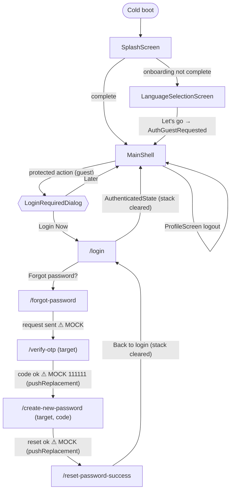
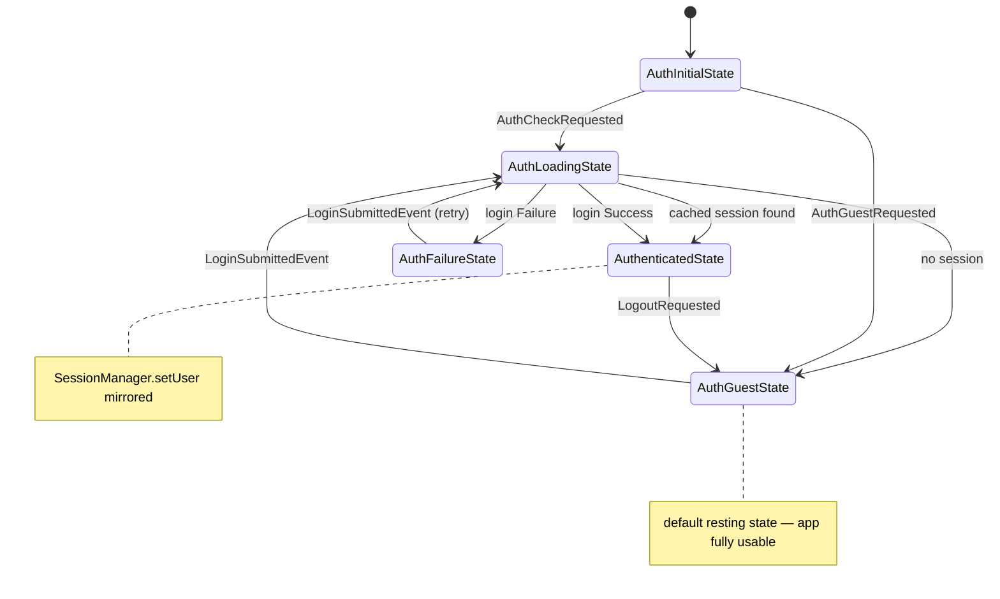
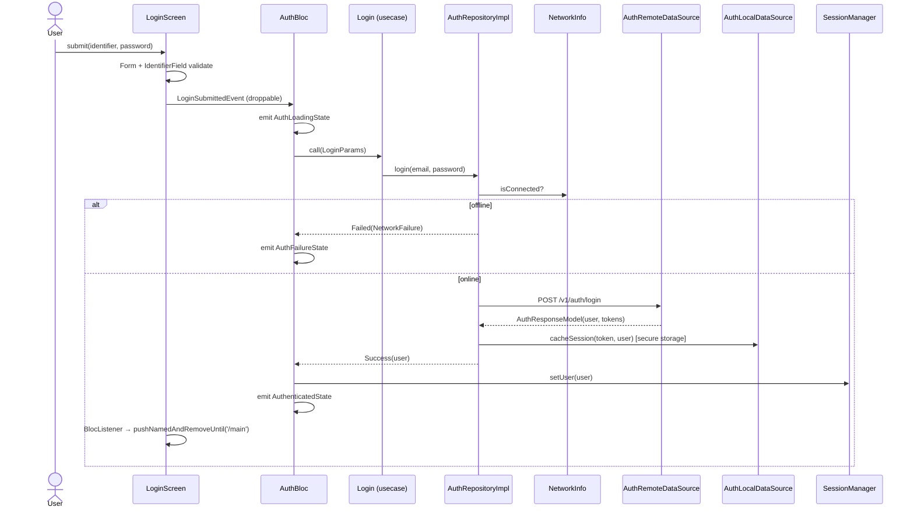
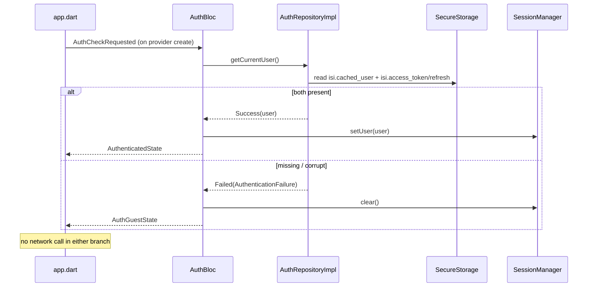

# Authentication — Feature Workflow

> Generated 2026-07-23 from the actual implementation. Diagrams reflect code, including currently-mocked steps (marked ⚠ MOCK).

---

## 1. User journey (happy path — returning rep)

1. Rep opens the app with no connectivity.
2. `app.dart` provides `AuthBloc` and fires `AuthCheckRequested`; splash (first cold boot only) routes by `onboarding_complete`.
3. `GetCurrentUser` reads the cached user + token pair from secure storage → `AuthenticatedState(user)`; `SessionManager.setUser(user)`.
4. Rep lands on `MainShell`, fully usable offline. First real API call later triggers a transparent token refresh if needed.

## 2. Happy path — first login

1. Guest taps a protected action → `AuthGuard` → `LoginRequiredDialog` → "Login Now" → `/login`.
2. Rep enters identifier (email **or** phone — `IdentifierField`) + password (≥ 6 chars), taps "Let's go".
3. `LoginSubmittedEvent` (droppable) → `AuthLoadingState` (`StatusPill` shows *verifying*, button spins).
4. Online check passes → `POST /v1/auth/login` → session cached (tokens + user JSON) → `AuthenticatedState`.
5. `LoginScreen`'s `BlocListener` clears the stack to `/main`.

## 3. Alternative flows

| Flow | Behavior (as implemented) |
|---|---|
| Guest dismisses login prompt ("Later") | Dialog closes; user stays exactly where they were, still guest |
| Double-tap "Let's go" | Second tap dropped by `droppable()` — one request only |
| Wrong credentials | `AuthenticationFailure` → `AuthFailureState(message)` → red `StatusPill` with server or fallback message |
| Login while offline | Repository fail-fast → `NetworkFailure` → `AuthFailureState` — no request attempted |
| Validation failure | Form + `IdentifierField` validate locally; no event dispatched |
| Guest entry after onboarding | `AuthGuestRequested` → `SessionManager.clear()` → `AuthGuestState` (idempotent) |

## 4. Offline flow

- **Boot**: entirely local (secure-storage reads). Missing/corrupt values → Guest, never a crash.
- **Login**: requires connectivity by design; offline attempt fails fast with a typed failure.
- **Logout**: works fully offline — server revocation is best-effort and skipped/swallowed; local clear always succeeds.
- **Session use**: all feature reads come from local data; the token is only needed when a real network call happens.

## 5. Online flow / token lifecycle

```
request ──► AuthInterceptor.onRequest: attach Bearer <access_token>
   │
   ▼ response 401 (first time for this request)
AuthInterceptor.onError:
   ├─ refresh in flight? ── yes ─► await same future (single-flight)
   ├─ POST /v1/auth/refresh {refresh_token}
   │     ├─ success ─► saveTokens(access, refresh?) ─► replay original
   │     │             request once (flag __auth_retried__)
   │     └─ failure ─► TokenStore.clear() ─► original 401 propagates
   │                   (⚠ gap G-5: AuthBloc/SessionManager not notified)
   ▼
second 401 on the replayed request ─► propagates (no retry loop)
```

## 6. Sync flow

Not applicable — no sync-queue participation. Token refresh (above) is the feature's only server reconciliation.

## 7. Resume flow

Authentication does not use `WorkflowSession`. "Resume" for auth = boot-time session restore (§1). The password-reset flow is **not** resumable: killing the app mid-OTP restarts from `/login`.

## 8. Error flow

| Error | Layer | Surfaced as |
|---|---|---|
| Timeout / connection error | Remote DS → `NetworkException` | `NetworkFailure` → `StatusPill` error |
| 401/403 on login | Remote DS → `AuthenticationException` | "Invalid email or password." (or server `message`) |
| Other HTTP / malformed | Remote DS → `ServerException` | "Something went wrong. Please try again." |
| Secure-storage write failure | Local DS → `CacheException('Failed to persist session.')` | `CacheFailure` → `StatusPill` error |
| Corrupt cached user JSON on boot | Local DS returns `null` | Silent → Guest |
| Wrong OTP (⚠ MOCK: only `111111` accepted) | `VerifyResult.failure` | `auth.invalid_code`, OTP boxes cleared |

## 9. Navigation diagram



## 10. State diagram (`AuthBloc`)



(`UnauthenticatedState` exists as a transient "must re-authenticate" signal but is never emitted by the current bloc — reserved for gap G-5.)

## 11. Sequence diagram — login



## 12. Sequence diagram — boot restore


