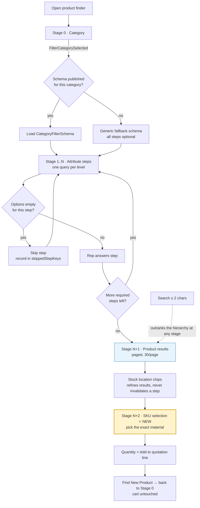
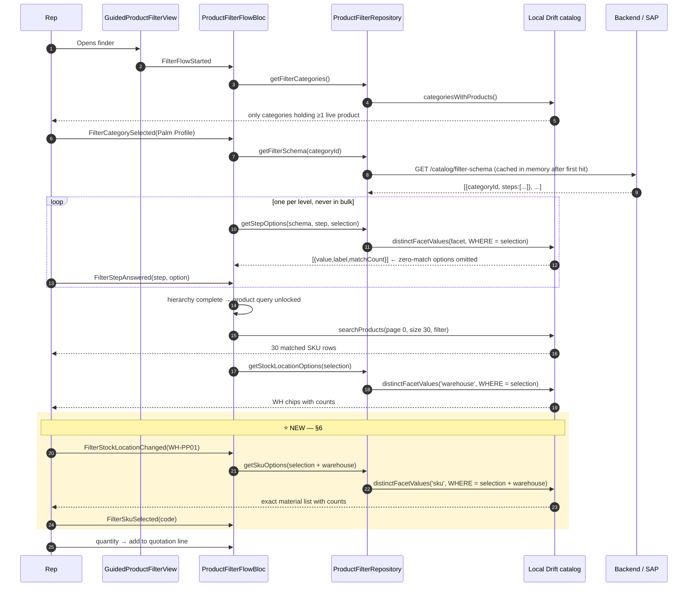
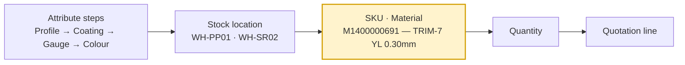

# Material / Product Selection Flow — Backend Integration Guide

> **Audience:** the SAP / middleware team building the endpoints this flow talks to.
> **Scope:** the guided product configurator in `lib/features/order` — category →
> attribute steps → stock location → **SKU** → quotation line.
> **Status:** the client flow exists end-to-end against a mock remote. Everything
> marked **NEW** (the SKU step, §6) is specified here but **not yet built** on
> either side.

---

## 1. The one guarantee this flow exists to keep

The catalog is ~100k SKUs. A sales rep on a 3G handset in a province must be able
to reach one sellable material **without the app ever pulling the catalog.**

Two rules enforce that, and every endpoint below is shaped by them:

1. **A product row is never returned until the request is bounded.** Either the
   rep finished the hierarchy, or they typed a query of ≥ 2 characters. Enforced
   in exactly one place — `ProductFilterFlowBloc._loadProducts`.
2. **Each level of the hierarchy costs one small aggregate.** Options for step
   *N+1* are resolved only when step *N* is answered. Never speculatively, never
   in bulk. An option that matches zero products is never returned, so the flow
   is dead-end free by construction.

A "level" transfers a few hundred bytes of labels and counts. A product page
transfers 30 rows. Nothing else crosses the wire.

---

## 2. Ownership split — who decides what

This is the single most important thing for the backend team to internalise.

| Thing | Owner | Where it comes from | Changes without an app release? |
|---|---|---|---|
| **Which steps** a category has, in what order, under what business label, with what control style and unit notation | **SAP / merchandising** | `GET /catalog/filter-schema` | ✅ Yes |
| **The values** at each step (which gauges, which colours, which mills) | The **locally synced catalog** on the device | Drift aggregate over `products` | ✅ Yes (via catalog sync) |
| **Which columns exist** to hang a step on | The **app** (`ProductAttribute` enum) | Dart code + Drift schema | ❌ No — needs a release |

So: merchandising can reorder Palm's flow from *Profile → Coating → Gauge →
Colour* to *Profile → Gauge → Coating → Colour*, add a step, relabel "Gauge" to
"Thickness", or publish a whole new category's hierarchy — **with no app
release**. What they cannot do without a release is invent an attribute the
`products` table has no column for.

> Corollary the backend must respect: an `attribute` value the app doesn't
> recognise causes that **single step to be dropped**, not the schema to fail.
> A rep in the field never loses the configurator because SAP shipped a new enum
> member. Do not rely on that as a feature — it means a mis-typed attribute
> fails silently.

---

## 3. The flow, end to end



### The dependency rule

Answering or clearing a step **invalidates every step below it**. Picking a
different Palm family cannot silently keep a thickness that family never came
in. This lives in `FilterSelection.select()` / `.clearFrom()` — business truth,
not UI behaviour.

**Three things are deliberately *not* steps**, because they refine the result set
rather than answer a question about the article, and so must never invalidate an
answered step:

- `sortBy`
- `availableOnly`
- `warehouseCode` (stock location) — chosen *after* the rep sees which SKUs
  matched

---

## 4. Call sequence



**Note the asymmetry:** the *hierarchy* comes from the backend (once, cached,
kilobytes). The *values* come from the local synced catalog. That is why every
screen in this flow works with the radio off.

---

## 5. Wire contracts

### 5.1 `GET /catalog/filter-schema`

The only read the flow makes against the backend. Returns **every published
schema at once** — it is configuration, not catalog data, and it is measured in
kilobytes. Cached in memory for the process lifetime
(`ProductFilterRepositoryImpl._loadSchemas`).

**Response**

```jsonc
[
  {
    "categoryId": "cat_palm_profile",
    "categoryName": "Palm Profile Roofing",
    "steps": [
      { "key": "profile", "label": "Profile",      "attribute": "family",      "sortOrder": 1, "style": "list",  "role": "family",        "required": true },
      { "key": "coating", "label": "Coating Line", "attribute": "brand",       "sortOrder": 2, "style": "chips", "role": "specification", "required": true },
      { "key": "gauge",   "label": "Gauge",        "attribute": "thickness",   "sortOrder": 3, "style": "grid",  "role": "dimension",     "required": true, "unitSuffix": "mm", "decimals": 2 },
      { "key": "colour",  "label": "Colour",       "attribute": "subCategory", "sortOrder": 4, "style": "chips", "role": "specification", "required": true },
      { "key": "sku",     "label": "Material",     "attribute": "sku",         "sortOrder": 99,"style": "list",  "role": "sku",           "required": true }
    ]
  }
]
```

**Field rules**

| Field | Type | Required | Rule |
|---|---|---|---|
| `categoryId` | string | ✅ | Must match `categories.id` the catalog sync publishes. A schema for an unknown category is silently unreachable. |
| `categoryName` | string | — | Display only; the app prefers the synced category name. |
| `steps[].key` | string | ✅ | Stable, unique **within the schema**. Used as the selection map key and in analytics. Never shown to the rep. Renaming a key is a breaking change — it orphans in-flight selections. |
| `steps[].label` | string | ✅ | What the rep reads. Free to change any time. |
| `steps[].attribute` | enum string | ✅ | Must be one of §5.4. Unknown ⇒ **step dropped**. |
| `steps[].sortOrder` | int | ✅ | Presentation order. The client sorts once on the way in; gaps are fine. |
| `steps[].style` | `chips` \| `grid` \| `list` | — (`chips`) | Control shape. Pick by data shape: 3 profiles = chips, 12 diameters = grid, a family list = rows with counts. |
| `steps[].role` | `family` \| `specification` \| `dimension` \| `sku` **NEW** | — (`specification`) | `family` and `sku` get richer selectors; the rest render generically. |
| `steps[].unitSuffix` | string \| null | — | Appended to numeric labels — `0.30` → `0.30 mm`. |
| `steps[].decimals` | int \| null | — | Fixed decimals for numeric labels. Business notation, not rendering taste: coil thickness reads `0.30`, rebar diameter reads `12`. Null = natural precision. |
| `steps[].required` | bool | — (`true`) | Optional steps can be skipped without blocking the product query. |

**Rules the backend must hold to**

- Two steps in one schema must not share a `key`.
- Two steps in one schema should not share an `attribute` — the second would
  narrow a column already pinned and always resolve to exactly one option.
- A `family`-role step, if present, must be first.
- A `sku`-role step, if present, must be **last** (see §6).
- Publish a schema only for categories that actually hold live products.
  Categories with no published schema fall back to a generic all-optional
  schema; they are never blocked.

### 5.2 `GET /catalog/categories` (part of catalog sync)

Standard master data. The client only ever *offers* categories that hold at
least one non-deleted product locally — a category whose every branch dead-ends
is the same defect as an option that matches nothing.

### 5.3 Catalog sync (`fetchInitial` / `fetchDelta`)

Everything the facets are computed from. Already specified by the sync engine
(`docs/SYNC_ENGINE.md`); repeated here only for what this flow depends on:

- **Scoped and paged.** Never the whole catalog in one call.
- **Delta by `since`**, returning `upserted[]` + `deletedIds[]`.
- **Products, prices and stock are separate rows** so the three can be applied
  independently.

The single most consequential fact for this flow:

> **A `products` row is a SKU *at one warehouse*.** Its id is
> `{code}-{warehouseCode}`. The same material stocked at three plants is three
> rows, sharing name, material code and spec, differing only in an id the rep
> never sees. Getting this wrong produced three identical-looking cards where
> picking the wrong one quoted from the wrong plant. See §6.

Every field the facets group on must therefore be populated on **every**
warehouse row of the same material, identically.

### 5.4 Attribute ↔ column ↔ SAP mapping

`ProductAttribute` is the closed set of columns a step can hang on. Adding a
member is an app release plus a Drift migration plus a DAO whitelist entry —
they change together.

| `attribute` | Facet name | `products` column | Numeric | Typical SAP source / ISI usage |
|---|---|---|---|---|
| `family` | `family` | `family_id` (label `family_name`) | | Product family / trade name — "TRIM-7" |
| `warehouse` | `warehouse` | `warehouse_code` | | Plant. *Where* the article is, not a property of it |
| `subCategory` | `subCategory` | `sub_category` | | Currently carries SAP `TopColor` — see the note below |
| `brand` | `brand` | `brand` | | Coating line ("PALM 50PPGL"), or the mill on traded stock |
| `size` | `size` | `size` | | Catalogue size code; PU core depth |
| `grade` | `grade` | `grade` | | Steel grade / "Quality" |
| `material` | `material` | `material` | | "Aluzinc Coated Steel" |
| `length` | `length` | `length` | ✅ | mm |
| `width` | `width` | `width` | ✅ | mm — also **girth** on flashings/gutters |
| `height` | `height` | `height` | ✅ | mm |
| `diameter` | `diameter` | `diameter` | ✅ | mm — rebar, pipe |
| `thickness` | `thickness` | `thickness` | ✅ | mm — gauge |
| **`sku` NEW** | `sku` | `code` (label `name`) | | The material itself — see §6 |

**Numeric semantics:** `0` in a numeric column means *not applicable to this
product type* (a steel sheet has no length). It is an absence, not a value, and
is excluded from facet results. **Do not send `0` to mean "unknown"** — send
`0` only when the dimension genuinely does not apply.

**Empty string** in a text column is likewise excluded from facets.

**⚠️ Known discrepancy to resolve with the backend:** the published schemas map
*Colour* onto `subCategory`, because that is the column the demo catalog loads
SAP's `TopColor` into. A dedicated `color` column now exists on `products` and
is populated in parallel. When `ProductAttribute.color` is added, the schema's
colour steps should move to `attribute: "color"` — schema and app change
together, and nothing above the data layer notices.

### 5.5 Facet resolution (local today, contract for a server-side twin)

Every option list is one aggregate over the local catalog, and there is exactly
one shape:

```sql
SELECT p.<value_col>              AS facet_value,
       MIN(p.<label_col>)         AS facet_label,
       COUNT(*)                   AS facet_count
FROM products p …joins…
WHERE p.deleted = 0
  AND <every answered selection, as equality predicates>
  AND p.<value_col> IS NOT NULL
  AND <value_col> != ''   -- or  > 0  for numeric columns
GROUP BY p.<value_col>
ORDER BY p.<value_col> ASC
```

If a server-side facet endpoint is ever added (for a thin web client, where
there is no synced catalog), **it must return the identical shape** so the two
paths can never disagree:

```
POST /catalog/facets
{
  "facet": "thickness",
  "filter": { "categoryId": "...", "familyId": "...", "brand": "...", "warehouseCode": null }
}
→ [ { "value": "0.3", "label": "0.3", "matchCount": 12 }, … ]
```

Rules: **never** return an option with `matchCount == 0`; the value is the
canonical catalog value the next query filters on; the label is formatted by the
client from `unitSuffix` + `decimals`, so send the raw value as the label.

### 5.6 Product query

The terminal, bounded read. Runs only when the hierarchy is complete or the
query is ≥ 2 characters.

| Parameter | Notes |
|---|---|
| `page`, `pageSize` | 30 per page |
| `query` | FTS across name (EN **and** KH), code, sku, materialCode, barcode, brand, specification, colour, size, grade |
| `filter` | `categoryId`, `familyId`, `subCategory`, `brand`, `warehouseCode`, `size`, `grade`, `material`, `length`, `width`, `height`, `diameter`, `thickness`, `availableOnly`, `sortBy` |

`sortBy` ∈ `relevance | nameAsc | priceAsc | priceDesc | stockDesc`.

Search spans **both languages regardless of the active locale** — a rep typing a
Khmer name into an English UI is looking for that product, and returning nothing
is a defect.

---

## 6. ⭐ NEW — SKU selection as the final filter

### 6.1 Why it is needed

Today the flow's last narrowing is the stock-location chip row, and the rep then
picks a card out of a grid. That grid can still contain several rows that look
identical:

- The same material at three warehouses — `id = {code}-{warehouseCode}` — which
  the location chips solve.
- **Genuinely different material numbers** whose published attributes are all
  equal, because SAP holds a distinction the schema does not expose (a packaging
  variant, a mill run, a length not modelled as a step, a legacy material number
  kept alive for a customer's spec).

For the second case the rep is choosing between rows the hierarchy cannot tell
apart. Making the material an explicit, labelled, counted step ends the guess:
the rep confirms **exactly which material number is going on the quotation**
before a quantity is ever typed.

### 6.2 Where it sits

**Last. Always last.** After every attribute step, and evaluated *after* the
stock-location narrowing.



Two properties distinguish it from every other step:

1. **It is resolved *including* the pinned `warehouseCode`.** Every other facet
   is resolved against the selection with warehouse deliberately excluded — the
   location chips must keep showing every plant the rep could switch to. The SKU
   list is the opposite: it answers "which materials can I actually quote from
   *here*", so the warehouse is part of its WHERE clause.
2. **Answering it does not invalidate anything.** It is the leaf. Changing the
   location, or any answered step above it, clears the SKU selection — never the
   reverse.

### 6.3 Contract

**Facet mapping**

| | |
|---|---|
| `attribute` / facet name | `sku` |
| Value column | `products.code` |
| Label column | `products.name` (localised to `name` / `nameKh` by the client) |
| Numeric | no |
| `matchCount` | number of **warehouse rows** for that material still matching the selection |

> **Naming caveat the backend must decide on.** In the current data,
> `products.sku` is set to `{code}-{warehouseCode}` — i.e. it is per-row, not per
> material. Grouping on it would re-introduce the duplicate-card problem this
> step exists to kill. So the facet named `sku` **groups on `code`**, which is
> the column that genuinely identifies one material across warehouses.
> Either accept that mapping, or change the extract so `sku` is per-material and
> a separate column carries the row identity. Do not leave it ambiguous.

**Schema step**

```jsonc
{
  "key": "sku",
  "label": "Material",
  "attribute": "sku",
  "sortOrder": 99,
  "style": "list",
  "role": "sku",
  "required": true
}
```

Use `sortOrder: 99` (or any value above every other step) as the convention, so
inserting an attribute step later cannot accidentally land below it.

**Response shape** — identical to every other facet:

```jsonc
[
  { "value": "M1400000691", "label": "TRIM-7 YL 0.30mm-PALM 50PPGL", "matchCount": 1 },
  { "value": "M1400000732", "label": "TRIM-7 BR 0.40x3m-PALM 100PPGL", "matchCount": 2 }
]
```

**Applied to the product query** as `code = <value>`, alongside everything
already selected.

### 6.4 Behaviour the client will implement

| Situation | Behaviour |
|---|---|
| Facet returns **0 options** | Step is skipped, exactly like any other empty step. Cannot happen if products matched — treat it as a data defect and log it. |
| Facet returns **1 option** | **Auto-select and do not render the step.** A one-chip picker is a wasted tap, and the flow already skips steps that offer no choice. |
| Facet returns **> 1 option** | Render as a list: material description, material code, unit, price, stock band. |
| Rep changes the **stock location** | SKU selection cleared, list re-resolved. That material may not be held at the new plant. |
| Rep changes **any attribute step** | SKU selection cleared along with the location, by the existing dependency rule. |
| Rep runs a **search** (≥ 2 chars) | Search outranks the hierarchy; the SKU step is bypassed and results show directly, as today. |
| Rep hits **Find New Product** | Everything cleared, cart untouched. |

### 6.5 What the backend must guarantee

- [ ] `code` is stable, unique per material, and **identical across every
      warehouse row** of that material.
- [ ] `name` (and `nameKh` where it exists) is populated on every row — it is
      the label the rep picks on. Empty names are excluded from facets and would
      make a material unselectable.
- [ ] `materialCode` is the SAP material number and is carried on every row; it
      is what appears on the quotation and what SAP validates on submit.
- [ ] `unit`, `weight` and pricing are consistent across the warehouse rows of
      one `code` — the rep sees one of them and orders against all.
- [ ] Every category schema that should end on a material carries the `sku` step
      as its last entry.
- [ ] Deleted / blocked materials are delivered as deletions
      (`deletedIds`) or `status != active`, not left stale — a facet cannot
      offer what the catalog says is gone.

### 6.6 Client-side changes this requires (tracked, not yet built)

| Layer | Change |
|---|---|
| `domain/entities/filter/product_attribute.dart` | Add `ProductAttribute.sku` |
| `domain/entities/filter/filter_step.dart` | Add `FilterStepRole.sku` |
| `domain/entities/product_filter.dart` | Add `String? code` + `copyWith`/`props`/`isEmpty` |
| `filter_selection.dart` | Map `ProductAttribute.sku → filter.copyWith(code: …)` |
| `core/database/drift/daos/catalog_dao.dart` | `facetColumns['sku'] = ('code', 'name', false)`; add `code` to `_productWhere` |
| `data/models/category_filter_schema_model.dart` | `_roleFrom`: `'sku' => FilterStepRole.sku` |
| `product_filter_repository.dart` | `_facetKey`: `ProductAttribute.sku => 'sku'`; resolve **with** `warehouseCode` |
| `product_filter_flow_bloc.dart` | Clear SKU on location change; auto-select single option |
| `widgets/filter_flow/` | `sku_selector.dart` — list rows with material code, unit, price, stock band |

Per `CLAUDE.md` §1 this is a **plan, not authorisation** — the code lands when
the module is approved and scheduled.

---

## 7. Error, offline and failure semantics

| Failure | Behaviour | Backend implication |
|---|---|---|
| `/catalog/filter-schema` unreachable | Category falls back to the **generic all-optional schema**; the flow degrades to attribute steps that adapt to whatever the category holds. The rep is never blocked. | Cache aggressively; this endpoint being slow is worse than it being stale. |
| Unknown `attribute` in a step | That step is dropped; the rest of the schema works. | Silent — a typo will not raise an error anywhere. Validate on publish. |
| Step resolves to 0 options | Step skipped and recorded, so "back" steps over it the same way it stepped forward. | Usually correct behaviour; frequent skips mean the schema does not match the data. |
| Facet read fails | Flow shows a failure state for that level. | Local only — implies a device database problem, not a server one. |
| Stock-location facet fails | **Swallowed.** Losing the chips must not turn a working product list into an error screen. | — |
| Product query fails | `ProductListStatus.failure` on the list only; the answered steps and summary do not flicker. | — |
| No connectivity | The **entire flow works**: the schema is cached, every value is local. | Correctness of the last successful sync is what the rep sees. |

---

## 8. Budgets and acceptance criteria

| Metric | Target |
|---|---|
| `/catalog/filter-schema` payload | < 100 KB for all categories |
| Schema fetches per app session | 1 |
| Bytes per hierarchy level | < 5 KB |
| Product page size | 30 rows |
| Option list latency (local aggregate) | < 50 ms p95 |
| Options with `matchCount == 0` returned | **0 — always** |
| Product rows transferred before the hierarchy completes | **0** |

**Definition of done for the backend side:**

1. `/catalog/filter-schema` serves every ISI category, validated against §5.1.
2. Every `attribute` in every published step is in §5.4.
3. Catalog sync populates every facet column on every warehouse row.
4. `code` / `name` / `materialCode` satisfy §6.5.
5. The `sku` step is present and last on every schema that should close on a
   material.
6. A contract test pins one full schema payload and one product page, the way
   `test/core/network/live_contract_test.dart` pins the auth payloads.

---

## 9. Appendix — the ten ISI hierarchies as published today

No two are the same shape, and that is the point: each follows how the product
is actually specified across an ISI counter. The `sku` step appends to each.

| Category | Steps (in order) | Why it closes there |
|---|---|---|
| Palm Profile Roofing | Profile → Coating Line → Gauge → Colour | Coating carries the warranty; colour last because customers change their mind about colour, never about profile |
| PU Insulated Panels | Panel → PU Core → Gauge → Colour | PU20 and PU40 are different materials at the same steel gauge |
| Roofing Accessories | Accessory → Girth (`width`) → Gauge → Colour | Specified by the flat blank width before folding, not a catalogue size code |
| Cold Formed Sections | Section → Size → Thickness → Grade | Structural, so it closes on grade — SGCC-Z60 vs G450-Z275 is load-bearing |
| Galvanized Pipe | Family → Size → Thickness → Grade | Nothing in the line is painted |
| K-Pipe | 2 steps | SAP holds no brand or grade variation; a one-chip step is a wasted tap |
| GI Steel Sheet | Dimensions only, no family step | The whole category is one product described by two dimensions |
| GI Steel Bending | Dimensions only, no family step | As above |
| Reinforcement (Traded) | Family → **Mill** → … | Bought-in stock; the mill is what a customer with a spec cares about |
| Beams (Traded) | 2 steps | As K-Pipe |

Source of truth for the mock: `lib/features/order/data/mock/isi_filter_schema_data.dart`
— rebuilt from the real material master in `SAP_BP_Data.pbix`. Swap that class
for a Dio call and every screen behaves identically.

---

## 10. Where the code lives

| Concern | Path |
|---|---|
| Guided flow UI | `lib/features/order/presentation/widgets/filter_flow/` |
| Legacy facet widgets (catalog browse) | `lib/features/order/presentation/widgets/filter/` |
| Flow state machine | `lib/features/order/presentation/bloc/product_filter_flow/` |
| Filter entities + dependency rule | `lib/features/order/domain/entities/filter/` |
| Repository interface | `lib/features/order/domain/repositories/product_filter_repository.dart` |
| Schema DTO (the wire contract) | `lib/features/order/data/models/category_filter_schema_model.dart` |
| Remote source (schema) | `lib/features/order/data/remote/product_filter_remote_data_source.dart` |
| Facet aggregate + column whitelist | `lib/core/database/drift/daos/catalog_dao.dart` |
| Mock "SAP" schema config | `lib/features/order/data/mock/isi_filter_schema_data.dart` |

Related: [`docs/ARCHITECTURE.md`](../../ARCHITECTURE.md) ·
[`docs/SYNC_ENGINE.md`](../../SYNC_ENGINE.md) ·
[`docs/OFFLINE_FIRST.md`](../../OFFLINE_FIRST.md) ·
[`docs/API_INTEGRATION.md`](../../API_INTEGRATION.md) ·
[ADR-009](../../adr) — customer filtering is flat; SAP master data is a cached lookup.
