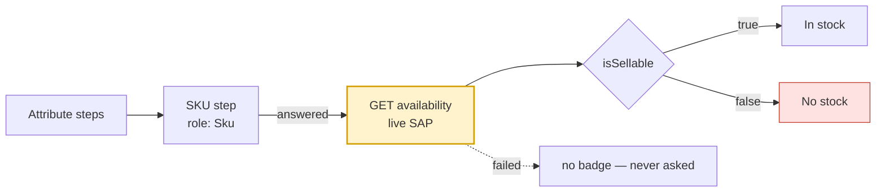

# Stock Availability — Implementation Notes

How the app implements the sellability check from
[`materials-guidline-integration-mobile.md`](materials-guidline-integration-mobile.md) §4a.

That document describes the server. This one describes **our side**: when the
call is made, what is rendered, and which decision was a deliberate compromise.

---

## What we call, and when

```
GET /api/v1/materials/{material}/availability
```

Note the path — `/materials/…`, **not** under `/mobile/`. Verified against the
staging host.

**Exactly one call per flow, fired when the rep answers the SKU step.** That is
the moment they stop narrowing and name a material, which is the commitment the
guide says to spend a live SAP round trip on. It is never called while browsing,
never per card, and never per page.



Re-asking is suppressed: the verdict concerns a material in a sales area, and
neither changes while the rep is on the screen.

---

## Four states, not a boolean

| Condition | Badge | Why |
|---|---|---|
| Never asked | **nothing** | The rep is browsing. Rendering "No stock" here would make them decline a sale over a question the handset had not asked. |
| In flight | spinner | Asked, waiting. A live ERP hop is slow enough to be worth acknowledging. |
| `isSellable: true` | **In stock** | SAP will accept the order line. |
| `isSellable: false` | **No stock** | SAP will not. |

The failing check's own message is attached as a long-press tooltip. "Material
is not extended to sales area 1000/10" is something a rep can act on by phoning
the right person; "cannot sell this" is not.

`MaterialAvailability.reason` deliberately prefers the first **blocking** check
over the verdict check, because the verdict only restates the summary.

---

## The compromise on record: `INPUT_*` renders as "No stock"

SAP requires `salesOrg`, `disChannel` and `division`. **The session does not
carry them yet**, so none is sent, and SAP answers:

```jsonc
{
  "isSellable": false,
  "summary": "Validation not performed. Mandatory input parameters are missing.",
  "checks": [
    { "checkId": "INPUT_VKORG", "status": "E", "message": "Sales Organization is required." },
    { "checkId": "INPUT_VTWEG", "status": "E", "message": "Distribution Channel is required." },
    { "checkId": "RESULT",      "status": "E", "isVerdict": true }
  ]
}
```

**HTTP 200.** The request succeeded; the validation never ran.

The integration guide says to treat `INPUT_*` as a client bug rather than as
"out of stock". **We render it as "No stock" anyway**, by explicit product
decision, and the reasoning is worth stating because it is a trade rather than
an oversight:

- It is the **safe** direction. The check never invents a yes, so no rep is
  told a blocked material is sellable.
- It is **not silent**. `MaterialAvailability.isInputIncomplete` is true for
  exactly this case, the failing check messages survive into the tooltip, and
  `MaterialAvailabilityRepositoryImpl` carries a `TODO(release-gate)`.

The cost is real and should not be forgotten: **until the sales area is wired,
every material reads "No stock"**, so the badge carries no information. Closing
that gap means resolving the signed-in rep's sales area and passing it into
`MaterialAvailabilityRepositoryImpl`'s `salesOrg` / `disChannel` / `division`.

Two tests pin the distinction so it cannot quietly collapse:
`missing sales-area parameters is still distinguishable from a business refusal`
and `surfaces which parameters SAP wanted`.

---

## A failed call is not a refusal

Network down, middleware down, timeout, 403 — all record **nothing**, which
renders as no badge at all. "We could not ask" and "the answer is no" are
different claims, and only the second should stop a rep from quoting.

Offline is checked before the call rather than discovered at the socket, so the
result is an honest "not asked" rather than a transport error.

---

## Related: what this API does *not* have

Two absences shape the cards, and both are rendered as absences rather than as
zeros:

| Missing | Where it shows |
|---|---|
| **On-hand quantity** — no units, no warehouse balance, no ATP | `Product.stockKnown == false`; the local quantity band is suppressed |
| **Price** — no list, no condition, no currency. `priceGroup` is a classification code, never an amount | `ProductPricing.unpriced()`; cards read "Price not available" |

`$0.00` and "Out of stock" are claims. A rep cannot tell a confident wrong
answer from a missing one, so neither is rendered.

---

## Files

| Concern | Path |
|---|---|
| Entity, four states, `INPUT_*` detection | `lib/features/order/domain/entities/material_availability.dart` |
| Wire → domain | `lib/features/order/data/models/material_api_mapper.dart` |
| Repository + the sales-area gap | `lib/features/order/data/repositories/material_availability_repository_impl.dart` |
| The HTTP call | `lib/features/order/data/remote/api_material_selection_remote_data_source.dart` |
| Trigger on the SKU step | `lib/features/order/presentation/bloc/product_filter_flow/product_filter_flow_bloc.dart` |
| The badge | `lib/features/order/presentation/widgets/catalog/stock_availability_badge.dart` |
| Tests, with the live payload pinned | `test/features/order/material_availability_test.dart` |
