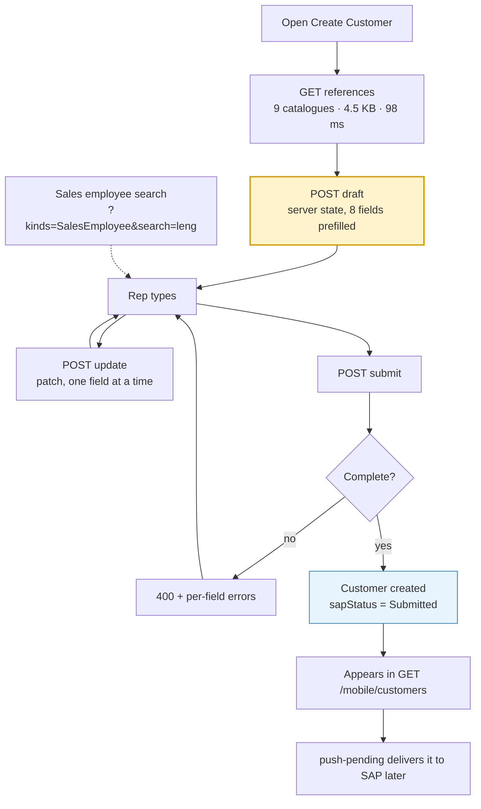

# Customer Mobile Registration — Overview

The Sales Rep "Register New Business Partner" flow: load the SAP dropdowns, open a
prefilled draft, save as they type, submit.

Implemented at `/api/v1/mobile/customers/{references,draft,update,submit}`.

---

## The flow

---

## Three decisions worth knowing

### 1. The draft is server-side state, and not a `Customer`

A `Customer` guarantees it has a name, a telephone and an address — that guarantee is
what lets the rest of the platform route, call and visit one. A half-filled form
satisfies none of it, and relaxing the aggregate so an empty shell could exist would
weaken **every** customer in the database to serve one screen.

So `CustomerDraft` is its own aggregate: 46 nullable strings shaped exactly like SAP's
`BpCreateRequestDto`. It becomes a real `Customer` on submit, and only then are the
invariants enforced. Because it lives on the server, a handset that dies mid-form
loses nothing.

### 2. The helper catalogues are synced, never called live

Measured against the live middleware, the ten `CustHelper` endpoints range from
**0.2 s to never completing**. A form that fetched them on open would be slow at best
and broken at worst.

They are synced into `customer_references` and served from there — **98 ms, works with
the radio off**. Refreshed daily at 03:00 UTC, as requested.

### 3. Sales employees are a search box, not a dropdown

There are **5,809** of them. Returning them with the other nine made the form-open
response **252 KB** — about ten seconds on a provincial 3G link, for a list nobody
scrolls.

They are excluded from the bulk response (now **4.5 KB**) and fetched with
`?kinds=SalesEmployee&search=leng` (2.3 KB, 48 matches).

---

## What already existed and was reused

This feature is mostly wiring, not new machinery. Already present before this work:

| Existing | Reused for |
|---|---|
| `SapBpWriteRequest` (46 fields) | The draft's field set matches it exactly |
| `CreateBusinessPartnerCommand` | Submit delegates the whole draft→customer mapping to it |
| `SapRegistrationStatus` | `Submitted` is the status the list shows |
| `POST /customers/sap/push-pending` | Delivers submitted customers to SAP |
| `ISapCustomerService` | Extended with the helper-catalogue read |
| `DatabaseSeeder`, Hangfire scheduler | One more idempotent step, one more daily job |

**No new SAP write endpoint was built.** Submission still goes through the existing
`CreateCust` push, exactly as you said it should.

---

## Documents

| Document | What it covers |
|---|---|
| [`api.md`](api.md) | The endpoints, with verified request and response shapes |
| [`sap-helpers.md`](sap-helpers.md) | All ten catalogues as the live API actually returns them |
| [`implementation.md`](implementation.md) | Files, database, verification, limitations |
