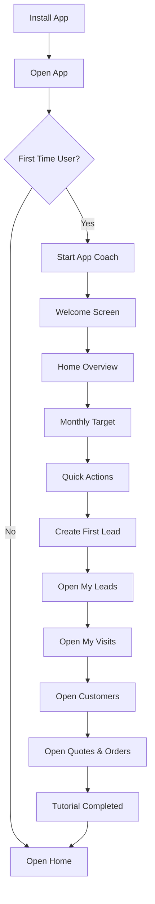

# App Coach Feature

## Overview

`App Coach` is an interactive assistant that guides first-time users through the application. Unlike traditional onboarding screens, App Coach teaches users by asking them to perform real actions inside the app.

The goal is to help users understand the workflow quickly and reduce confusion.

---

# Goals

- Help new users understand the app.
- Teach users through interaction.
- Highlight important features.
- Save onboarding progress.
- Resume tutorials after app restart.
- Allow users to skip or restart the tutorial.

---

# User Journey



---

# Tutorial Steps

| Step | Screen | Description |
|--------|--------|--------|
| 1 | Welcome | Introduce the application |
| 2 | Home | Explain dashboard |
| 3 | Monthly Target | Explain sales progress |
| 4 | Quick Actions | Explain shortcuts |
| 5 | New Lead | Create first lead |
| 6 | My Leads | Show lead management |
| 7 | My Visits | Show visit tracking |
| 8 | My Customers | Show customer management |
| 9 | Quotes & Orders | Show quotation workflow |
| 10 | Finish | Complete tutorial |

---

# Tutorial State Flow

```text
IDLE
    ↓
START
    ↓
SHOW_STEP
    ↓
WAIT_FOR_USER_ACTION
    ↓
VALIDATE_ACTION
    ↓
NEXT_STEP
    ↓
COMPLETED
```

---

# How App Coach Works

App Coach follows an event-driven architecture.

The coach does not move to the next step when the user presses "Next".

Instead, it waits for the user to complete the required action.

Example:

```text
Coach:
"Tap New Lead"
        ↓
User taps New Lead
        ↓
App emits event
        ↓
Coach validates event
        ↓
Coach moves to next step
```

---

# Coach Lifecycle

## 1. App Launch

```dart
void initializeCoach() async {
  final completed = storage.isTutorialCompleted();

  if (!completed) {
    coach.start();
  }
}
```

---

## 2. Load Current Step

```dart
final step = storage.currentStep();
```

---

## 3. Display Overlay

App Coach:

- Darkens the screen.
- Highlights widgets.
- Displays assistant messages.
- Shows progress.

Example:

```text
┌────────────────────┐
│                    │
│    [ Highlight ]   │
│                    │
│ 🤖 Tap New Lead    │
│                    │
│ Skip        Next   │
└────────────────────┘
```

---

## 4. Wait for User Action

Example:

```dart
CoachStep(
  id: "new_lead",
  requiredAction: CoachAction.createLead,
)
```

---

## 5. User Performs Action

Screen:

```dart
context.read<AppCoachBloc>().add(
  CoachActionTriggered(
    CoachAction.createLead,
  ),
);
```

---

## 6. Validate Action

```dart
if (event.action == currentStep.requiredAction) {
  moveToNextStep();
}
```

---

## 7. Save Progress

```dart
storage.save(
  currentStep: "my_leads",
);
```

---

## 8. Resume Tutorial

```dart
coach.resume();
```

---

# Coach Actions

```dart
enum CoachAction {
  openHome,
  viewTarget,
  openQuickActions,
  createLead,
  openMyLeads,
  openMyVisits,
  openCustomers,
  openOrders,
  completeTutorial,
}
```

---

# Coach Step Model

```dart
class CoachStep {
  final String id;

  final String title;

  final String message;

  final String route;

  final String targetKey;

  final CoachAction requiredAction;

  final bool canSkip;

  final bool autoNavigate;

  final int order;
}
```

---

# Example Step

```dart
CoachStep(
  id: "new_lead",

  title: "Create your first lead",

  message:
      "Tap the New Lead button to create your first customer.",

  route: "/home",

  targetKey: "new_lead_button",

  requiredAction: CoachAction.createLead,

  canSkip: true,

  autoNavigate: false,

  order: 5,
)
```

---

# Widget Registration

Every coach target must have a key.

```dart
class CoachKeys {
  static final monthlyTarget = GlobalKey();

  static final newLead = GlobalKey();

  static final myLeads = GlobalKey();

  static final myVisits = GlobalKey();

  static final customers = GlobalKey();

  static final orders = GlobalKey();
}
```

Example:

```dart
Container(
  key: CoachKeys.newLead,
)
```

---

# Storage Structure

Hive / Isar:

```json
{
  "completed": false,
  "currentStep": "create_lead",
  "completedSteps": [
    "welcome",
    "home",
    "monthly_target"
  ],
  "version": 1
}
```

---

# Assistant UI

## Floating Button

```text
🤖
```

Functions:

- Resume tutorial.
- Restart tutorial.
- Replay current step.
- Skip tutorial.
- Open help center.

---

# States

```dart
enum CoachStatus {
  idle,
  running,
  waitingAction,
  paused,
  completed,
}
```

---

# Events

```dart
abstract class CoachEvent {}

class StartCoach extends CoachEvent {}

class ResumeCoach extends CoachEvent {}

class SkipCoach extends CoachEvent {}

class RestartCoach extends CoachEvent {}

class NextStep extends CoachEvent {}

class ActionCompleted extends CoachEvent {
  final CoachAction action;
}
```

---

# Recommended UX Rules

✅ Keep messages short.

✅ Focus on one action.

✅ Never show multiple highlights.

✅ Save progress automatically.

✅ Allow users to skip.

---

# Future Improvements

- AI assistant.
- Voice guidance.
- Khmer narration.
- Analytics.
- Personalized tutorials.
- Role-based onboarding.
- Video demos.
- Remote configuration.

---

# Example Flow

```text
👋 Welcome

        ↓

📈 Monthly Target

        ↓

➕ Create First Lead

        ↓

📋 Open My Leads

        ↓

📍 Open My Visits

        ↓

👥 Open Customers

        ↓

📦 Open Quotes & Orders

        ↓

🎉 Tutorial Completed
```

---

# Success Criteria

A successful App Coach should ensure:

- Users understand the app within 2–3 minutes.
- Users complete at least one real workflow.
- Users can continue after closing the app.
- Users feel confident using the application.

---

# Implementation (as built)

## Layer map

```
app_coach/
├── data/
│   ├── datasource/  coach_local_datasource.dart   (Hive cache box, tolerant IO)
│   │               coach_step_catalog.dart        (const script + coachVersion)
│   ├── models/      coach_progress_model.dart      (Hive map <-> entity)
│   └── repositories/coach_repository_impl.dart     (load/save + safe migration)
├── domain/
│   ├── entities/    coach_action / coach_status / coach_step / coach_progress
│   ├── repositories/coach_repository.dart
│   └── usecases/    start_tutorial / complete_step / next_step / skip_tutorial
├── presentation/
│   ├── blocs/       app_coach_bloc (+ event/state parts)
│   ├── services/    coach_keys / app_coach (facade) / coach_analytics
│   └── widgets/     app_coach_host / assistant_overlay / assistant_bubble
│                    highlight_painter / pointer_animation / floating_assistant_button
└── app_coach_injection.dart
```

The domain layer is framework-free: `CoachStep` holds a `targetKeyId` **string**,
resolved to a live `GlobalKey` in `CoachKeys` (presentation). Storage returns
plain values (not `Result`) and swallows IO errors — the coach can never crash
the app.

## How progression works (event-driven)

- The bloc is a **lazy singleton** so it survives tab switches and is reachable
  context-free via the `AppCoach` facade.
- `AppCoachHost` (mounted as the top child of `MainShell`'s `Stack`) listens to
  `ShellTabController`; every tab switch becomes a `CoachActionTriggered`.
- A step advances only when the triggered action equals its `requiredAction`
  (informational steps advance via their CTA instead). No bare "Next".
- Progress is persisted after every transition and resumes on relaunch /
  re-login. A `coachVersion` bump safely restarts the walkthrough.

## Integration points (only these files were touched)

- `core/di/injection_container.dart` — `registerAppCoachFeature(sl)`
- `features/shell/.../main_shell.dart` — mounts `AppCoachHost`; wraps the
  Monthly-Target, Quick-Actions and My-Work anchors with `CoachKeys.wrap(...)`
- `features/shell/.../quick_action_widget.dart` — one line:
  `AppCoach.notify(CoachAction.createLead)` on the "New lead" tap
- `assets/lang/{en,kh}.json` — the `coach.*` strings

## Adding a step or anchor

1. Add a `CoachStep` to `CoachStepCatalog.steps` (bump `coachVersion`).
2. If it spotlights a widget, add an id to `CoachKeys` and wrap the target with
   `CoachKeys.wrap(id, child: ...)`.
3. Add its `title`/`message`/`cta` keys to both language files.
4. For a custom action, call `AppCoach.notify(CoachAction.xxx)` at the real tap.

## Behavior & resilience notes

- Missing/unmounted target → the overlay falls back to a **centered** bubble;
  spotlight is clamped to the visible area (safe on scroll/rotation).
- Reduced-motion (`MediaQuery.disableAnimations`) disables the glow/pointer.
- Taps pass through the spotlight cutout to the real widget; the dimmed area is
  absorbed so background UI can't be triggered mid-step.
- Analytics are hook-only (`CoachAnalytics`); swap `DebugCoachAnalytics` at DI
  time for a real provider — the bloc is untouched.
- Verified with `flutter analyze` (clean). Recommend a device pass to confirm
  spotlight geometry across screen sizes.